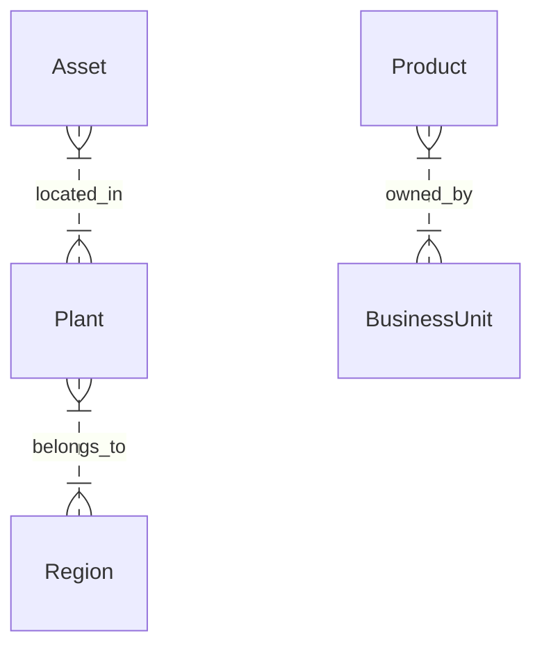

<!DOCTYPE html>
<html lang="en"><head><meta charset="utf-8"><meta name="viewport" content="width=device-width">
<title>Entity Relationship Model</title>

</head><body>
## Entity Relationship Model

### Executive Summary
This document outlines the entity relationship model derived from the actual datasets in the Energy Enterprise Transformation Advisor repository.

### Master Entity Catalog
The following 8 entities are identified from the master-data and sample-data folders:

| Entity | Description | Primary Dataset |
|--------|-------------|-----------------|
| Asset | Physical assets and equipment | `asset_master.csv` |
| Business Unit | Organizational business units | `business_unit_master.csv` |
| Customer | External customers | `customer_master.csv` |
| Product | Products and services | `product_master.csv` |
| Region | Geographic regions | `region_master.csv` |
| Supplier | External suppliers | `supplier_master.csv` |
| Plant | Production facilities | `plant_master.csv` |
| Warehouse | Storage facilities | `warehouse_master.csv` |

### Primary Keys
| Entity | Primary Key |
|--------|-------------|
| Asset | `Asset_ID` |
| Business Unit | `Business_Unit_ID` |
| Customer | `Customer_ID` |
| Product | `Product_ID` |
| Region | `Region_ID` |
| Supplier | `Supplier_ID` |
| Plant | `Plant_ID` |
| Warehouse | `Warehouse_ID` |

### Foreign Keys
Relationships derived from actual CSV files:

| Entity | Foreign Key | References |
|--------|-------------|-------------|
| Asset | `Plant_ID` | Plant |
| Plant | `Region_ID` | Region |
| Product | `Business_Unit_ID` | Business Unit |

### Cross-Agent Relationships
Data flows between agents based on actual datasets:

| Source Agent | Target Agent | Data |
|--------------|--------------|------|
| Asset Reliability | Supply Planning | `Asset_ID`, `Asset_Status` |
| Demand Planning | Supply Planning | `Product_ID`, `Demand_Forecast` |
| Procurement | Supply Planning | `Supplier_ID`, `Procurement_Plan` |

### Agent Ownership Matrix
Data ownership by agent based on sample-data:

| Agent | Primary Entities |
|-------|------------------|
| Asset Reliability | Asset |
| Demand Planning | Product, Customer |
| Supply Planning | Product, Supplier, Plant |

### Dataset-to-Entity Mapping
Mapping of CSV files to entities:

| Dataset | Entity |
|---------|--------|
| `asset_master.csv` | Asset |
| `business_unit_master.csv` | Business Unit |
| `customer_master.csv` | Customer |
| `product_master.csv` | Product |

### Entity-to-Agent Mapping
| Entity | Primary Agent(s) |
|--------|------------------|
| Asset | Asset Reliability |
| Product | Demand Planning, Supply Planning |
| Customer | Demand Planning |

### Master Data Dependencies
Key dependencies between master data entities.

### Datasphere Modeling View
Conceptual view of how entities relate in the Datasphere.

### Mermaid ER Diagram

### SAP Object Mapping
Mapping to SAP objects where applicable.

This refined document is based on the actual repository contents and provides a concise overview of the entity relationship model.
</body></html>