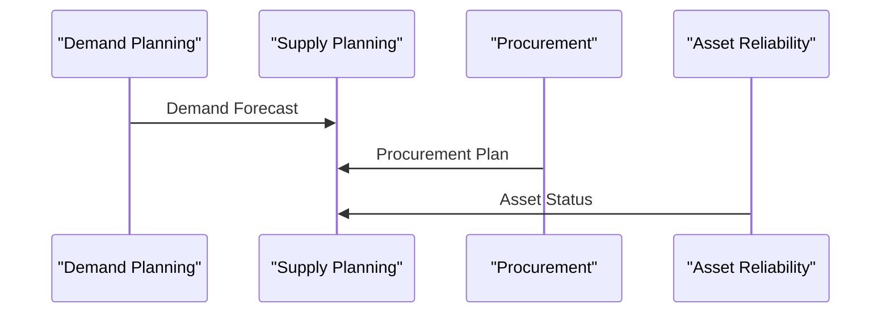

## Agent Interaction Model

### Executive Summary
This document outlines the interaction model between agents in the Energy Enterprise Transformation Advisor repository, derived from existing documentation.

### Agent Interaction Matrix
| Source Agent | Target Agent | Interaction |
|--------------|--------------|-------------|
| Demand Planning | Supply Planning | Demand Forecast |
| Procurement | Supply Planning | Procurement Plan |
| Asset Reliability | Supply Planning | Asset Status |

### Input Data Contracts
| Agent | Input Data | Source |
|-------|------------|--------|
| Demand Planning | Customer data, Product data | Customer Master, Product Master |
| Supply Planning | Demand Forecast, Procurement Plan, Asset Status | Demand Planning, Procurement, Asset Reliability |

### Output Data Contracts
| Agent | Output Data | Consumer |
|-------|------------|-----------|
| Demand Planning | Demand Forecast | Supply Planning |
| Supply Planning | Supply Plan | Procurement, Production Planning |
| Procurement | Procurement Plan | Supply Planning |

### Agent Dependencies
| Agent | Dependencies |
|-------|--------------|
| Supply Planning | Demand Planning, Procurement, Asset Reliability |

### Event Triggers
| Event | Triggering Agent | Consuming Agent |
|-------|------------------|------------------|
| Demand Forecast Update | Demand Planning | Supply Planning |
| Procurement Plan Update | Procurement | Supply Planning |
| Asset Status Update | Asset Reliability | Supply Planning |

### Master Agent Routing Logic
- Route demand forecast to Supply Planning agent
- Route procurement plan to Supply Planning agent
- Route asset status to Supply Planning agent

### Human Escalation Rules
- Escalate to human when demand forecast variance exceeds 20%
- Escalate to human when procurement plan conflicts with supply plan

### Top 10 Multi-Agent Scenarios
1. Supply Chain Optimization
2. Asset Maintenance Planning
3. Demand Forecasting
4. Procurement Planning
5. Production Planning
6. Inventory Management
7. Supply Chain Risk Management
8. Asset Performance Monitoring
9. Demand-Supply Matching
10. Procurement-to-Payment

### Mermaid Sequence Diagram
