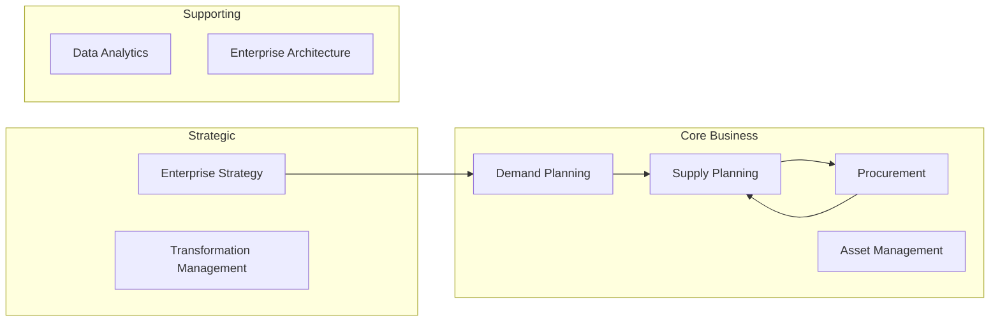

## Enterprise Capability Model

### Executive Summary
This document outlines the enterprise capability model for the Energy Enterprise Transformation Advisor repository, aligning with the 19 agents and derived from existing documentation.

### Capability Hierarchy
- Strategic Capabilities
  - Enterprise Strategy
  - Transformation Management
- Core Business Capabilities
  - Demand Planning
  - Supply Planning
  - Procurement
  - Asset Management
- Supporting Capabilities
  - Data Analytics
  - Enterprise Architecture

### Strategic Capabilities
| Capability | Description | Primary Agent(s) |
|------------|-------------|------------------|
| Enterprise Strategy | Develop and maintain overall enterprise strategy | Corporate Strategy Agent |
| Transformation Management | Manage transformation initiatives across the enterprise | Transformation PMO Agent |

### Core Business Capabilities
| Capability | Description | Primary Agent(s) |
|------------|-------------|------------------|
| Demand Planning | Forecast and manage demand | Demand Planning Agent |
| Supply Planning | Plan and manage supply chain activities | Supply Planning Agent |
| Procurement | Source and procure materials and services | Procurement Agent |
| Asset Management | Manage physical assets throughout their lifecycle | Asset Reliability Agent |

### Supporting Capabilities
| Capability | Description | Primary Agent(s) |
|------------|-------------|------------------|
| Data Analytics | Analyze data to inform business decisions | Data Analytics Agent |
| Enterprise Architecture | Design and maintain enterprise architecture | Enterprise Architecture Agent |

### Capability Ownership Matrix
| Capability | Primary Owner | Secondary Owner(s) |
|------------|---------------|--------------------|
| Demand Planning | Demand Planning Agent | Supply Planning Agent |
| Supply Planning | Supply Planning Agent | Procurement Agent, Demand Planning Agent |

### Capability-to-Agent Mapping
| Capability | Primary Agent(s) |
|------------|---------------|
| Enterprise Strategy | Corporate Strategy Agent |
| Demand Planning | Demand Planning Agent |
| Supply Planning | Supply Planning Agent |
| Procurement | Procurement Agent |

### Capability Dependencies
| Capability | Dependencies |
|------------|--------------|
| Supply Planning | Demand Planning, Procurement |
| Procurement | Supply Planning, Demand Planning |

### Capability Maturity Framework
| Capability | Current Maturity Level | Target Maturity Level |
|------------|------------------------|-------------------------|
| Demand Planning | Level 2 | Level 4 |
| Supply Planning | Level 3 | Level 4 |

### Mermaid Capability Map
