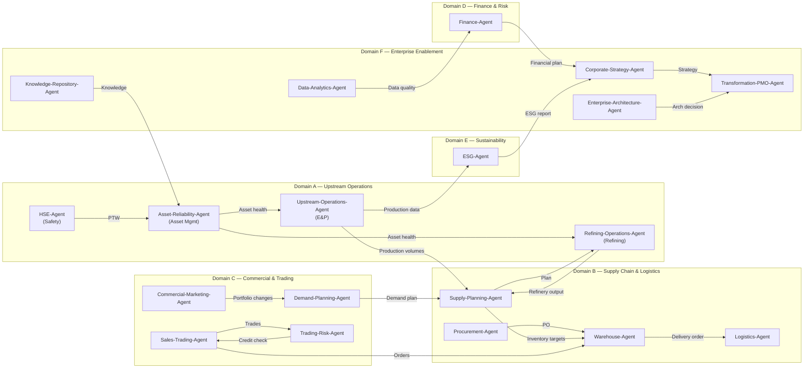
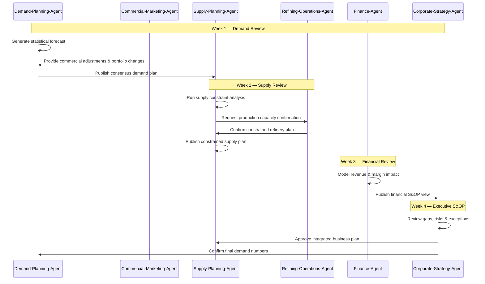
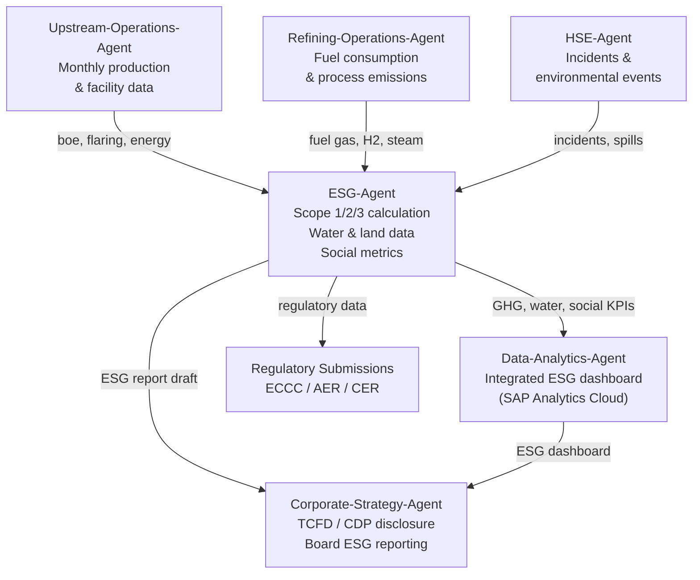

# Enterprise Process Model
## Energy Enterprise Transformation Advisor

**Version:** 1.0  
**Date:** 2026-10-08  
**Repository:** `energy-enterprise-transformation-advisor`  
**Framework:** IBM watsonx Multi-Agent AI System  
**Enterprise Context:** Integrated Canadian Oil & Gas Company (CanPetro — synthetic reference model)

---

## Table of Contents

1. [Executive Summary](#1-executive-summary)
2. [Business Capability Mapping](#2-business-capability-mapping)
3. [Level 0 Enterprise Process Model](#3-level-0-enterprise-process-model)
4. [Level 1 Enterprise Process Hierarchy](#4-level-1-enterprise-process-hierarchy)
5. [Level 2 Process Decomposition — All 19 Agents](#5-level-2-process-decomposition--all-19-agents)
6. [End-to-End Process Flows](#6-end-to-end-process-flows)
7. [Agent Ownership Matrix](#7-agent-ownership-matrix)
8. [Process-to-Dataset Mapping](#8-process-to-dataset-mapping)
9. [Cross-Agent Handoffs](#9-cross-agent-handoffs)
10. [SAP Process Mapping](#10-sap-process-mapping)
11. [Process Maturity Assessment Framework](#11-process-maturity-assessment-framework)
12. [Mermaid Process Diagrams](#12-mermaid-process-diagrams)

---

## 1. Executive Summary

### 1.1 Purpose

This document defines the complete enterprise process model for the **Energy Enterprise Transformation Advisor** — a 19-agent IBM watsonx AI framework purpose-built for global energy enterprises. The model provides:

- A hierarchical process taxonomy from Level 0 (macro domains) to Level 2 (agent-level process decomposition)
- End-to-end process flows spanning multiple agents
- Agent ownership of each process area
- Dataset-to-process traceability across 57 sample datasets and 11 master data entities
- SAP module alignment for enterprise system integration
- A maturity framework for progressive process capability development

### 1.2 Framework Scope

The Energy Enterprise Transformation Advisor covers the full oil and gas value chain:

| Value Chain Stage | Agents Involved |
|---|---|
| **Upstream (Exploration & Production)** | Upstream-Operations-Agent, Asset-Reliability-Agent, HSE-Agent |
| **Midstream & Supply Chain** | Supply-Planning-Agent, Warehouse-Agent, Logistics-Agent, Procurement-Agent |
| **Downstream (Refining & Processing)** | Refining-Operations-Agent, Asset-Reliability-Agent |
| **Commercial & Trading** | Commercial-Marketing-Agent, Sales-Trading-Agent, Trading-Risk-Agent, Demand-Planning-Agent |
| **Finance & Risk** | Finance-Agent, Trading-Risk-Agent |
| **Sustainability & Compliance** | ESG-Agent, HSE-Agent |
| **Enterprise & Transformation** | Corporate-Strategy-Agent, Enterprise-Architecture-Agent, Transformation-PMO-Agent, Data-Analytics-Agent, Knowledge-Repository-Agent |

### 1.3 Repository Coverage

As of the analysis date (2026-10-08), the repository contains:

| Asset Type | Count |
|---|---|
| Agent folders | 19 |
| Root framework files | 5 (README, SKILL, structure, agent-template, entity_relationship_model) |
| Sample-data CSV files | 57 |
| Master data CSV files | 11 |
| Agent data dictionaries | 17 / 19 |
| Master data documentation files | 2 (README_master_data_model.md, master_data_dictionary.md) |
| Master data entities | 11 canonical entities (regions, business_units, plants, facilities, warehouses, assets, customers, suppliers, products, bu_crosswalk, data_relationship_matrix) |

### 1.4 Reference Enterprise

All datasets reference **CanPetro** — a synthetic integrated Canadian oil and gas company with operations across:

- **6 regions:** Western Canada Upstream (AB, BC), Alberta Downstream, Ontario/Quebec Downstream, British Columbia, Prairies (SK/MB), Atlantic
- **20 business units** (BU-001 to BU-020) across upstream, midstream, downstream, and corporate domains
- **20 plants** (refineries R100–R300, upgrader U100, gas plants G100–G300, terminals T100–T800, and specialty plants)
- **33 upstream/midstream facilities** (FAC-01–FAC-25 + pipeline systems, HQ, and distribution centre)
- **12 warehouses** (WH01–WH12) across Alberta, Ontario, Quebec, British Columbia
- **500 assets** (AST-00001–AST-00500) spanning pumps, compressors, heat exchangers, vessels, tanks, and rotating equipment
- **200 customers** (CUS-001–CUS-200) across retail, industrial, and commercial segments
- **200 suppliers** (SUP-0001–SUP-0200) across maintenance, operations, and capital categories
- **100 products** (PRD-001–PRD-100) including crude streams, refined products, NGLs, petrochemicals, and lubricants

---

## 2. Business Capability Mapping

### 2.1 APQC-Aligned Capability Domains

The 19 agents collectively deliver business capabilities across 7 APQC-aligned domains:

| Domain | Code | Agents |
|---|---|---|
| **Develop Vision & Strategy** | D1 | Corporate-Strategy-Agent, Transformation-PMO-Agent |
| **Develop & Manage Products/Services** | D2 | Commercial-Marketing-Agent, Demand-Planning-Agent, Refining-Operations-Agent |
| **Market & Sell Products/Services** | D3 | Sales-Trading-Agent, Commercial-Marketing-Agent, Trading-Risk-Agent |
| **Deliver Products/Services** | D4 | Upstream-Operations-Agent, Refining-Operations-Agent, Supply-Planning-Agent, Warehouse-Agent, Logistics-Agent |
| **Manage Supply Chain** | D5 | Procurement-Agent, Supply-Planning-Agent, Warehouse-Agent, Logistics-Agent |
| **Manage Customer Service** | D6 | Sales-Trading-Agent, Commercial-Marketing-Agent |
| **Develop & Manage Human Capital** | D7 | HSE-Agent (occupational health), Transformation-PMO-Agent |
| **Manage Information Technology** | D8 | Enterprise-Architecture-Agent, Data-Analytics-Agent, Knowledge-Repository-Agent |
| **Manage Financial Resources** | D9 | Finance-Agent, Trading-Risk-Agent |
| **Acquire, Construct & Manage Assets** | D10 | Asset-Reliability-Agent, Upstream-Operations-Agent, Refining-Operations-Agent |
| **Manage Enterprise Risk, Compliance & Resilience** | D11 | HSE-Agent, ESG-Agent, Trading-Risk-Agent |
| **Manage External Relationships** | D12 | Corporate-Strategy-Agent, ESG-Agent, Commercial-Marketing-Agent |
| **Develop & Manage Business Capabilities** | D13 | Transformation-PMO-Agent, Enterprise-Architecture-Agent, Data-Analytics-Agent |

### 2.2 Agent-to-Capability Coverage Map

| Agent | Primary Domain | Secondary Domain | APQC Codes |
|---|---|---|---|
| Corporate-Strategy-Agent | Enterprise Strategy | M&A & Portfolio | D1, D12 |
| Commercial-Marketing-Agent | Marketing & Product | Customer Management | D2, D3, D6 |
| Demand-Planning-Agent | Demand Management | S&OP | D2, D5 |
| Procurement-Agent | Strategic Sourcing | Supplier Management | D5 |
| Supply-Planning-Agent | Supply Planning | Inventory Optimization | D4, D5 |
| Warehouse-Agent | Warehouse Operations | Materials Management | D5 |
| Logistics-Agent | Distribution & Freight | Carrier Management | D4, D5 |
| Upstream-Operations-Agent | E&P Operations | Production Management | D4, D10 |
| Refining-Operations-Agent | Refining & Processing | Yield Optimization | D2, D4, D10 |
| Asset-Reliability-Agent | Asset Performance | Predictive Maintenance | D10 |
| Sales-Trading-Agent | Sales & Contracts | Commercial Optimization | D3, D6 |
| Finance-Agent | FP&A | Cost & Revenue Mgmt | D9 |
| ESG-Agent | Sustainability | Regulatory Reporting | D11, D12 |
| Data-Analytics-Agent | Data & BI | AI/ML Governance | D8, D13 |
| Enterprise-Architecture-Agent | IT Strategy | Integration Architecture | D8, D13 |
| Transformation-PMO-Agent | Program Management | Benefits Tracking | D1, D13 |
| HSE-Agent | Process Safety | Incident Management | D7, D11 |
| Trading-Risk-Agent | Market & Credit Risk | Hedging Strategy | D3, D9, D11 |
| Knowledge-Repository-Agent | Knowledge Management | Institutional Memory | D8, D13 |

---

## 3. Level 0 Enterprise Process Model

The Level 0 model organises the enterprise into **6 macro process domains**, each containing one or more Level 1 process groups. These domains reflect the integrated oil and gas value chain from resource extraction to customer delivery, underpinned by enabling functions.

```
┌──────────────────────────────────────────────────────────────────────────────────────────┐
│                     ENERGY ENTERPRISE TRANSFORMATION ADVISOR                             │
│                        Level 0 Enterprise Process Domains                                │
├───────────────┬──────────────────┬─────────────────┬────────────────┬───────────────────┤
│  DOMAIN A     │    DOMAIN B      │    DOMAIN C      │   DOMAIN D     │    DOMAIN E       │
│  UPSTREAM     │  SUPPLY CHAIN    │  COMMERCIAL      │  FINANCE &     │  SUSTAINABILITY   │
│  OPERATIONS   │  & LOGISTICS     │  & TRADING       │  RISK          │  & COMPLIANCE     │
│               │                  │                  │                │                   │
│  Upstream-Ops │  Procurement     │  Commercial-Mktg │  Finance       │  ESG              │
│  Refining-Ops │  Supply-Planning │  Sales-Trading   │  Trading-Risk  │  HSE              │
│  Asset-Rel    │  Warehouse       │  Demand-Planning │                │                   │
│               │  Logistics       │  Trading-Risk    │                │                   │
├───────────────┴──────────────────┴─────────────────┴────────────────┴───────────────────┤
│                              DOMAIN F — ENTERPRISE ENABLEMENT                            │
│  Corporate-Strategy  │  Enterprise-Architecture  │  Transformation-PMO                   │
│  Data-Analytics      │  Knowledge-Repository                                             │
└──────────────────────────────────────────────────────────────────────────────────────────┘
```

### Domain Definitions

| Domain | Code | Description | Key Agents |
|---|---|---|---|
| **Upstream Operations** | A | Resource extraction, well operations, drilling, facility management, and field production optimisation | Upstream-Ops, Asset-Reliability, HSE |
| **Supply Chain & Logistics** | B | End-to-end physical supply chain from sourcing through inventory, warehouse management, and distribution | Procurement, Supply-Planning, Warehouse, Logistics |
| **Commercial & Trading** | C | Revenue generation, product marketing, customer management, energy trading, risk management, and demand forecasting | Commercial-Mktg, Sales-Trading, Demand-Planning, Trading-Risk |
| **Finance & Risk** | D | Financial planning, budgeting, cost management, trading risk, credit exposure, and hedging | Finance, Trading-Risk |
| **Sustainability & Compliance** | E | ESG reporting, emissions management, process safety, occupational health, environmental compliance, and incident management | ESG, HSE |
| **Enterprise Enablement** | F | Strategy, architecture, data, transformation programme management, and knowledge governance | Corporate-Strategy, Enterprise-Architecture, Transformation-PMO, Data-Analytics, Knowledge-Repository |

---

## 4. Level 1 Enterprise Process Hierarchy

### Domain A — Upstream Operations

| L1 Code | L1 Process | Owning Agent | Key Sub-Processes |
|---|---|---|---|
| A.1 | Exploration & Appraisal | Upstream-Operations-Agent | Resource assessment, well targeting, G&G analysis |
| A.2 | Drilling & Completions | Upstream-Operations-Agent | Well planning, rig scheduling, D&C cost tracking |
| A.3 | Production Operations | Upstream-Operations-Agent | Well production monitoring, facility throughput, downtime management |
| A.4 | Facility Management | Upstream-Operations-Agent | Facility performance, gas plant operations, pipeline integrity |
| A.5 | Asset Performance Management | Asset-Reliability-Agent | Asset health scoring, predictive maintenance, MTBF/MTTR tracking |
| A.6 | Maintenance Execution | Asset-Reliability-Agent | Corrective & preventive maintenance, work order management |
| A.7 | Refining & Processing Operations | Refining-Operations-Agent | Unit operations, yield optimisation, production scheduling |
| A.8 | Refinery Maintenance & Turnaround | Asset-Reliability-Agent, Refining-Operations-Agent | TAR planning, unit shutdown, catalyst management |
| A.9 | Process Safety Management | HSE-Agent | HAZOP/HAZID, barrier management, safety case |
| A.10 | Field HSE Compliance | HSE-Agent | Permit-to-work, hot work, confined space, LOTO |

### Domain B — Supply Chain & Logistics

| L1 Code | L1 Process | Owning Agent | Key Sub-Processes |
|---|---|---|---|
| B.1 | Strategic Sourcing | Procurement-Agent | Category strategy, RFQ/RFP, supplier selection |
| B.2 | Supplier Relationship Management | Procurement-Agent | Supplier performance, risk assessment, qualification |
| B.3 | Contract Management | Procurement-Agent | Contract lifecycle, terms compliance, renewal |
| B.4 | Purchase-to-Pay | Procurement-Agent | PO creation, GR/IR, three-way match, invoice processing |
| B.5 | Demand & Supply Balancing (S&OP) | Supply-Planning-Agent, Demand-Planning-Agent | Monthly S&OP cycle, consensus forecast, supply constraint resolution |
| B.6 | Inventory Planning & Optimisation | Supply-Planning-Agent | Safety stock, reorder points, inventory policy |
| B.7 | Production Planning | Supply-Planning-Agent | Plant production plan, feedstock allocation, capacity utilisation |
| B.8 | Warehouse & Inventory Management | Warehouse-Agent | Stock management, cycle counting, slotting, picking |
| B.9 | Materials Movement | Warehouse-Agent | GR/GI, plant transfers, scrapping, return-to-vendor |
| B.10 | Freight & Distribution | Logistics-Agent | Carrier selection, shipment planning, route optimisation |
| B.11 | Carrier Performance Management | Logistics-Agent | On-time delivery, cost-per-tonne, carrier scorecards |
| B.12 | Distribution Network Optimisation | Logistics-Agent, Supply-Planning-Agent | Network design, lane optimisation, modal shift |

### Domain C — Commercial & Trading

| L1 Code | L1 Process | Owning Agent | Key Sub-Processes |
|---|---|---|---|
| C.1 | Demand Forecasting | Demand-Planning-Agent | Statistical forecast, forecast accuracy, market signal integration |
| C.2 | Sales & Operations Planning | Demand-Planning-Agent, Supply-Planning-Agent | S&OP cycle, unconstrained/constrained forecast, executive review |
| C.3 | Product Portfolio Management | Commercial-Marketing-Agent | Product lifecycle, margin analysis, portfolio rationalisation |
| C.4 | Pricing & Margin Management | Commercial-Marketing-Agent | Price setting, differential management, margin by segment |
| C.5 | Customer Segmentation & Analytics | Commercial-Marketing-Agent | Segment profiling, value analysis, customer scoring |
| C.6 | Order Management | Sales-Trading-Agent | Order entry, contract fulfilment, volume tracking |
| C.7 | Contract & Volume Management | Sales-Trading-Agent | Term contracts, spot transactions, deal book management |
| C.8 | Energy Trading Operations | Sales-Trading-Agent, Trading-Risk-Agent | Physical & paper trading, position management, book valuation |
| C.9 | Trading Risk Management | Trading-Risk-Agent | VaR/CVaR, P&L attribution, counterparty exposure |
| C.10 | Hedging Strategy & Execution | Trading-Risk-Agent | Hedge policy, instrument selection, effectiveness testing |
| C.11 | Market Intelligence | Commercial-Marketing-Agent | Competitor analysis, market pricing, industry benchmarks |
| C.12 | Credit & Counterparty Risk | Trading-Risk-Agent | Credit limits, collateral management, netting |

### Domain D — Finance & Risk

| L1 Code | L1 Process | Owning Agent | Key Sub-Processes |
|---|---|---|---|
| D.1 | Financial Planning & Budgeting | Finance-Agent | Annual budget, rolling forecast, CAPEX planning |
| D.2 | Management Reporting & Analytics | Finance-Agent | Monthly actuals, variance analysis, flash reporting |
| D.3 | Revenue Management | Finance-Agent | Revenue recognition, pricing reconciliation, accruals |
| D.4 | Cost Management | Finance-Agent | Cost centre management, operational cost drivers, benchmarking |
| D.5 | Capital Allocation | Finance-Agent, Corporate-Strategy-Agent | CAPEX governance, project evaluation, NPV/IRR analysis |
| D.6 | Risk Reporting & Compliance | Trading-Risk-Agent, Finance-Agent | Regulatory reporting (ISDA, EMIR), board risk packs |

### Domain E — Sustainability & Compliance

| L1 Code | L1 Process | Owning Agent | Key Sub-Processes |
|---|---|---|---|
| E.1 | Emissions Monitoring & Reporting | ESG-Agent | Scope 1/2/3 GHG, TCFD reporting, CER filings |
| E.2 | Environmental Compliance | ESG-Agent | Water, land, spill management, environmental permits |
| E.3 | Sustainability Strategy | ESG-Agent | Net-zero roadmap, CDP response, sustainability targets |
| E.4 | Social Responsibility | ESG-Agent | Indigenous engagement, social impact, community reporting |
| E.5 | Incident Management | HSE-Agent | Incident reporting (API RP754), investigation, CAPA |
| E.6 | Safety Observations & Near-Miss | HSE-Agent | Safety observation cards, lagging/leading indicator tracking |
| E.7 | Occupational Health | HSE-Agent | Exposure monitoring, medical surveillance, fatigue management |
| E.8 | Regulatory Inspections & Audits | HSE-Agent | Compliance audits, regulatory submissions, corrective actions |

### Domain F — Enterprise Enablement

| L1 Code | L1 Process | Owning Agent | Key Sub-Processes |
|---|---|---|---|
| F.1 | Enterprise Strategy & Portfolio | Corporate-Strategy-Agent | Strategic planning, SWOT, portfolio prioritisation |
| F.2 | Transformation Programme Management | Transformation-PMO-Agent | Programme governance, milestone tracking, benefits realisation |
| F.3 | Change Management | Transformation-PMO-Agent | Readiness assessment, stakeholder engagement, adoption |
| F.4 | Application Portfolio Management | Enterprise-Architecture-Agent | System landscape, rationalisation, lifecycle management |
| F.5 | Integration Architecture | Enterprise-Architecture-Agent | API governance, integration patterns, middleware |
| F.6 | Technology Standards & Roadmap | Enterprise-Architecture-Agent | Architecture principles, tech radar, standards compliance |
| F.7 | Data Governance & Quality | Data-Analytics-Agent | Data ownership, data quality rules, MDM governance |
| F.8 | Business Intelligence & Reporting | Data-Analytics-Agent | Dashboard development, self-service BI, KPI publishing |
| F.9 | AI/ML Model Management | Data-Analytics-Agent | Model registry, performance monitoring, retraining |
| F.10 | Knowledge Capture & Retrieval | Knowledge-Repository-Agent | Document management, best practice library, lessons learned |
| F.11 | Architecture Patterns & Reuse | Knowledge-Repository-Agent, Enterprise-Architecture-Agent | Pattern library, reusable assets, reference architectures |


---

## 5. Level 2 Process Decomposition — All 19 Agents

### 5.1 Corporate-Strategy-Agent

**Domain:** F — Enterprise Enablement  
**L1 Owner:** F.1 Enterprise Strategy & Portfolio, D.5 Capital Allocation

| L2 Code | L2 Process | Description | Key Dataset |
|---|---|---|---|
| F.1.1 | Strategic Planning & Roadmapping | Annual/multi-year strategic planning cycle; scenario modelling; strategic initiatives identification | business_units.csv, regions.csv |
| F.1.2 | Portfolio Analysis & Prioritisation | Business portfolio assessment; BCG/GE matrix analysis; value-at-risk by portfolio segment | business_units.csv |
| F.1.3 | M&A Screening & Evaluation | Acquisition target identification; valuation modelling; synergy assessment | — |
| F.1.4 | Strategic Options Analysis | Real options modelling; sensitivity analysis; strategic scenario comparison | — |
| F.1.5 | Transformation Governance | Strategic initiative oversight; investment case approval; benefits tracking at portfolio level | — |
| D.5.1 | CAPEX Portfolio Governance | Capital allocation framework; project ranking by strategic value and return; gate reviews | plants.csv, facilities.csv |

---

### 5.2 Commercial-Marketing-Agent

**Domain:** C — Commercial & Trading  
**L1 Owner:** C.3 Product Portfolio Mgmt, C.4 Pricing & Margin, C.5 Customer Segmentation, C.11 Market Intelligence

| L2 Code | L2 Process | Description | Key Dataset |
|---|---|---|---|
| C.3.1 | Product Lifecycle Management | Product introduction/discontinuation; margin analysis by product; SKU rationalisation | products.csv |
| C.3.2 | Product Margin Optimisation | Margin modelling by product-region-customer segment; feedstock-to-product economics | products.csv, customers.csv |
| C.4.1 | Pricing Strategy & Execution | Index-linked pricing; differential management; rack pricing; spot vs. term mix | products.csv, regions.csv |
| C.4.2 | Competitor & Market Benchmarking | Market price index tracking; differential vs. benchmark crudes; product price premiums | — |
| C.5.1 | Customer Segmentation | Customer profiling by spend, segment, region; RFM scoring; growth potential ranking | customers.csv |
| C.5.2 | Customer Profitability Analysis | Revenue and margin by customer, segment, and region; wallet share analysis | customers.csv |
| C.11.1 | Market Intelligence & Reporting | Supply/demand balance; market share; competitive landscape reporting | regions.csv |

---

### 5.3 Demand-Planning-Agent

**Domain:** C — Commercial & Trading, B — Supply Chain  
**L1 Owner:** C.1 Demand Forecasting, C.2 S&OP

| L2 Code | L2 Process | Description | Key Dataset |
|---|---|---|---|
| C.1.1 | Baseline Statistical Forecast | Time-series forecasting (ARIMA, exponential smoothing); product-level demand baseline | demand_forecast.csv (agent) |
| C.1.2 | Consensus Forecast Management | Commercial override; field sales input; market event adjustments | forecast_accuracy.csv (agent) |
| C.1.3 | Forecast Accuracy Tracking | MAPE, BIAS, Forecast Value Add measurement; root-cause of error analysis | — |
| C.1.4 | New Product Demand Estimation | Analogue-based forecasting; launch ramp modelling | products.csv |
| C.2.1 | S&OP Demand Review | Preparation and facilitation of the monthly demand review step in the S&OP cycle | customers.csv |
| C.2.2 | Market Signal Integration | Customer order signals; pricing impacts on demand; macroeconomic drivers | customers.csv, regions.csv |

---

### 5.4 Procurement-Agent

**Domain:** B — Supply Chain & Logistics  
**L1 Owner:** B.1 Strategic Sourcing, B.2 SRM, B.3 Contract Mgmt, B.4 Purchase-to-Pay

| L2 Code | L2 Process | Description | Key Dataset |
|---|---|---|---|
| B.1.1 | Category Strategy Development | Spend analysis by category; sourcing strategy (sole source vs. competitive); make-or-buy | suppliers.csv |
| B.1.2 | RFQ / RFP Management | Tender preparation; supplier bid evaluation; award recommendation | suppliers.csv |
| B.1.3 | Supplier Selection & Onboarding | Vendor qualification; safety pre-qualification; Indigenous supplier priority | suppliers.csv |
| B.2.1 | Supplier Performance Scorecard | KPI tracking: delivery, quality, safety, cost; tier classification | suppliers.csv |
| B.2.2 | Supplier Risk Assessment | Financial health; concentration risk; geopolitical exposure; risk tier | suppliers.csv |
| B.3.1 | Contract Lifecycle Management | Contract creation, approval, execution; expiry and renewal tracking | purchase_orders.csv (agent) |
| B.4.1 | Purchase Order Management | PO creation, change management, expediting; three-way match | purchase_orders.csv (agent) |
| B.4.2 | Invoice Processing & GRIR | GR/IR account management; invoice discrepancy resolution | — |

---

### 5.5 Supply-Planning-Agent

**Domain:** B — Supply Chain & Logistics  
**L1 Owner:** B.5 S&OP, B.6 Inventory Planning, B.7 Production Planning, B.12 Network Optimisation

| L2 Code | L2 Process | Description | Key Dataset |
|---|---|---|---|
| B.5.1 | S&OP Supply Review | Capacity-constrained supply plan; supply constraint identification; resolution options | production_plan.csv (agent) |
| B.5.2 | S&OP Executive Review | Integrated business plan; gap and risk review; final approved plan | — |
| B.6.1 | Safety Stock Optimisation | Target stock days; reorder point; days-of-coverage by material-plant | inventory_plan.csv (agent) |
| B.6.2 | Inventory Performance Monitoring | Excess and obsolete inventory; stock turns; carrying cost | inventory_plan.csv (agent) |
| B.7.1 | Monthly Production Plan | Plant-level production planning by product; capacity allocation; run-of-plant | production_plan.csv (agent) |
| B.7.2 | Supply Constraint Management | Constraint identification (feedstock, capacity, logistics); mitigation actions | supply_constraints.csv (agent) |
| B.12.1 | Supply Network Optimisation | Distribution network design; plant-to-customer flow optimisation; modal analysis | plants.csv, warehouses.csv |

---

### 5.6 Warehouse-Agent

**Domain:** B — Supply Chain & Logistics  
**L1 Owner:** B.8 Warehouse & Inventory Mgmt, B.9 Materials Movement

| L2 Code | L2 Process | Description | Key Dataset |
|---|---|---|---|
| B.8.1 | Stock Management | Real-time inventory visibility; bin/location management; material master alignment | inventory_stock.csv (agent) |
| B.8.2 | Cycle Count Programme | Annual cycle count schedule; count execution; variance investigation | cycle_count.csv (agent) |
| B.8.3 | Inventory Accuracy Reporting | Accuracy %; book vs. physical variance; root-cause by warehouse | cycle_count.csv (agent) |
| B.9.1 | Goods Receipts & Issues | SAP movement type processing: GR (101), GI for maintenance (261), GI cost centre (201) | warehouse_movements.csv (agent) |
| B.9.2 | Inter-Plant Transfers | Plant-to-plant transfer orders (SAP mvt 301/311); transit stock management | warehouse_movements.csv (agent) |
| B.9.3 | Scrap & Returns Management | Scrapping (mvt 551), return-to-vendor (122); inventory gain/loss (701/702) | warehouse_movements.csv (agent) |
| B.8.4 | Warehouse Layout & Slotting | Storage type assignment; dangerous goods segregation; capacity utilisation | warehouses.csv |

---

### 5.7 Logistics-Agent

**Domain:** B — Supply Chain & Logistics  
**L1 Owner:** B.10 Freight & Distribution, B.11 Carrier Performance, B.12 Network Optimisation

| L2 Code | L2 Process | Description | Key Dataset |
|---|---|---|---|
| B.10.1 | Shipment Planning & Execution | Load planning; carrier assignment; freight mode selection (truck, rail, pipeline, marine) | shipments.csv (agent) |
| B.10.2 | Route Optimisation | Lane optimisation; multi-stop routing; carbon-efficient routing | — |
| B.10.3 | Freight Cost Management | Freight rate benchmarking; cost-per-unit-shipped; accessorial charge management | freight_costs.csv (agent) |
| B.11.1 | Carrier Performance Scorecard | On-time pick-up/delivery; damage rate; claims processing; carrier tier classification | carrier_performance.csv (agent) |
| B.11.2 | Carrier Contract Management | Spot vs. contract rate management; lane coverage; carrier development programme | — |
| B.12.2 | Delivery Performance Monitoring | Perfect order rate; OTIF; delivery exception management | delivery_performance.csv (agent) |

---

### 5.8 Upstream-Operations-Agent

**Domain:** A — Upstream Operations  
**L1 Owner:** A.1 Exploration, A.2 Drilling, A.3 Production Ops, A.4 Facility Mgmt

| L2 Code | L2 Process | Description | Key Dataset |
|---|---|---|---|
| A.1.1 | Resource Assessment | Resource booking (1P/2P/3P); G&G evaluation; drilling prospect ranking | wells.csv (agent) |
| A.2.1 | Well Planning & Scheduling | AFE preparation; rig scheduling; well programme design | drilling_operations.csv (agent) |
| A.2.2 | Drilling Cost Tracking | D&C cost vs. AFE; NPT tracking; rig contractor performance | drilling_operations.csv (agent) |
| A.3.1 | Production Monitoring | Daily/monthly boe production by well and facility; decline curve analysis | production_metrics.csv (agent) |
| A.3.2 | Production Optimisation | Well performance surveillance; ESP optimisation; GL injection management | production_metrics.csv (agent) |
| A.3.3 | Production Downtime Management | Downtime cause analysis; deferral tracking; uptime improvement | production_metrics.csv (agent) |
| A.4.1 | Facility Throughput Management | Gas plant inlet/outlet balance; separator loading; compression management | facilities.csv |
| A.4.2 | Pipeline Integrity Management | ILI scheduling; anomaly management; hydrostatic testing | facilities.csv |

---

### 5.9 Refining-Operations-Agent

**Domain:** A — Upstream Operations (Downstream processing)  
**L1 Owner:** A.7 Refining & Processing, A.8 Refinery Maintenance

| L2 Code | L2 Process | Description | Key Dataset |
|---|---|---|---|
| A.7.1 | Unit Operations Management | CDU/VDU/FCC/HDS/DHT performance; yield monitoring; unit rate optimisation | refinery_yields.csv (agent) |
| A.7.2 | Linear Programming & Yield Optimisation | LP model for crude blend and product yields; margin maximisation | crude_blends.csv (agent) |
| A.7.3 | Crude & Feedstock Scheduling | Crude receipts; blend sequence; feedstock quality tracking | — |
| A.7.4 | Product Quality Management | Specification compliance; blending recipe management; lab data integration | — |
| A.7.5 | Refinery Production Scheduling | Short-term production scheduling (weekly/daily); unit rate plan | production_schedule.csv (agent) |
| A.8.1 | Turnaround Planning | TAR scope development; contractor management; cost estimation; schedule risk | — |
| A.7.6 | Energy & Utilities Management | Steam balance; fuel gas; hydrogen balance; energy intensity tracking | energy_consumption.csv (agent) |

---

### 5.10 Asset-Reliability-Agent

**Domain:** A — Upstream Operations (cross-domain asset management)  
**L1 Owner:** A.5 Asset Performance Mgmt, A.6 Maintenance Execution

| L2 Code | L2 Process | Description | Key Dataset |
|---|---|---|---|
| A.5.1 | Asset Health Scoring | Composite health index by asset class; criticality-weighted scoring | asset_master.csv (agent), assets.csv |
| A.5.2 | Predictive Maintenance (PdM) | Condition monitoring; vibration/thermography/oil analysis; PdM trigger rules | failure_analysis.csv (agent) |
| A.5.3 | MTBF / MTTR Tracking | Mean time between failure; mean time to repair; availability and reliability KPIs | maintenance_history.csv (agent) |
| A.5.4 | Failure Mode Analysis | FMEA/RCM; top failure modes by equipment class; bad actor identification | failure_analysis.csv (agent) |
| A.6.1 | Work Order Management | WO creation, prioritisation, scheduling, and completion; SAP PM integration | maintenance_history.csv (agent) |
| A.6.2 | Preventive Maintenance Scheduling | PM task list management; compliance %; schedule adherence | maintenance_history.csv (agent) |
| A.6.3 | Maintenance Cost Management | Maintenance cost by asset and plant; cost vs. replacement value (CoRVA) | assets.csv, maintenance_history.csv (agent) |
| A.6.4 | Spares & MRO Management | Critical spare identification; min/max stock; obsolescence management | assets.csv, warehouses.csv |

---

### 5.11 Sales-Trading-Agent

**Domain:** C — Commercial & Trading  
**L1 Owner:** C.6 Order Mgmt, C.7 Contract & Volume, C.8 Energy Trading

| L2 Code | L2 Process | Description | Key Dataset |
|---|---|---|---|
| C.6.1 | Customer Order Management | Order entry; nomination; volume tracking; short/over supply management | customer_orders.csv (agent) |
| C.6.2 | Order Fulfilment Monitoring | Delivery against contract; volume allocation; shortfall resolution | customer_orders.csv (agent) |
| C.7.1 | Term Contract Management | Annual/multi-year supply contracts; volume bands; pricing mechanism | contract_volume.csv (agent) |
| C.7.2 | Spot Transaction Management | Spot deal capture; pricing; settlement confirmation | trading_transactions.csv (agent) |
| C.8.1 | Trading Book Management | Position management; book P&L; daily mark-to-market | trading_transactions.csv (agent) |
| C.8.2 | Deal Capture & Confirmation | Trade entry; confirmation matching; settlement instruction | trading_transactions.csv (agent) |
| C.8.3 | Commercial Optimisation | Margin optimisation; term vs. spot mix; volume reallocation | customers.csv, products.csv |

---

### 5.12 Finance-Agent

**Domain:** D — Finance & Risk  
**L1 Owner:** D.1 FP&A, D.2 Mgmt Reporting, D.3 Revenue Mgmt, D.4 Cost Mgmt

| L2 Code | L2 Process | Description | Key Dataset |
|---|---|---|---|
| D.1.1 | Annual Budget Development | Bottom-up budget; consolidation by BU; capex/opex separation | business_units.csv |
| D.1.2 | Rolling Forecast (RF3/RF9) | Rolling forecast updates; reforecast vs. budget variance; latest estimate | — |
| D.1.3 | Capital Expenditure Planning | Project-level CAPEX plans; funding approval; spend phasing | plants.csv, facilities.csv |
| D.2.1 | Monthly Actuals Reporting | P&L, balance sheet, and cash flow actuals; BU and entity consolidation | business_units.csv |
| D.2.2 | Variance Analysis | Budget vs. actual vs. prior year; driver-based variance commentary | — |
| D.2.3 | Flash Reporting | Early-close P&L estimate; key metric flash for leadership | — |
| D.3.1 | Revenue Reconciliation | Volume × price reconciliation; revenue accruals; intercompany eliminations | products.csv, customers.csv |
| D.4.1 | Cost Centre Management | Opex tracking by cost centre; recharge allocations; BU-level cost visibility | business_units.csv |
| D.4.2 | Operational Cost Benchmarking | Opex per boe; refinery cost per barrel; unit cost vs. industry benchmarks | — |

---

### 5.13 ESG-Agent

**Domain:** E — Sustainability & Compliance  
**L1 Owner:** E.1 Emissions Reporting, E.2 Environmental Compliance, E.3 Sustainability Strategy, E.4 Social Responsibility

| L2 Code | L2 Process | Description | Key Dataset |
|---|---|---|---|
| E.1.1 | GHG Emissions Inventory (Scope 1/2) | Facility-level GHG calculation; CER/ECCC regulatory submission | emissions_data.csv (agent) |
| E.1.2 | Scope 3 Emissions Estimation | Upstream, downstream, and value chain emissions; TCFD disclosure | — |
| E.1.3 | TCFD Reporting | Climate-related financial disclosure; scenario analysis; transition risk | — |
| E.1.4 | Carbon Credit Management | Carbon credit portfolio; offset quality; compliance vs. voluntary | — |
| E.2.1 | Water Management | Water intake, discharge, and recycling; spill tracking; EPEA compliance | water_usage.csv (agent) |
| E.2.2 | Land & Spill Management | Spill volume and severity; remediation tracking; AER reporting | — |
| E.3.1 | Net-Zero Roadmap | Decarbonisation pathway; technology options; reduction target tracking | — |
| E.3.2 | CDP Response Management | CDP climate, water, and forests questionnaire; score tracking | — |
| E.4.1 | Indigenous Engagement Reporting | Consultation activity; benefit agreements; Indigenous business spend % | suppliers.csv |
| E.4.2 | Social Impact Assessment | Community investment; local employment; stakeholder mapping | — |

---

### 5.14 Data-Analytics-Agent

**Domain:** F — Enterprise Enablement  
**L1 Owner:** F.7 Data Governance, F.8 BI & Reporting, F.9 AI/ML Model Mgmt

| L2 Code | L2 Process | Description | Key Dataset |
|---|---|---|---|
| F.7.1 | Data Governance Framework | Data ownership; stewardship; quality rules; golden record management | data_relationship_matrix.csv |
| F.7.2 | Master Data Management | MDM governance; duplicate management; data lineage | master_data_dictionary.md, bu_crosswalk.csv |
| F.7.3 | Data Quality Monitoring | Completeness, accuracy, timeliness; data quality scorecards by domain | — |
| F.8.1 | Enterprise Dashboard Development | Executive and operational dashboards; KPI publishing; standard report library | — |
| F.8.2 | Self-Service BI Enablement | SAP Datasphere & Analytics Cloud configuration; semantic layer management | — |
| F.8.3 | Data Product Management | Data product catalogue; data contract definitions; consumer SLA management | — |
| F.9.1 | ML Model Registry & Governance | Model versioning; champion/challenger; model risk assessment | — |
| F.9.2 | ML Performance Monitoring | Model drift detection; retraining triggers; performance vs. baseline | — |
| F.9.3 | Data Engineering & Pipelines | ETL/ELT pipeline management; data lake integration; SAP CDS view governance | — |

---

### 5.15 Enterprise-Architecture-Agent

**Domain:** F — Enterprise Enablement  
**L1 Owner:** F.4 App Portfolio, F.5 Integration Architecture, F.6 Technology Standards

| L2 Code | L2 Process | Description | Key Dataset |
|---|---|---|---|
| F.4.1 | Application Portfolio Inventory | Full application landscape; lifecycle status (current/sunset/retire); TCO tracking | application_inventory.csv (agent) |
| F.4.2 | Application Rationalisation | Redundancy identification; consolidation planning; decommission roadmap | application_inventory.csv (agent) |
| F.4.3 | ERP Landscape Management | SAP system landscape (ECC/S4HANA); upgrade and migration planning | application_inventory.csv (agent) |
| F.5.1 | Integration Architecture | Integration patterns; API registry; middleware (SAP Integration Suite) governance | integration_inventory.csv (agent) |
| F.5.2 | API Governance | API lifecycle; standards (REST/OData); consumer registration | integration_inventory.csv (agent) |
| F.6.1 | Architecture Principles & Standards | Architecture principles; approved technology standards; guardrails | — |
| F.6.2 | Technology Radar | Emerging technology assessment; adopt/trial/hold/retire classification | — |
| F.6.3 | Architecture Review Board | ARB governance; project architecture review; pattern compliance | — |

---

### 5.16 Transformation-PMO-Agent

**Domain:** F — Enterprise Enablement  
**L1 Owner:** F.2 Transformation PMO, F.3 Change Management

| L2 Code | L2 Process | Description | Key Dataset |
|---|---|---|---|
| F.2.1 | Programme Portfolio Governance | Initiative tracking; strategic alignment; portfolio-level risk and issue management | project_portfolio.csv (agent) |
| F.2.2 | Project Milestone Tracking | Milestone plan vs. actual; critical path management; schedule risk | project_milestones.csv (agent) |
| F.2.3 | Benefits Realisation Management | Benefits register; realisation tracking; value measurement framework | — |
| F.2.4 | Programme Risk & Issue Management | Risk register; escalation paths; RAID log management | project_risks.csv (agent) |
| F.3.1 | Stakeholder Management | Stakeholder mapping; engagement plan; communication calendar | — |
| F.3.2 | Organisational Readiness Assessment | Change readiness survey; capability gap analysis; adoption tracking | — |
| F.3.3 | Training Needs Analysis | Skill gap identification; training plan; completion tracking | — |

---

### 5.17 HSE-Agent

**Domain:** E — Sustainability & Compliance  
**L1 Owner:** E.5 Incident Mgmt, E.6 Safety Observations, E.7 Occupational Health, E.8 Audits & Inspections

| L2 Code | L2 Process | Description | Key Dataset |
|---|---|---|---|
| E.5.1 | Incident Reporting & Classification | API RP754 tier classification; OSHA recordable; severity assessment | incidents.csv (agent) |
| E.5.2 | Incident Investigation (RCA) | Root cause analysis; bow-tie; CAPA development and tracking | incidents.csv (agent) |
| E.5.3 | Leading & Lagging Indicator Tracking | TRIR, LTIF, process safety events; tier 1/2 PSE tracking | safety_observations.csv (agent) |
| E.6.1 | Safety Observation Card Management | STOP/safety observation submission; near-miss reporting; close-out tracking | safety_observations.csv (agent) |
| E.7.1 | Occupational Health Surveillance | Noise/dust/chemical exposure; medical fitness to work; audiometric testing | — |
| E.7.2 | Fatigue Management | Hours-of-service; shift rotation compliance; fatigue risk management | — |
| E.8.1 | Compliance Audit Management | Audit schedule; finding classification; corrective action tracking | compliance_audits.csv (agent) |
| E.8.2 | Regulatory Submission Management | AER, WSIB, Transport Canada submissions; deadline tracking | compliance_audits.csv (agent) |

---

### 5.18 Trading-Risk-Agent

**Domain:** C — Commercial & Trading, D — Finance & Risk  
**L1 Owner:** C.9 Trading Risk, C.10 Hedging, C.12 Credit Risk, D.6 Risk Reporting

| L2 Code | L2 Process | Description | Key Dataset |
|---|---|---|---|
| C.9.1 | Market Risk Measurement | VaR (95%/99%); CVaR; historical simulation; commodity price risk | market_risk_positions.csv (agent) |
| C.9.2 | P&L Attribution | Daily P&L by desk/book; Greeks calculation; risk-P&L reconciliation | trading_pnl.csv (agent) |
| C.10.1 | Hedge Policy Management | Board-approved hedge ratio; instrument policy; tenor constraints | — |
| C.10.2 | Hedge Execution & Monitoring | Hedge instrument selection; execution tracking; effectiveness testing | hedge_positions.csv (agent) |
| C.10.3 | Hedge Effectiveness Testing | Prospective/retrospective test; regression analysis; OCI accounting | — |
| C.12.1 | Counterparty Credit Exposure | Gross/net credit exposure; CSA/ISDA netting; initial margin | counterparty_exposure.csv (agent) |
| C.12.2 | Credit Limit Management | Credit limit setting; utilisation tracking; limit breach alerts | counterparty_exposure.csv (agent) |
| D.6.1 | Risk Regulatory Reporting | EMIR/ISDA reporting; internal risk packs; board risk dashboard | — |

---

### 5.19 Knowledge-Repository-Agent

**Domain:** F — Enterprise Enablement  
**L1 Owner:** F.10 Knowledge Capture, F.11 Architecture Patterns

| L2 Code | L2 Process | Description | Key Dataset |
|---|---|---|---|
| F.10.1 | Document Management | Document capture; metadata tagging; version control; retrieval | knowledge_articles.csv (agent) |
| F.10.2 | Best Practice Library | Best practice identification; peer review; publishing and maintenance | — |
| F.10.3 | Lessons Learned Management | Project/incident lessons captured; searchable knowledge base; dissemination | — |
| F.10.4 | Expert Directory | Subject matter expert registry; skill taxonomy; consultation facilitation | expert_directory.csv (agent) |
| F.11.1 | Reusable Asset Catalogue | Architecture patterns; code templates; configuration blueprints | — |
| F.11.2 | Knowledge Retrieval & Search | Natural language search; contextual retrieval; agent knowledge injection | — |


---

## 6. End-to-End Process Flows

### 6.1 Sales & Operations Planning (S&OP) Cycle

The S&OP cycle runs monthly and spans five agents across Domains B, C, and D.

| Step | Process Step | Agent | Output |
|---|---|---|---|
| 1 | Statistical Demand Forecast | Demand-Planning-Agent | Unconstrained 18-month demand forecast by product-region |
| 2 | Commercial Demand Review | Commercial-Marketing-Agent | Commercial-adjusted demand plan; product portfolio changes |
| 3 | Supply Constraint Identification | Supply-Planning-Agent | Capacity and feedstock constraints; risk scenarios |
| 4 | S&OP Supply Review | Supply-Planning-Agent + Refining-Operations-Agent | Constrained supply plan; inventory plan; production schedule |
| 5 | Financial Review | Finance-Agent | Revenue, margin, and opex impact of the constrained plan |
| 6 | Executive S&OP | Corporate-Strategy-Agent | Approved integrated business plan; exception decisions |
| 7 | Plan Execution | Warehouse-Agent + Logistics-Agent | Inventory targets and distribution plan execution |

---

### 6.2 Procure-to-Pay (P2P)

| Step | Process Step | Agent | Output |
|---|---|---|---|
| 1 | Requisition Creation | Warehouse-Agent / Operations agents | Purchase requisition (SAP PR) |
| 2 | Sourcing & PO Creation | Procurement-Agent | Approved PO (SAP PO) |
| 3 | Goods Receipt | Warehouse-Agent | GR posted; stock updated (SAP mvt 101) |
| 4 | Invoice Verification | Procurement-Agent | Three-way match; invoice approved |
| 5 | Payment Processing | Finance-Agent | Vendor payment; cash flow update |

---

### 6.3 Maintenance-to-Reliability (M2R)

| Step | Process Step | Agent | Output |
|---|---|---|---|
| 1 | Asset Condition Monitoring | Asset-Reliability-Agent | Anomaly detection; health score deterioration alert |
| 2 | Work Order Creation | Asset-Reliability-Agent | SAP PM Work Order (PM01/PM02/PM03) |
| 3 | Materials Requisition | Warehouse-Agent | Spare parts reservation and issue (SAP mvt 261) |
| 4 | HSE Permit & Risk Assessment | HSE-Agent | Permit-to-Work; risk assessment approved |
| 5 | Maintenance Execution | Asset-Reliability-Agent | Work order completion; maintenance history updated |
| 6 | Cost Capture | Finance-Agent | Maintenance cost posted to cost centre / asset |
| 7 | Reliability KPI Update | Asset-Reliability-Agent | MTBF, MTTR, maintenance cost KPIs refreshed |

---

### 6.4 Order-to-Cash (O2C)

| Step | Process Step | Agent | Output |
|---|---|---|---|
| 1 | Customer Order Entry | Sales-Trading-Agent | Sales order captured (SAP SD) |
| 2 | Credit Check | Trading-Risk-Agent | Credit limit validation; exposure updated |
| 3 | Inventory Availability Check | Supply-Planning-Agent + Warehouse-Agent | ATP confirmed; allocation made |
| 4 | Shipment Planning | Logistics-Agent | Delivery order; carrier assigned |
| 5 | Goods Issue & Delivery | Warehouse-Agent | SAP GI posted; delivery confirmed |
| 6 | Invoicing | Finance-Agent | Sales invoice issued; revenue recognised |
| 7 | Collection | Finance-Agent | Payment received; AR cleared |

---

### 6.5 Incident-to-Close (I2C) — HSE

| Step | Process Step | Agent | Output |
|---|---|---|---|
| 1 | Incident / Near-Miss Reporting | HSE-Agent | Incident record created; API RP754 tier assigned |
| 2 | Immediate Response | HSE-Agent + Upstream-Operations-Agent | Production shutdown / isolation if required |
| 3 | Root Cause Investigation | HSE-Agent | RCA report; bow-tie analysis |
| 4 | CAPA Development | HSE-Agent | Corrective action register; owner assignment |
| 5 | CAPA Implementation | Responsible operations agent | Technical or procedural fix implemented |
| 6 | Verification & Close | HSE-Agent | Effectiveness verified; incident closed |
| 7 | Lessons Learned | Knowledge-Repository-Agent | Lesson captured; disseminated to relevant agents |

---

### 6.6 ESG Reporting Cycle

| Step | Process Step | Agent | Output |
|---|---|---|---|
| 1 | Operational Data Collection | Upstream-Operations-Agent, Refining-Operations-Agent, HSE-Agent | Production volumes, energy use, incident counts |
| 2 | Emissions Calculation | ESG-Agent | Scope 1/2 GHG inventory; facility-level tCO2e |
| 3 | Water & Environmental Data | ESG-Agent | Water intake/discharge; spill events |
| 4 | Social Data | ESG-Agent | Indigenous spend; community investment; workforce metrics |
| 5 | External Disclosure | ESG-Agent | TCFD report; CDP submission; AIF/MD&A ESG section |
| 6 | Internal ESG Dashboard | Data-Analytics-Agent | Integrated ESG KPI dashboard; SAP Analytics Cloud |

---

## 7. Agent Ownership Matrix

### 7.1 Primary Process Ownership

| L1 Process | Primary Owner | Secondary Owner | RACI: R | RACI: A |
|---|---|---|---|---|
| A.1 Exploration & Appraisal | Upstream-Operations-Agent | Corporate-Strategy-Agent | Upstream-Ops | Corporate-Strategy |
| A.2 Drilling & Completions | Upstream-Operations-Agent | Finance-Agent | Upstream-Ops | Finance |
| A.3 Production Operations | Upstream-Operations-Agent | Asset-Reliability-Agent | Upstream-Ops | Upstream-Ops |
| A.4 Facility Management | Upstream-Operations-Agent | HSE-Agent | Upstream-Ops | Upstream-Ops |
| A.5 Asset Performance Mgmt | Asset-Reliability-Agent | Upstream-Ops, Refining-Ops | Asset-Reliability | Asset-Reliability |
| A.6 Maintenance Execution | Asset-Reliability-Agent | Warehouse-Agent, HSE-Agent | Asset-Reliability | Asset-Reliability |
| A.7 Refining & Processing | Refining-Operations-Agent | Supply-Planning-Agent | Refining-Ops | Refining-Ops |
| A.8 Refinery TAR | Asset-Reliability-Agent | Refining-Operations-Agent | Asset-Reliability | Refining-Ops |
| A.9 Process Safety | HSE-Agent | Upstream-Ops, Refining-Ops | HSE | HSE |
| A.10 Field HSE Compliance | HSE-Agent | Upstream-Ops | HSE | HSE |
| B.1 Strategic Sourcing | Procurement-Agent | Corporate-Strategy-Agent | Procurement | Procurement |
| B.2 Supplier Relationship Mgmt | Procurement-Agent | — | Procurement | Procurement |
| B.3 Contract Management | Procurement-Agent | Sales-Trading-Agent | Procurement | Procurement |
| B.4 Purchase-to-Pay | Procurement-Agent | Finance-Agent, Warehouse-Agent | Procurement | Finance |
| B.5 S&OP | Demand-Planning-Agent | Supply-Planning-Agent | Demand-Planning | Corporate-Strategy |
| B.6 Inventory Planning | Supply-Planning-Agent | Warehouse-Agent | Supply-Planning | Supply-Planning |
| B.7 Production Planning | Supply-Planning-Agent | Refining-Operations-Agent | Supply-Planning | Refining-Ops |
| B.8 Warehouse & Inventory Mgmt | Warehouse-Agent | Supply-Planning-Agent | Warehouse | Warehouse |
| B.9 Materials Movement | Warehouse-Agent | Procurement-Agent | Warehouse | Warehouse |
| B.10 Freight & Distribution | Logistics-Agent | Supply-Planning-Agent | Logistics | Logistics |
| B.11 Carrier Performance | Logistics-Agent | Procurement-Agent | Logistics | Logistics |
| B.12 Network Optimisation | Logistics-Agent | Supply-Planning-Agent | Logistics | Supply-Planning |
| C.1 Demand Forecasting | Demand-Planning-Agent | Commercial-Marketing-Agent | Demand-Planning | Demand-Planning |
| C.2 S&OP Integration | Demand-Planning-Agent | Supply-Planning-Agent | Demand-Planning | Corporate-Strategy |
| C.3 Product Portfolio Mgmt | Commercial-Marketing-Agent | Refining-Operations-Agent | Commercial-Mktg | Commercial-Mktg |
| C.4 Pricing & Margin | Commercial-Marketing-Agent | Trading-Risk-Agent | Commercial-Mktg | Commercial-Mktg |
| C.5 Customer Segmentation | Commercial-Marketing-Agent | Sales-Trading-Agent | Commercial-Mktg | Commercial-Mktg |
| C.6 Order Management | Sales-Trading-Agent | Warehouse-Agent, Logistics-Agent | Sales-Trading | Sales-Trading |
| C.7 Contract & Volume | Sales-Trading-Agent | Procurement-Agent | Sales-Trading | Sales-Trading |
| C.8 Energy Trading | Sales-Trading-Agent | Trading-Risk-Agent | Sales-Trading | Trading-Risk |
| C.9 Trading Risk | Trading-Risk-Agent | Finance-Agent | Trading-Risk | Trading-Risk |
| C.10 Hedging | Trading-Risk-Agent | Finance-Agent | Trading-Risk | Finance |
| C.11 Market Intelligence | Commercial-Marketing-Agent | Corporate-Strategy-Agent | Commercial-Mktg | Commercial-Mktg |
| C.12 Credit & Counterparty Risk | Trading-Risk-Agent | Sales-Trading-Agent | Trading-Risk | Trading-Risk |
| D.1 FP&A | Finance-Agent | Corporate-Strategy-Agent | Finance | Finance |
| D.2 Management Reporting | Finance-Agent | Data-Analytics-Agent | Finance | Finance |
| D.3 Revenue Management | Finance-Agent | Sales-Trading-Agent | Finance | Finance |
| D.4 Cost Management | Finance-Agent | Upstream-Ops, Refining-Ops | Finance | Finance |
| D.5 Capital Allocation | Finance-Agent | Corporate-Strategy-Agent | Finance | Corporate-Strategy |
| D.6 Risk Reporting | Trading-Risk-Agent | Finance-Agent | Trading-Risk | Finance |
| E.1 Emissions Reporting | ESG-Agent | Upstream-Ops, Refining-Ops | ESG | ESG |
| E.2 Environmental Compliance | ESG-Agent | HSE-Agent | ESG | ESG |
| E.3 Sustainability Strategy | ESG-Agent | Corporate-Strategy-Agent | ESG | Corporate-Strategy |
| E.4 Social Responsibility | ESG-Agent | Corporate-Strategy-Agent | ESG | Corporate-Strategy |
| E.5 Incident Management | HSE-Agent | Upstream-Ops, Refining-Ops | HSE | HSE |
| E.6 Safety Observations | HSE-Agent | — | HSE | HSE |
| E.7 Occupational Health | HSE-Agent | — | HSE | HSE |
| E.8 Regulatory Audits | HSE-Agent | ESG-Agent | HSE | HSE |
| F.1 Enterprise Strategy | Corporate-Strategy-Agent | Transformation-PMO-Agent | Corp-Strategy | Corp-Strategy |
| F.2 Transformation PMO | Transformation-PMO-Agent | Corporate-Strategy-Agent | Trans-PMO | Trans-PMO |
| F.3 Change Management | Transformation-PMO-Agent | — | Trans-PMO | Trans-PMO |
| F.4 App Portfolio | Enterprise-Architecture-Agent | Data-Analytics-Agent | EA | EA |
| F.5 Integration Architecture | Enterprise-Architecture-Agent | Data-Analytics-Agent | EA | EA |
| F.6 Technology Standards | Enterprise-Architecture-Agent | — | EA | EA |
| F.7 Data Governance | Data-Analytics-Agent | Enterprise-Architecture-Agent | Data-Analytics | Data-Analytics |
| F.8 BI & Reporting | Data-Analytics-Agent | Finance-Agent | Data-Analytics | Data-Analytics |
| F.9 AI/ML Model Mgmt | Data-Analytics-Agent | Enterprise-Architecture-Agent | Data-Analytics | EA |
| F.10 Knowledge Capture | Knowledge-Repository-Agent | — | Knowledge-Repo | Knowledge-Repo |
| F.11 Architecture Patterns | Knowledge-Repository-Agent | Enterprise-Architecture-Agent | Knowledge-Repo | EA |

---

## 8. Process-to-Dataset Mapping

### 8.1 Master Data to Process Mapping

| Master Dataset | Records | Processes Supported | Agents Using |
|---|---|---|---|
| `regions.csv` | 6 | Market analysis, pricing zones, regulatory framing, geographic reporting | Commercial-Mktg, Demand-Planning, ESG, Finance |
| `business_units.csv` | 20 | BU-level FP&A, portfolio analysis, consolidation, strategy | Finance, Corporate-Strategy, Transformation-PMO |
| `plants.csv` | 20 | Production planning, supply network, refinery scheduling, capex | Supply-Planning, Refining-Ops, Finance, Asset-Reliability |
| `facilities.csv` | 33 | Upstream production, ESG boundary, asset management, HSE | Upstream-Ops, ESG, Asset-Reliability, HSE |
| `warehouses.csv` | 12 | Inventory management, materials movement, logistics | Warehouse, Logistics, Supply-Planning |
| `assets.csv` | 500 | Asset health, maintenance cost, criticality, reliability KPIs | Asset-Reliability, HSE, Refining-Ops, Upstream-Ops |
| `customers.csv` | 200 | Demand forecast, order management, segmentation, credit risk | Demand-Planning, Sales-Trading, Commercial-Mktg, Trading-Risk |
| `suppliers.csv` | 200 | Strategic sourcing, SRM, P2P, Indigenous procurement | Procurement |
| `products.csv` | 100 | Product portfolio, pricing, yield analysis, supply planning | Commercial-Mktg, Refining-Ops, Supply-Planning, Sales-Trading |
| `bu_crosswalk.csv` | ~90 | BU label normalisation across agent datasets | Data-Analytics, Procurement, Finance |
| `data_relationship_matrix.csv` | ~80 | FK coverage tracking; cross-agent data integration quality | Data-Analytics, Enterprise-Architecture |

### 8.2 Agent Sample Data to Process Mapping

| Agent | Dataset File | Records | Primary Process |
|---|---|---|---|
| Asset-Reliability | `asset_master.csv` | 500 | Asset health scoring (A.5.1) |
| Asset-Reliability | `maintenance_history.csv` | — | Work order management (A.6.1), MTBF/MTTR (A.5.3) |
| Asset-Reliability | `failure_analysis.csv` | — | Failure mode analysis (A.5.4), PdM triggers (A.5.2) |
| Asset-Reliability | `data_dictionary.md` | — | Documentation |
| Commercial-Marketing | `customer_segments.csv` | — | Customer segmentation (C.5.1) |
| Commercial-Marketing | `market_pricing.csv` | — | Pricing strategy (C.4.1), Market intelligence (C.11.1) |
| Commercial-Marketing | `product_margins.csv` | — | Product margin optimisation (C.3.2) |
| Demand-Planning | `demand_forecast.csv` | — | Statistical forecast (C.1.1) |
| Demand-Planning | `forecast_accuracy.csv` | — | Forecast accuracy tracking (C.1.3) |
| ESG | `emissions_data.csv` | — | GHG inventory (E.1.1) |
| ESG | `water_usage.csv` | — | Water management (E.2.1) |
| Finance | `budget_vs_actuals.csv` | — | Variance analysis (D.2.2) |
| Finance | `cost_centres.csv` | — | Cost centre management (D.4.1) |
| HSE | `incidents.csv` | — | Incident reporting (E.5.1), RCA (E.5.2) |
| HSE | `safety_observations.csv` | — | Safety observation management (E.6.1) |
| HSE | `compliance_audits.csv` | — | Compliance audit management (E.8.1) |
| Logistics | `shipments.csv` | — | Shipment planning (B.10.1) |
| Logistics | `carrier_performance.csv` | — | Carrier performance scorecard (B.11.1) |
| Logistics | `freight_costs.csv` | — | Freight cost management (B.10.3) |
| Logistics | `delivery_performance.csv` | — | Delivery performance monitoring (B.12.2) |
| Procurement | `purchase_orders.csv` | — | PO management (B.4.1) |
| Procurement | `supplier_performance.csv` | — | Supplier performance (B.2.1) |
| Procurement | `contracts.csv` | — | Contract lifecycle (B.3.1) |
| Refining-Ops | `refinery_yields.csv` | — | Unit operations management (A.7.1) |
| Refining-Ops | `crude_blends.csv` | — | LP & yield optimisation (A.7.2) |
| Refining-Ops | `production_schedule.csv` | — | Production scheduling (A.7.5) |
| Refining-Ops | `energy_consumption.csv` | — | Energy & utilities management (A.7.6) |
| Sales-Trading | `customer_orders.csv` | — | Order management (C.6.1) |
| Sales-Trading | `trading_transactions.csv` | — | Trading book management (C.8.1) |
| Sales-Trading | `contract_volume.csv` | — | Contract & volume management (C.7.1) |
| Supply-Planning | `inventory_plan.csv` | — | Inventory planning (B.6.1) |
| Supply-Planning | `production_plan.csv` | — | Monthly production plan (B.7.1) |
| Supply-Planning | `supply_constraints.csv` | — | Supply constraint management (B.7.2) |
| Trading-Risk | `market_risk_positions.csv` | — | Market risk measurement (C.9.1) |
| Trading-Risk | `trading_pnl.csv` | — | P&L attribution (C.9.2) |
| Trading-Risk | `hedge_positions.csv` | — | Hedge execution & monitoring (C.10.2) |
| Trading-Risk | `counterparty_exposure.csv` | — | Credit exposure management (C.12.1) |
| Upstream-Ops | `wells.csv` | 300 | Well production monitoring (A.3.1) |
| Upstream-Ops | `drilling_operations.csv` | 300 | Drilling cost tracking (A.2.2) |
| Upstream-Ops | `production_metrics.csv` | 500 | Production optimisation (A.3.2) |
| Warehouse | `inventory_stock.csv` | 500 | Stock management (B.8.1) |
| Warehouse | `cycle_count.csv` | 500 | Cycle count programme (B.8.2) |
| Warehouse | `warehouse_movements.csv` | 1,000 | Materials movement (B.9.1) |
| Enterprise-Architecture | `application_inventory.csv` | — | App portfolio (F.4.1) |
| Enterprise-Architecture | `integration_inventory.csv` | — | Integration architecture (F.5.1) |
| Transformation-PMO | `project_portfolio.csv` | — | Programme portfolio governance (F.2.1) |
| Transformation-PMO | `project_milestones.csv` | — | Milestone tracking (F.2.2) |
| Transformation-PMO | `project_risks.csv` | — | Risk & issue management (F.2.4) |
| Knowledge-Repository | `knowledge_articles.csv` | — | Document management (F.10.1) |
| Knowledge-Repository | `expert_directory.csv` | — | Expert directory (F.10.4) |
| Data-Analytics | `data_quality_metrics.csv` | — | Data quality monitoring (F.7.3) |
| Corporate-Strategy | `strategic_initiatives.csv` | — | Portfolio analysis (F.1.2) |

---

## 9. Cross-Agent Handoffs

### 9.1 Handoff Registry

A handoff is a formal data or decision transfer between two agents, triggering downstream process activity.

| ID | From Agent | To Agent | Handoff Trigger | Data Transferred | Process Flow |
|---|---|---|---|---|---|
| H-01 | Demand-Planning-Agent | Supply-Planning-Agent | Monthly demand review approved | Consensus demand plan by product-plant | S&OP (§6.1) |
| H-02 | Supply-Planning-Agent | Refining-Operations-Agent | S&OP supply review complete | Production plan by plant (volumes/products) | S&OP (§6.1) |
| H-03 | Supply-Planning-Agent | Warehouse-Agent | Inventory plan approved | Safety stock targets; reorder points | S&OP (§6.1) |
| H-04 | Supply-Planning-Agent | Logistics-Agent | Distribution plan issued | Plant-to-customer volume allocations | S&OP (§6.1) |
| H-05 | Commercial-Marketing-Agent | Demand-Planning-Agent | Product portfolio changes | Product launches/discontinuations; price changes | S&OP (§6.1) |
| H-06 | Corporate-Strategy-Agent | Finance-Agent | Strategic plan approved | Strategic investment decisions; CAPEX envelope | Capital Allocation (§D.5) |
| H-07 | Finance-Agent | Corporate-Strategy-Agent | Financial impact assessment | NPV/IRR analysis; financial model | Capital Allocation |
| H-08 | Asset-Reliability-Agent | Warehouse-Agent | Work order materials requirement | Spare parts reservation request | M2R (§6.3) |
| H-09 | Asset-Reliability-Agent | HSE-Agent | Maintenance job planned | Job hazard analysis; PTW requirement | M2R (§6.3) |
| H-10 | HSE-Agent | Asset-Reliability-Agent | Permit-to-Work approved | PTW clearance; safety conditions | M2R (§6.3) |
| H-11 | Asset-Reliability-Agent | Finance-Agent | Work order completed | Maintenance cost actuals | M2R (§6.3) |
| H-12 | Sales-Trading-Agent | Trading-Risk-Agent | Deal captured | Trade details; counterparty; volume; price | O2C (§6.4) |
| H-13 | Trading-Risk-Agent | Sales-Trading-Agent | Credit check complete | Credit limit approval / decline | O2C (§6.4) |
| H-14 | Sales-Trading-Agent | Warehouse-Agent | Sales order confirmed | Allocation request; delivery date | O2C (§6.4) |
| H-15 | Warehouse-Agent | Logistics-Agent | Goods ready for dispatch | Delivery order; shipping instruction | O2C (§6.4) |
| H-16 | Logistics-Agent | Finance-Agent | Delivery confirmed | Delivery note; POD for invoicing | O2C (§6.4) |
| H-17 | Upstream-Operations-Agent | ESG-Agent | Monthly production data | Production volumes; flaring volumes; energy use | ESG Cycle (§6.6) |
| H-18 | Refining-Operations-Agent | ESG-Agent | Monthly refinery data | Fuel consumption; emissions; effluent | ESG Cycle (§6.6) |
| H-19 | HSE-Agent | ESG-Agent | Incident data | HSE incidents; environmental events | ESG Cycle (§6.6) |
| H-20 | ESG-Agent | Corporate-Strategy-Agent | ESG report draft | Sustainability KPIs; regulatory submissions | ESG Cycle (§6.6) |
| H-21 | HSE-Agent | Knowledge-Repository-Agent | Incident closed | Lessons learned record | I2C (§6.5) |
| H-22 | Procurement-Agent | Warehouse-Agent | PO placed | Expected delivery; material; quantity | P2P (§6.2) |
| H-23 | Warehouse-Agent | Procurement-Agent | Goods receipt posted | GR confirmation; quantity/quality variance | P2P (§6.2) |
| H-24 | Procurement-Agent | Finance-Agent | Invoice approved | Three-way match result; payment instruction | P2P (§6.2) |
| H-25 | Transformation-PMO-Agent | Corporate-Strategy-Agent | Milestone report | Programme status; benefits realised; risks | Transformation Governance |
| H-26 | Enterprise-Architecture-Agent | Transformation-PMO-Agent | Architecture decision | Technology decision record; project impact | Transformation Governance |
| H-27 | Data-Analytics-Agent | All agents | Data quality report | Data quality scores; anomaly alerts | Ongoing |
| H-28 | Knowledge-Repository-Agent | All agents | Knowledge retrieval | Best practice documents; lessons learned | On demand |

### 9.2 Agent Interaction Density

| Agent | Sends To (count) | Receives From (count) | Total Interactions |
|---|---|---|---|
| Asset-Reliability-Agent | 3 (Warehouse, HSE, Finance) | 2 (HSE, Upstream-Ops) | 5 |
| Commercial-Marketing-Agent | 1 (Demand-Planning) | 0 | 1 |
| Corporate-Strategy-Agent | 1 (Finance) | 4 (Finance, ESG, Trans-PMO, EA) | 5 |
| Data-Analytics-Agent | N (all agents) | N (all agents) | N+N |
| Demand-Planning-Agent | 1 (Supply-Planning) | 1 (Commercial-Mktg) | 2 |
| ESG-Agent | 1 (Corporate-Strategy) | 3 (Upstream-Ops, Refining-Ops, HSE) | 4 |
| Enterprise-Architecture-Agent | 1 (Trans-PMO) | 0 | 1 |
| Finance-Agent | 1 (Corporate-Strategy) | 4 (Asset-Reliability, Logistics, Procurement, Sales-Trading) | 5 |
| HSE-Agent | 2 (Asset-Reliability, ESG) | 1 (Asset-Reliability) | 3 |
| Knowledge-Repository-Agent | N (all agents) | 1 (HSE) | N+1 |
| Logistics-Agent | 1 (Finance) | 2 (Warehouse, Supply-Planning) | 3 |
| Procurement-Agent | 2 (Warehouse, Finance) | 1 (Warehouse) | 3 |
| Refining-Operations-Agent | 1 (ESG) | 1 (Supply-Planning) | 2 |
| Sales-Trading-Agent | 2 (Trading-Risk, Warehouse) | 1 (Trading-Risk) | 3 |
| Supply-Planning-Agent | 3 (Refining-Ops, Warehouse, Logistics) | 1 (Demand-Planning) | 4 |
| Trading-Risk-Agent | 1 (Sales-Trading) | 1 (Sales-Trading) | 2 |
| Transformation-PMO-Agent | 1 (Corporate-Strategy) | 1 (EA) | 2 |
| Upstream-Operations-Agent | 1 (ESG) | 0 | 1 |
| Warehouse-Agent | 2 (Logistics, Procurement) | 3 (Sales-Trading, Asset-Reliability, Procurement) | 5 |


---

## 10. SAP Process Mapping

### 10.1 SAP Module Coverage by Agent

| Agent | Primary SAP Modules | Secondary SAP Modules | SAP BTP Services |
|---|---|---|---|
| Corporate-Strategy-Agent | SAP S/4HANA Finance (FI-CO) | SAP Analytics Cloud | SAP Build Process Automation |
| Commercial-Marketing-Agent | SAP S/4HANA SD (Sales & Distribution) | SAP CRM / C4C | SAP Analytics Cloud |
| Demand-Planning-Agent | SAP IBP (Integrated Business Planning) | SAP S/4HANA SD | SAP Analytics Cloud |
| Procurement-Agent | SAP S/4HANA MM (Materials Mgmt) — Purchasing | SAP Ariba Sourcing & Contracts | SAP Business Network |
| Supply-Planning-Agent | SAP IBP Supply | SAP S/4HANA PP/MRP | SAP Analytics Cloud |
| Warehouse-Agent | SAP S/4HANA WM / EWM (Extended Warehouse Mgmt) | SAP S/4HANA MM-IM | — |
| Logistics-Agent | SAP Transportation Management (TM) | SAP S/4HANA WM | SAP Business Network Logistics |
| Upstream-Operations-Agent | SAP S/4HANA Oil & Gas (RM-RA) | SAP PM (Plant Maintenance) | SAP Asset Intelligence Network |
| Refining-Operations-Agent | SAP S/4HANA Oil & Gas (OG-IS) | SAP PP (Production Planning) | SAP Analytics Cloud |
| Asset-Reliability-Agent | SAP S/4HANA PM (Plant Maintenance) | SAP Asset Strategy & Performance Mgmt | SAP Asset Intelligence Network |
| Sales-Trading-Agent | SAP S/4HANA SD | SAP Commodity Management / CTRM | SAP Analytics Cloud |
| Finance-Agent | SAP S/4HANA FI (Financial Accounting) | SAP S/4HANA CO (Controlling) | SAP Analytics Cloud, Group Reporting |
| ESG-Agent | SAP Sustainability Control Tower | SAP S/4HANA FI-SL | SAP BTP Data Sphere |
| Data-Analytics-Agent | SAP Datasphere | SAP Analytics Cloud | SAP BTP AI Core, SAP BTP Integration Suite |
| Enterprise-Architecture-Agent | SAP LeanIX | SAP S/4HANA (landscape) | SAP BTP Integration Suite |
| Transformation-PMO-Agent | SAP S/4HANA PS (Project System) | SAP Enable Now | SAP Build Process Automation |
| HSE-Agent | SAP S/4HANA EH&S (Environment, Health & Safety) | SAP S/4HANA PM | SAP Sustainability Control Tower |
| Trading-Risk-Agent | SAP Commodity Management / CTRM (ETRM) | SAP S/4HANA TRM (Treasury & Risk) | SAP Analytics Cloud |
| Knowledge-Repository-Agent | SAP Build Work Zone | SAP Enable Now | SAP AI Core (RAG), SAP BTP |

### 10.2 SAP Module to Process Mapping

| SAP Module | L1 Processes Supported | Owning Agent(s) |
|---|---|---|
| SAP S/4HANA MM — Purchasing (MM-PUR) | B.1, B.2, B.3, B.4 | Procurement-Agent |
| SAP S/4HANA MM — Inventory Management (MM-IM) | B.8, B.9 | Warehouse-Agent |
| SAP S/4HANA WM / EWM | B.8 | Warehouse-Agent |
| SAP S/4HANA SD | C.6, C.7, D.3 | Sales-Trading-Agent, Finance-Agent |
| SAP S/4HANA PP / MRP | B.7 | Supply-Planning-Agent |
| SAP S/4HANA PM | A.5, A.6 | Asset-Reliability-Agent |
| SAP S/4HANA FI | D.1, D.2, D.3, D.4 | Finance-Agent |
| SAP S/4HANA CO | D.1, D.4 | Finance-Agent |
| SAP S/4HANA PS | F.2 | Transformation-PMO-Agent |
| SAP S/4HANA EH&S | E.5, E.6, E.7, E.8 | HSE-Agent |
| SAP S/4HANA Oil & Gas (RM-RA / OG-IS) | A.3, A.7 | Upstream-Ops, Refining-Ops |
| SAP IBP | B.5, B.6, C.1, C.2 | Demand-Planning-Agent, Supply-Planning-Agent |
| SAP TM (Transportation Mgmt) | B.10, B.11 | Logistics-Agent |
| SAP Ariba | B.1, B.2, B.3 | Procurement-Agent |
| SAP CTRM / Commodity Mgmt | C.8, C.9, C.10, C.12 | Sales-Trading-Agent, Trading-Risk-Agent |
| SAP TRM (Treasury & Risk) | D.6, C.10 | Trading-Risk-Agent |
| SAP Sustainability Control Tower | E.1, E.2, E.3 | ESG-Agent |
| SAP Datasphere | F.7, F.8, F.9 | Data-Analytics-Agent |
| SAP Analytics Cloud (SAC) | F.8, D.2, C.1 | Data-Analytics-Agent, Finance-Agent |
| SAP LeanIX | F.4, F.5, F.6 | Enterprise-Architecture-Agent |
| SAP AI Core | F.9 | Data-Analytics-Agent |
| SAP Build Work Zone | F.10, F.11 | Knowledge-Repository-Agent |

### 10.3 Master Data in SAP

| SAP Master Data Object | Master Entity | Agent(s) |
|---|---|---|
| SAP Plant (Werk) | `plants.csv` (Plant_ID → SAP_Plant_Code) | Supply-Planning, Refining-Ops, Warehouse |
| SAP Storage Location | `warehouses.csv` (SAP_Storage_Location) | Warehouse-Agent |
| SAP Company Code | `business_units.csv` (ERP_Company_Code) | Finance-Agent |
| SAP Sales Organisation | `regions.csv` (SAP_Sales_Org) | Commercial-Mktg, Sales-Trading |
| SAP Maintenance Plant | `assets.csv` (SAP_Maintenance_Plant) | Asset-Reliability-Agent |
| SAP Material Type | `products.csv` (SAP_Material_Type) | Procurement, Supply-Planning |
| SAP Product Hierarchy | `products.csv` (SAP_Product_Hierarchy) | Commercial-Mktg |
| SAP Equipment / Functional Location | `assets.csv` (Functional_Location) | Asset-Reliability-Agent |
| SAP Customer Master | `customers.csv` | Sales-Trading, Commercial-Mktg |
| SAP Vendor Master | `suppliers.csv` | Procurement-Agent |

---

## 11. Process Maturity Assessment Framework

### 11.1 Maturity Levels

| Level | Name | Description |
|---|---|---|
| **0** | **Not Defined** | Process does not exist; no documentation or data assets |
| **1** | **Initial** | Process defined in agent README; sample data exists; no automation |
| **2** | **Managed** | Data dictionary present; process inputs/outputs mapped; SAP module identified |
| **3** | **Defined** | Agent prompts documented; SAP integration designed; KPIs defined with targets |
| **4** | **Quantitatively Managed** | Agent operational; KPIs tracked in real-time; ML/AI models active |
| **5** | **Optimising** | Continuous improvement loop; cross-agent orchestration; predictive insights |

### 11.2 Current Process Maturity by Domain

Based on repository state as of 2026-10-08:

| Domain | Representative Process | Current Level | Evidence |
|---|---|---|---|
| **A — Upstream Operations** | A.3 Production Operations | **1** | README ✅, sample data ✅, data_dictionary ✅, SAP module identified (this doc) |
| **A — Asset Reliability** | A.5 Asset Performance Mgmt | **1** | README ✅, 3 CSV datasets ✅, data_dictionary ✅ |
| **A — Refining Operations** | A.7 Refining & Processing | **1** | README ✅, sample data ✅, data_dictionary ✅ |
| **B — Procurement** | B.4 Purchase-to-Pay | **1** | README ✅, sample data ✅, data_dictionary ✅ |
| **B — Supply Planning** | B.6 Inventory Planning | **1** | README ✅, sample data ✅, data_dictionary ✅ |
| **B — Warehouse** | B.8 Warehouse Mgmt | **1** | README ✅, 3 CSV datasets ✅, data_dictionary ✅ |
| **B — Logistics** | B.10 Freight & Distribution | **1** | README ✅, 4 CSV datasets ✅, data_dictionary ✅ (largest: 4,064 bytes) |
| **C — Demand Planning** | C.1 Demand Forecasting | **1** | README ✅, sample data ✅, data_dictionary variant ✅ |
| **C — Commercial** | C.3 Product Portfolio | **1** | README ✅, sample data ✅, data_dictionary ✅ |
| **C — Sales Trading** | C.6 Order Management | **1** | README ✅, 3 CSV datasets ✅, data_dictionary ✅ |
| **C — Trading Risk** | C.9 Market Risk | **1** | README ✅, sample data ✅, data_dictionary ✅ |
| **D — Finance** | D.1 FP&A | **1** | README ✅, sample data ✅, data_dictionary ✅ |
| **E — ESG** | E.1 Emissions Reporting | **1** | README ✅, sample data ✅, data_dictionary ✅ |
| **E — HSE** | E.5 Incident Management | **1** | README ✅, 3 CSV datasets ✅, data_dictionary ✅ |
| **F — Corporate Strategy** | F.1 Enterprise Strategy | **1** | README ✅, sample data ✅, **no data_dictionary** |
| **F — Enterprise Architecture** | F.4 App Portfolio | **1** | README ✅, sample data ✅, data_dictionary ✅ |
| **F — Transformation PMO** | F.2 Programme Mgmt | **1** | README ✅, sample data ✅, **no data_dictionary** |
| **F — Data Analytics** | F.7 Data Governance | **1** | README ✅, sample data ✅, data_dictionary ✅ |
| **F — Knowledge Repository** | F.10 Knowledge Capture | **1** | README ✅, sample data ✅, data_dictionary ✅ |

**Overall Process Maturity: Level 1 (Initial) across all 19 agents.**  
All agents have completed the foundational Level 1 evidence requirements. The entire estate is positioned for a coordinated Level 2 uplift.

### 11.3 Level 2 Uplift Requirements

To achieve Level 2 (Managed) across all processes:

| Requirement | Status | Effort |
|---|---|---|
| Data dictionary per agent | 17/19 ✅ (2 missing: Corporate-Strategy, Trans-PMO) | Low — 2 docs to create |
| Process inputs/outputs mapped | 0/19 | Medium — add Key Data Inputs/Outputs tables to all READMEs |
| SAP module identified | 0/19 (now defined in this document — Section 10) | Complete — use this doc |
| Cross-agent handoffs documented | 0/19 (now defined in this document — Section 9) | Complete — use this doc |
| KPI definitions | 0/19 | Medium — create `kpis.md` per agent |

### 11.4 Level 3 Uplift Requirements

| Requirement | Status | Effort |
|---|---|---|
| Agent prompt templates | 0/19 | High — create `prompts/` folder per agent |
| SAP integration design | 0/19 | High — create `sap-integration.md` per agent |
| KPIs with targets and thresholds | 0/19 | Medium — complete `kpis.md` per agent |
| Process flow diagrams | 0/19 | Medium — Mermaid diagrams per L1 process |

---

## 12. Mermaid Process Diagrams

### 12.1 Enterprise Value Chain — Level 0



---

### 12.2 S&OP Monthly Process Flow



---

### 12.3 Maintenance-to-Reliability (M2R) Process Flow

```mermaid
sequenceDiagram
    participant ARA as Asset-Reliability-Agent
    participant HSE as HSE-Agent
    participant WHS as Warehouse-Agent
    participant FIN as Finance-Agent
    participant KNW as Knowledge-Repository-Agent

    ARA->>ARA: Detect asset anomaly / health deterioration
    ARA->>ARA: Create SAP PM Work Order
    ARA->>WHS: Reserve spare parts (SAP Reservation)
    ARA->>HSE: Request Permit-to-Work (PTW)
    HSE->>HSE: Review JHA / risk assessment
    HSE->>ARA: Issue PTW clearance
    WHS->>WHS: Issue parts to work order (SAP mvt 261)
    ARA->>ARA: Execute maintenance task
    ARA->>ARA: Complete work order; record findings
    ARA->>FIN: Post maintenance cost to asset/cost centre
    ARA->>KNW: Log failure mode & repair findings
    KNW->>KNW: Update best practice library
    ARA->>ARA: Recalculate MTBF / asset health score
```

---

### 12.4 Order-to-Cash (O2C) Process Flow

```mermaid
sequenceDiagram
    participant STA as Sales-Trading-Agent
    participant TRK as Trading-Risk-Agent
    participant SPL as Supply-Planning-Agent
    participant WHS as Warehouse-Agent
    participant LOG as Logistics-Agent
    participant FIN as Finance-Agent

    STA->>STA: Capture customer order / trade
    STA->>TRK: Request credit check
    TRK->>TRK: Validate credit limit & counterparty exposure
    TRK->>STA: Return credit decision (approve / decline)
    STA->>SPL: Availability-to-Promise (ATP) check
    SPL->>WHS: Confirm inventory allocation
    WHS->>STA: Confirm ATP
    STA->>STA: Confirm order to customer
    WHS->>WHS: Post goods issue (SAP mvt 601)
    WHS->>LOG: Issue delivery order
    LOG->>LOG: Plan shipment & assign carrier
    LOG->>LOG: Execute delivery; obtain POD
    LOG->>FIN: Confirm delivery for invoicing
    FIN->>FIN: Issue invoice; recognise revenue
    FIN->>FIN: Post cash receipt; clear AR
```

---

### 12.5 ESG Reporting Cycle



---

### 12.6 Procure-to-Pay (P2P) Process Flow

```mermaid
sequenceDiagram
    participant OPS as Operations Agents
    participant PRO as Procurement-Agent
    participant WHS as Warehouse-Agent
    participant FIN as Finance-Agent

    OPS->>PRO: Create Purchase Requisition (SAP PR)
    PRO->>PRO: Source (RFQ/RFP) or use contract
    PRO->>PRO: Create Purchase Order (SAP PO)
    PRO->>WHS: Notify expected delivery
    WHS->>WHS: Receive goods (SAP mvt 101)
    WHS->>PRO: Confirm GR; flag quantity/quality deviations
    PRO->>PRO: Verify invoice (3-way match: PO / GR / Invoice)
    PRO->>FIN: Approve invoice for payment
    FIN->>FIN: Post vendor payment
    FIN->>FIN: Update cash flow; clear GR/IR account
```

---

*End of Enterprise Process Model — Version 1.0*

---

**Document Metadata**

| Field | Value |
|---|---|
| Document Name | `enterprise_process_model.md` |
| Repository Path | `energy-enterprise-transformation-advisor/enterprise_process_model.md` |
| Version | 1.0 |
| Date | 2026-10-08 |
| Source Inputs | README.md, SKILL.md, structure.md, agent-template.md, all 19 agent README.md files, master-data/ (11 CSV + 2 markdown), all 57 agent sample-data CSV files, 17 agent data_dictionary.md files, data_relationship_matrix.csv |
| Process Domains | 6 (A: Upstream, B: Supply Chain, C: Commercial, D: Finance, E: Sustainability, F: Enterprise) |
| L1 Processes | 41 |
| L2 Processes | 130+ |
| End-to-End Flows | 6 (S&OP, P2P, M2R, O2C, I2C, ESG Cycle) |
| Agent Handoffs | 28 |
| SAP Modules Mapped | 22 |
| Mermaid Diagrams | 6 |
| Status | Ready for commit |
