# Enterprise Entity Relationship Model

## 1. Executive Summary

This document defines the logical enterprise data model for the Energy Enterprise Transformation Advisor, based on the current master-data CSVs, all 19 agent sample-data folders, agent READMEs and SKILL files, the enterprise process/capability/KPI models, Agent Interaction Model, and SAP reference architecture.

The repository currently contains nine entity master CSVs (`customers`, `suppliers`, `products`, `plants`, `warehouses`, `assets`, `regions`, `business_units`, `facilities`), two supporting integration CSVs (`bu_crosswalk`, `data_relationship_matrix`), and 57 agent sample-data CSVs. The relationship matrix documents 85 master-to-dependent-column mappings and coverage values. Most transactional records are synthetic; this is a logical model, not a live SAP schema or production data contract.

The model separates:

- **Core business entities** that participate in the energy value chain.
- **Current master data** with canonical IDs in `master-data/`.
- **Transactional entities** represented by agent sample datasets.
- **Proposed master entities** (such as Material and Counterparty) that are needed to close documented join gaps but do not yet have master CSVs.

Use canonical IDs where available. Some agent records still join by name, legacy code, province, or zone; treat those as provisional mappings rather than stable foreign keys. The shared `Enterprise_Capability_Model.md`, `Enterprise_KPI_Model.md`, and `Agent_Interaction_Model.md` cover only subsets of the 19 agents and do not override actual data-file schemas. `enterprise_process_model.md` contains broader process and handoff proposals; verify any interface before treating it as implemented.

## 2. Core Business Entities

| Entity | Business meaning | Current key/state | Principal domains |
|---|---|---|---|
| Customer / account | A commercial party buying products or represented in a demand forecast. A customer account is not necessarily the ship-to location. | `Customer_ID` in `customers.csv`; Demand Planning also uses customer names. | Commercial Marketing, Demand Planning, Sales Trading, Trading Risk, Finance, Logistics |
| Supplier | External provider of goods or services, with qualification and risk attributes. | `Supplier_ID` in `suppliers.csv`. | Procurement, Warehouse, Supply Planning, Finance |
| Product | Saleable product/service or product portfolio item. Not every operating material/feedstock is a portfolio product. | `Product_ID` in `products.csv`. | Marketing, Demand, Supply, Refining, Sales Trading, Logistics |
| Material | Stocked, purchased, maintained, or consumed item (including MRO parts, feedstocks, catalysts, and non-saleable goods). | **No conformed material master currently exists.** | Procurement, Supply Planning, Warehouse, Reliability, Refining, Logistics |
| Plant | SAP-like production, processing, terminal, or supply location. | `Plant_ID` in `plants.csv`. | Upstream, Refining, Supply, Warehouse, Logistics, Finance, HSE |
| Facility / site | Upstream facility, pipeline system, head office, or distribution center; may be distinct from an SAP plant. | `Facility_ID` in `facilities.csv`; legacy site codes also occur. | Upstream, Asset Reliability, ESG, HSE, Logistics |
| Warehouse / storage location | Physical inventory location associated with a plant and business unit. | `Warehouse_ID` in `warehouses.csv`; SAP storage-location mapping is supplied. | Warehouse, Supply, Procurement, Logistics, Reliability |
| Asset / equipment | Maintainable equipment or infrastructure at a plant or facility, with a functional-location hierarchy. | `Asset_ID` in `assets.csv`; one of `Plant_ID` or `Facility_ID` is populated. | Asset Reliability, Upstream, Refining, HSE, ESG, Finance |
| Business unit / organization | Reporting and ownership hierarchy that harmonizes domain labels and Finance codes. | `Business_Unit_ID` in `business_units.csv`; legacy values map through `bu_crosswalk.csv`. | All agents; primary financial stewardship in Finance |
| Region / zone | Geographic reporting hierarchy, including sales regions and separate pricing, logistics, and climate zones. | `Region_ID` in `regions.csv`. | Commercial, Demand, Supply, Logistics, ESG, Finance, Strategy |
| Well / wellbore | Upstream producing/drilling entity, linked to field and facility. | `Well_ID` exists in Upstream sample data; **not a separate master CSV**. | Upstream, Asset Reliability, HSE, Finance, ESG |
| Project / initiative / program | Capital investment or transformation work with strategic goals, milestones, costs, benefits, and risks. | `Project_ID` appears in Strategy/PMO data; no shared project master CSV. | Strategy, Transformation PMO, Finance, Enterprise Architecture |
| Counterparty | Trading/hedging party with credit, netting, collateral, and exposure relationships. | Names appear in trade/hedge data; **no canonical counterparty master**. | Sales Trading, Trading Risk, Finance |
| Carrier | Transport service provider with mode, lane, performance, and freight rate. | Carrier names appear in Logistics data; **no canonical carrier master**. | Logistics, Procurement, HSE, Finance |
| Ship-to / delivery location | Customer delivery point, retail site, mine, farm, export terminal, or other destination. | Location codes/names appear in Logistics data; **no dedicated Ship-To master**. | Sales Trading, Supply, Warehouse, Logistics, Finance |
| Commodity / benchmark | Traded commodity, market index, or pricing benchmark and its price curve. | Commodity/benchmark names appear in Sales Trading and Trading Risk; **no canonical commodity master**. | Sales Trading, Trading Risk, Commercial Marketing, Finance |
| Cost center / GL account | Financial cost object and account used to allocate, plan, post, and report values. | Codes occur in Finance datasets; no conformed Cost Center/GL entity CSV. | Finance, Procurement, Operations, Strategy, PMO |
| Application / data source / technology | Systems and interfaces that produce or consume governed business data. | `Application_ID`, `Source_ID`, and `Standard_ID` in agent sample data; not in master-data CSVs. | Enterprise Architecture, Data Analytics, Knowledge Repository |
| Document / KPI / risk / practice | Governed knowledge, measure, risk, and process-control catalog item. | IDs exist in agent sample data; separate enterprise-wide canonical catalogs are not established. | Knowledge Repository, Data Analytics, all domain agents |

## 3. Master Data Entities

Current master/support files and their declared keys are:

| CSV | Entity / role | Primary key | Important relationships and consumers |
|---|---|---|---|
| `master-data/customers.csv` | Customer/account master (200 records) | `Customer_ID` | `Region_ID`, `Primary_Supply_Plant_ID`, `Owning_Business_Unit_ID`, `Segment_ID`; Sales, Demand, Marketing and credit analysis. |
| `master-data/suppliers.csv` | Supplier master (200 records) | `Supplier_ID` | `Region_ID`; Procurement POs/contracts and supplier score/risk. Does not include all logistics carriers or drilling contractors. |
| `master-data/products.csv` | Product portfolio master (100 records) | `Product_ID` | Owning BU, primary/producing plants, observed supply points; SAP material type/hierarchy and transport attributes. Not a complete material master. |
| `master-data/plants.csv` | Plant master (20 records) | `Plant_ID` | `Business_Unit_ID`, `Region_ID`, SAP company/plant codes, capacity, products and warehouse references. |
| `master-data/warehouses.csv` | Warehouse master (15 records) | `Warehouse_ID` | `Plant_ID`, `Business_Unit_ID`, `Region_ID`, SAP plant/storage location; WH13-WH15 have no activity in agent datasets. |
| `master-data/assets.csv` | Asset/equipment master (500 records) | `Asset_ID` | Exactly one of `Plant_ID` or `Facility_ID`; BU/region, functional location and legacy site; summary counts link to maintenance, failures and incidents. |
| `master-data/facilities.csv` | Facility/site master (33 records) | `Facility_ID` | `Business_Unit_ID`, `Region_ID`; upstream facilities, pipeline systems, HQ and DC. Includes ESG boundary and well/asset summary attributes. |
| `master-data/regions.csv` | Region and zone reference (10 records) | `Region_ID` | Province codes, sales region, pricing/logistics/climate zones, regulator context. No single SAP object represents this entire hierarchy. |
| `master-data/business_units.csv` | Conformed BU reporting hierarchy (10 records) | `Business_Unit_ID` | Finance codes/names, Strategy labels, company code and profit-center prefix. Roll-up, not necessarily a legal entity. |
| `master-data/bu_crosswalk.csv` | Legacy BU mapping support (81 rows) | `Source_Dataset` + `Source_Column` + `Source_Value` | Maps legacy source values to `Business_Unit_ID`, with `Mapping_Type` and optional secondary BU. |
| `master-data/data_relationship_matrix.csv` | Relationship/coverage metadata (85 rows) | Composite relationship row; no business-entity key | Records dependent file/column, master key, join type, cardinality, coverage, unmatched values, and notes. This is metadata, not a business master. |

The master-data dictionary is the authoritative current field inventory. File record counts are synthetic snapshot counts, not target cardinalities. The earlier SAP reference discusses eight requested entities; the current generated master set additionally includes facilities, BU crosswalk, and the relationship matrix.

### Proposed Master Entities

The master-data model identifies these unresolved or recommended dimensions. They must not be represented as existing conformed masters until created and governed:

| Proposed entity | Why needed | Candidate consumers |
|---|---|---|
| Material | PO materials, warehouse stock, inventory-plan materials, feedstocks, and MRO items do not reliably share product IDs/names. | Procurement, Supply, Warehouse, Reliability, Refining, Logistics |
| Cost Center and GL Account | Finance costs/accounts do not consistently map to facilities, plants, or business units. | Finance, Procurement, Operations, Strategy, PMO |
| Counterparty | Trade and hedge counterparty names need canonical identity, credit, netting and collateral relationships. | Sales Trading, Trading Risk, Finance |
| Commodity / Benchmark | Trade, market-price, and hedge names need common IDs, units, currencies, and benchmark/curve metadata. | Sales Trading, Trading Risk, Commercial, Finance |
| Ship-To / Delivery Location | Many Logistics destinations are customer/site pseudo-codes rather than plants or warehouses. | Sales Trading, Supply, Warehouse, Logistics |
| Carrier | Carrier names/performance/freight costs need stable IDs and mode/contract relationships; carrier and supplier are not automatically identical. | Logistics, Procurement, HSE, Finance |
| Well | `Well_ID` already exists in Upstream data and should be governed with field/facility, status and production history. | Upstream, Asset Reliability, HSE, Finance, ESG |
| Project / Program | Strategy, PMO and Finance need shared initiative/project identifiers and benefit/cost links. | Strategy, PMO, Finance, Enterprise Architecture |
| Contract | Sales and purchase contracts use different identifiers/lifecycles and require a governed contract type/key. | Sales Trading, Procurement, Finance, Risk |
| Employee / Organization / Role | Owners, approvers, managers, and affected populations are often free text. | HSE, ESG, Strategy, PMO, all agents |
| Calendar / Period; UoM / Currency | Period and measurement normalization is essential for cross-agent rollups and conversions. | All agents |

## 4. Transactional Entities

Every Energy agent folder has three sample CSVs (57 total). The inventory below records each current dataset; details and column definitions remain in the respective `sample-data/data_dictionary.md` where present. Three agents (Corporate Strategy, Demand Planning, Transformation PMO) currently have no data dictionary. The process model contains some legacy dataset names; the filenames below match the current disk inventory.

| Agent | Sample transactional / reference datasets | Main entity links and grain |
|---|---|---|
| Asset-Reliability-Agent | `asset_master.csv`; `maintenance_history.csv`; `failure_analysis.csv` | Asset/site; work order by asset; failure linked to work order and asset. |
| Commercial-Marketing-Agent | `customer_segments.csv`; `pricing_strategy.csv`; `product_portfolio.csv` | Segment by region; price by product and region/pricing zone; product portfolio by Product_ID. |
| Corporate-Strategy-Agent | `investment_portfolio.csv`; `strategy_goals.csv`; `transformation_roadmap.csv` | Initiative/project, strategic goal and BU label; roadmap workstream/milestone. |
| Data-Analytics-Agent | `datasource_inventory.csv`; `datasphere_objects.csv`; `report_catalog.csv` | Source_ID links datasource inventory to Datasphere objects; report data source/model and owner. |
| Demand-Planning-Agent | `demand_forecast.csv`; `demand_scenarios.csv`; `sales_forecast.csv` | Forecast by month/product/region; named product; sales forecast by customer/product. |
| Enterprise-Architecture-Agent | `application_inventory.csv`; `integration_inventory.csv`; `technology_standards.csv` | Application_ID and technology standards; source/target application and interface/data object. |
| ESG-Agent | `emissions.csv`; `sustainability_targets.csv`; `water_consumption.csv` | Facility and period emissions/water facts; KPI_ID/period/target and data-source reference. |
| Finance-Agent | `budget_vs_actual.csv`; `operating_cost.csv`; `revenue.csv` | GL account/period budget-actual; cost center/period/BU/GL; revenue stream/period/BU. |
| HSE-Agent | `compliance_audits.csv`; `incidents.csv`; `safety_observations.csv` | Audit/location; incident/site with optional Asset_ID and Related_Work_Order; observation/site/action. |
| Knowledge-Repository-Agent | `architecture_patterns.csv`; `best_practices.csv`; `document_catalog.csv` | Pattern/technology/standard; practice/process/KPI; document/version/domain/related agent/system. |
| Logistics-Agent | `carrier_performance.csv`; `freight_costs.csv`; `shipments.csv` | Carrier and mode; Shipment_ID links freight cost and shipment; origin/destination/product. |
| Procurement-Agent | `contracts.csv`; `purchase_orders.csv`; `supplier_master.csv` | Supplier_ID and contract; PO supplier/material/value; supplier category/risk. |
| Refining-Operations-Agent | `refinery_output.csv`; `refinery_performance.csv`; `yield_analysis.csv` | Refinery/plant and product by period; daily throughput; yield by refinery/product/period. |
| Sales-Trading-Agent | `contract_volume.csv`; `customer_orders.csv`; `trading_transactions.csv` | Customer/product/contract/order; Product_ID and Customer_ID available on orders; trade/commodity/counterparty/delivery period. |
| Supply-Planning-Agent | `inventory_plan.csv`; `production_plan.csv`; `supply_constraints.csv` | Material/plant safety stock; plant/product/month plan; constraint/plant/time window. |
| Trading-Risk-Agent | `hedging_positions.csv`; `market_prices.csv`; `risk_exposure.csv` | Hedge/commodity/counterparty; commodity/date/benchmark price; risk category/BU/period/limit. |
| Transformation-PMO-Agent | `benefits_tracking.csv`; `project_portfolio.csv`; `risk_register.csv` | Project_ID/program/strategic goal; Benefit_ID links to initiative/project; risk register links to Project_ID. |
| Upstream-Operations-Agent | `drilling_operations.csv`; `production_metrics.csv`; `wells.csv` | Well_ID/Drilling_ID/rig; facility production by period; well links to facility and field. |
| Warehouse-Agent | `cycle_count.csv`; `inventory_stock.csv`; `warehouse_movements.csv` | Material/warehouse stock; cycle count; movement by Movement_ID, warehouse, material and date. |

Transactional families across agents include forecast/plan, sales/trade/contract, sourcing/PO/receipt, inventory/movement, production/refining, maintenance/failure, shipment/freight, finance, HSE/audit, emissions/water, project/benefit/risk, application/interface, and document/pattern/practice records. A record with an entity name is not necessarily a foreign-key relation; use the relationship matrix and data dictionaries to assess actual joins.

## 5. Entity Ownership by Agent

Ownership below distinguishes business stewardship from consumption. Data Analytics enables standards, quality controls, cataloging, and lineage; it is not the business owner of every source fact. Final ownership and RACI assignments require enterprise approval.

| Agent | Primary business entities / stewardship | Major shared or consumed entities |
|---|---|---|
| Corporate-Strategy-Agent | Strategy goals, portfolio/investment initiatives, strategic scenarios | Business Unit, Project, financial measures, product/market, ESG targets, risk profile |
| Commercial-Marketing-Agent | Customer segments, product portfolio, pricing zones/strategy | Customer, Product, Region, sales/order history, demand and margin |
| Demand-Planning-Agent | Demand forecasts, scenarios and forecast performance | Customer, Product/Material, Region, calendar, pricing/promotion, Plant/capacity |
| Procurement-Agent | Supplier qualification, sourcing, procurement contracts/POs and spend | Supplier, Material/Service, Business Unit, Plant, Cost Center, inventory and budget |
| Supply-Planning-Agent | Supply plan, production/inventory plan, constraints and allocation | Demand, Product/Material, Plant, Warehouse, Supplier, asset availability, calendar |
| Warehouse-Agent | Warehouse stock, movements, counts, storage-location execution | Material, Warehouse, Plant, Supplier, Asset/work-order demand, orders and delivery |
| Logistics-Agent | Shipment, carrier service/performance and freight execution facts | Ship-To, Carrier, Product/Material, Plant, Warehouse, Region, dangerous-goods reference |
| Upstream-Operations-Agent | Wells, drilling operations, production/facility measures | Well, Facility, Asset, Business Unit, JV/contractor, HSE, ESG, Finance |
| Refining-Operations-Agent | Refinery output, throughput, yield, unit performance and quality facts | Plant, Product/Material, Feedstock, Asset, Supply plan, HSE, ESG, Finance |
| Asset-Reliability-Agent | Asset register, maintenance orders/history, failure/condition measures | Equipment/functional location, Plant/Facility, Material/Spare, Supplier, HSE and Finance |
| Sales-Trading-Agent | Customer orders, physical trades, sales contract volumes and deals | Customer, Product, Counterparty, Commodity/Benchmark, Plant, Warehouse, Risk, Finance |
| Finance-Agent | GL/accounting, revenue/cost, budget/actual, financial forecast and reporting | Business Unit, Company Code, Cost Center, GL, Project, Customer, Supplier, Asset, all process actuals |
| ESG-Agent | ESG target/methodology, consolidated emissions/water/disclosure facts | Facility, Plant, Asset, Region, BU, Supplier, HSE incidents, operational activity |
| Data-Analytics-Agent | Metadata, data products, source/model/report catalog and data-quality evidence | All source entities and KPI definitions; accountable domain teams remain source stewards |
| Enterprise-Architecture-Agent | Application, technology standard, interface and architecture decision inventory | Capability, process, data object, SAP system/release, security and domain owners |
| Transformation-PMO-Agent | Project/program portfolio, milestone, risk/issue, benefit and change status | Project, Business Unit, strategic goal, Finance actuals, architecture decision, domain KPIs |
| HSE-Agent | Incidents, audits, observations, hazards, permits, corrective actions | Site/Facility/Plant, Asset, Person/Contractor, work order, regulation, ESG facts |
| Trading-Risk-Agent | Risk exposures, hedge positions/designations, risk limits and valuation outputs | Trade, Counterparty, Commodity/Curve, Currency, Business Unit, Finance ledger |
| Knowledge-Repository-Agent | Document/version, architecture patterns, best practices and lessons | All agent/domain/process/system/KPI entities with access-controlled provenance |

## 6. Entity Relationships

### 6.1 Current Master Relationships

| Parent / referenced entity | Child / dependent entity | Relationship key | Notes |
|---|---|---|---|
| Region | Plant | `plants.Region_ID -> regions.Region_ID` | Plant has one region in the master; region has zero or many plants. |
| Region | Facility | `facilities.Region_ID -> regions.Region_ID` | Facility is geographically assigned to one region. |
| Region | Customer | `customers.Region_ID -> regions.Region_ID` | Customer has a home/sales region; exported and pseudo-sites may need a different delivery geography. |
| Region | Supplier | `suppliers.Region_ID -> regions.Region_ID` | Nullable for non-Canadian suppliers. |
| Region | Warehouse | `warehouses.Region_ID -> regions.Region_ID` | Warehouse has one operating region. |
| Business Unit | Plant, Facility, Warehouse | `Business_Unit_ID` | Each record has an owning/reporting BU in the master; use BU crosswalk for legacy values. |
| Business Unit | Product | `products.Owning_Business_Unit_ID -> business_units.Business_Unit_ID` | Product has one principal owner; producing plants may be multiple. |
| Business Unit | Customer | `customers.Owning_Business_Unit_ID -> business_units.Business_Unit_ID` | Reporting/servicing BU, not legal customer identity. |
| Plant | Warehouse | `warehouses.Plant_ID -> plants.Plant_ID` | Warehouse belongs to a plant; plant may host zero or many warehouses. |
| Plant | Product | `products.Primary_Plant_ID -> plants.Plant_ID` | Optional primary plant; `Producing_Plant_IDs` is a multi-value field and should be normalized to a bridge table. |
| Plant | Customer | `customers.Primary_Supply_Plant_ID -> plants.Plant_ID` | Optional default supply point; actual order supply point can differ. |
| Plant or Facility | Asset | `assets.Plant_ID` or `assets.Facility_ID` | Exactly one is populated in the master; this is a polymorphic site reference, not two mandatory parents. |
| Facility | Well | Upstream `wells.Facility` -> facility code/name | Current source uses facility text/code; normalize to `Facility_ID` and create a Well master. |
| Customer | Order / contract volume / sales forecast | `Customer_ID` when available; otherwise customer name | Customer orders include ID; Demand sales forecast uses names and has partial master coverage. |
| Product | Price / order / production / demand / shipment facts | `Product_ID` where available; otherwise product name | Product keys are absent from several datasets; resolve through an approved product/material alias bridge. |
| Supplier | PO / procurement contract | `Supplier_ID` or `Supplier` value | Procurement sample values resolve to supplier IDs; carrier/contractor names are separate populations. |
| Warehouse | Stock / cycle count / movement | Warehouse code/name | Warehouse sample records use codes; maintain a crosswalk to `Warehouse_ID`. |
| Asset | Maintenance / failure / incident | `Asset_ID`; `Work_Order` and `Related_Work_Order` | Failure analysis and some HSE incidents link to maintenance history. Not every incident has an asset. |
| Legacy BU label | Business Unit | `bu_crosswalk` composite key | Join on dataset, source column, and source value, then use `Business_Unit_ID`; some mappings have a secondary BU. |
| Data source | Datasphere object | `Source_ID` | Explicit foreign key in Data Analytics sample data. |
| Datasphere object | Report | Model name/data-source name | Report source is a logical model/query; reconcile legacy source names and duplicate reports. |
| Project | PMO risk and benefit records | `Project_ID` | Project portfolio, benefits tracking, and risk register share project identifiers; Strategy initiative/goal links need crosswalk validation. |

### 6.2 Important Unresolved Relationship Gaps

- PO material descriptions, warehouse stock materials, supply inventory-plan materials, and maintenance spares lack a complete common Material_ID. The master-data guide reports zero name overlap between PO materials and warehouse stock and only partial overlap for inventory planning.
- Logistics shipment destinations include pseudo-site/customer delivery locations; a Ship-To/Delivery Location master is required. Do not force every destination into Plant or Warehouse.
- Carrier names and drilling contractors do not fully resolve to suppliers; create a Carrier entity or governed supplier subtype and maintain role distinctions.
- Counterparty and commodity labels in trade, hedge, and price data are names, not canonical IDs.
- Finance cost centers and GL accounts do not currently link completely to plants/business units. BU normalization does not replace accounting dimensions.
- Forecast customer coverage is partial: the master does not contain every customer name in Demand Planning `sales_forecast.csv`; determine whether unmatched names represent accounts, ship-tos, or prospects.
- Product names/IDs do not span every non-portfolio feedstock, material, or shipped item. Avoid silently mapping material to product.
- Region, province, pricing-zone and logistics-zone are different attributes. Name/province/zone joins are not interchangeable.

## 7. Cardinality Definitions

The relationship notation follows crow's-foot conventions:

| Notation | Meaning | Example |
|---|---|---|
| `||` | Exactly one | Each asset master row is associated with one plant or one facility, by exclusive rule. |
| `o|` | Zero or one (optional one) | An asset may have a Plant_ID or a Facility_ID parent; only one is populated. |
| `|{` | One or many | A parent must have at least one child (use only where validated). |
| `o{` | Zero or many | A plant may currently have no matching work order or warehouse record. |
| `1:N` | One parent to many dependent records | One customer may have many orders. |
| `M:N` | Many-to-many, normally requiring a bridge | Products may be produced at multiple plants; represent `Producing_Plant_IDs` as a product-plant bridge. |

The relationship matrix labels joins as direct ID, name, crosswalk, province, or zone and reports match coverage. A logical one-to-many does not guarantee current data completeness. For example, the master guide reports 100% customer-ID matches for Sales orders, but only 63.9% name coverage for Demand Planning forecasts; product and site relationships also have partial coverage. Check `master-data/data_relationship_matrix.csv` before asserting referential integrity.

Fact grain must be declared for each dataset. Examples from the current files include customer order line; product-region-month demand forecast; plant-product-month production plan; facility-period emissions and water; asset-work-order maintenance; shipment; BU/period financial measure; and risk-category/period exposure. Do not join facts at incompatible grains without aggregation or a bridge.

## 8. SAP ECC Mapping

These are reference-level logical mappings from `sap_reference_architecture.md`, the agent skills, and the process model. ECC availability and table use depend on release, active industry components, and configuration. Prefer supported extractors, BAPIs, IDocs, CDS-equivalent views where available, and approved interfaces; do not write directly to SAP tables.

| Entity / process data | Typical ECC object or table family | Notes |
|---|---|---|
| Customer | Customer master `KNA1`; sales-area `KNVV` | Customer identity and sales-area attributes; legacy customer and ship-to roles must be distinguished. |
| Supplier | Vendor master `LFA1`; company/purchasing views | Legacy vendor identity; supplier category/qualification may be in Ariba or extensions. |
| Product / Material | Material master `MARA`, plant data `MARC`, storage location `MARD`, sales data `MVKE` | Material is broader than the commercial product portfolio. |
| Plant / Storage Location | Plant `T001W`; storage location `T001L` | Warehouse may be modeled as storage location, WM warehouse number, or EWM warehouse depending on deployment. |
| Asset / Functional Location | Equipment `EQUI`; functional location `IFLOT`; PM notification `QMEL`; PM order `AUFK`/`AFIH`; reservation `RESB` | Sensor/historian time series commonly remain outside ECC. |
| Inventory / Goods Movement | Stock `MARD`/`MCHB`; material documents `MKPF`/`MSEG` | Movement type and batch/valuation configuration affect semantics. |
| Purchase Requisition / Order / Receipt | Requisition `EBAN`; PO `EKKO`/`EKPO`; history `EKBE`; goods receipt via material documents | Three-way match and invoice/payment span MM and FI. |
| Sales Order / Delivery / Billing | `VBAK`/`VBAP`; delivery `LIKP`/`LIPS`; billing `VBRK`/`VBRP`; pricing conditions `KONV` | Trading deals may require IS-Oil TSW or a separate ETRM; SD documents alone do not model every physical trade. |
| Production / Process Order / Quality | PP/PP-PI orders (`AFKO`/`AFPO` and configuration-specific process-order objects); QM inspection lots/results (`QALS`, `QAM*`) | Refinery control, historian, LIMS, and linear programming are not replaced by ERP tables. |
| Finance / Cost / Project | FI `BKPF`/`BSEG`; CO cost center `CSKS`, profit center `CEPC`; PS `PROJ`/`PRPS` | Account/organization model and costing rules vary by implementation. |
| Well / Reservoir / Production Measurement | IS-Oil PRA/JVA and interfaces where deployed; specialist applications for well/reservoir data | Do not infer a standard ECC well master table from these CSVs. |
| HSE / ESG | SAP EHS/EH&S processes where deployed; environmental and ESG data often integrated from source systems | No single canonical ECC table is assumed for all incident/emissions facts. |
| Region / Business Unit | Country/region customizing such as `T005S`, sales districts, company code, profit center, segment | Region and BU are hierarchies/rollups, not one-to-one SAP master objects. |
| Carrier / Counterparty / Commodity / Ship-To | TM/IS-Oil/SD/BP roles and external trading/logistics systems, configuration-dependent | Canonical IDs and operational role definitions must be validated; not all are represented by the current masters. |

## 9. SAP S/4HANA Mapping

| Entity / process data | S/4HANA target object / service | Relationship and migration implications |
|---|---|---|
| Customer and Supplier | Business Partner (customer/supplier roles) with Customer-Vendor Integration (CVI) | Cleanse duplicates and reconcile customer/vendor identities before conversion; preserve sold-to, ship-to, bill-to, and supplier roles. |
| Product / Material | S/4HANA Material/Product master (`MARA`/`MARC` semantics) | Material number supports up to 40 characters; review extensions, interfaces, labels and the proposed Material master. |
| Plant / Storage / Warehouse | Plant; storage location; embedded or decentralized SAP EWM | Preserve plant/storage-location relationship; decide where warehouse number, bins and EWM stock are authoritative. |
| Asset / Functional Location | S/4HANA EAM equipment and functional locations; SAP APM where selected | Map `Asset_ID` and functional-location hierarchy; redesign Fiori roles and condition-data interfaces. |
| Inventory / Goods Movement | S/4HANA inventory document data model centered on `MATDOC`; released CDS/APIs | Replace custom reads of `MKPF`/`MSEG`; reconcile stock and movement history and update agent extracts. |
| Procurement | S/4HANA MM Purchasing; Ariba sourcing/contracts and Business Network where deployed | Harmonize supplier BP, Material_ID, PO/receipt and supplier qualification; extend integration contracts. |
| Sales / Delivery / Billing / Pricing | S/4HANA SD; Business Partner and material; pricing elements including `PRCD_ELEMENTS` | Validate pricing procedure, order/delivery/billing APIs and sales/trade distinction. |
| Production / Quality | S/4HANA PP/PP-PI, QM and industry components such as IS-Oil HPM | Validate process-order, batch, quality and material-document semantics; DCS/LIMS/LP remain external where required. |
| Finance / Cost / Asset Accounting | Universal Journal `ACDOCA`, S/4HANA Asset Accounting, cost/profit centers; Group Reporting as licensed | Reconcile FI/CO/AA history and report logic; align Cost Center/GL/BU/plant mappings. |
| Planning | MRP Live plus SAP IBP for demand, supply, inventory and S&OP | Migrate spreadsheet/APO planning and define Product/Material, Location, calendar, key figures, versions and event handoffs. |
| Trading / Credit / Risk | SAP Commodity Management, TRM and SAP Credit Management; IS-Oil TSW/PRA/JVA as deployed | Review simplification items, position/curve interfaces and counterparties; a full commodity ETRM and forward curves may remain external. |
| HSE / ESG | S/4HANA EHS; Sustainability Control Tower and Footprint Management where selected | Migrate incident/permit history and methodology; integrate operational factors and preserve disclosure evidence. |
| Region / Business Unit | BP/address and organizational structures; profit center/segment/company code; Datasphere hierarchy | Continue governed hierarchy and crosswalk; there is no single universal S/4 object for the generated BU/region model. |
| Applications / Data Products | Released CDS/ODP/OData APIs; Datasphere/Business Data Cloud, SAC; LeanIX/Signavio and BTP Integration Suite | Use governed semantic views, API/event integration and clean-core extensions; avoid direct table coupling. |

The reference architecture recommends a brownfield conversion as a baseline hypothesis for retaining industry configuration/history, with selective transition for carve-outs and possible greenfield work for specifically agreed redesigns. This is not an approved customer migration decision. Confirm the target edition, SAP product availability, and Simplification List for the actual landscape.

## 10. Mermaid ER Diagram

The diagram focuses on current master relationships and principal transactional dependents. Optional site/product links and missing master entities are called out in labels/notes; it is not a complete physical schema.

```mermaid
erDiagram
	REGION ||--o{ PLANT : locates
	REGION ||--o{ FACILITY : locates
	REGION ||--o{ CUSTOMER : serves
	REGION o|--o{ SUPPLIER : headquarters
	REGION ||--o{ WAREHOUSE : locates

	BUSINESS_UNIT ||--o{ PLANT : owns
	BUSINESS_UNIT ||--o{ FACILITY : owns
	BUSINESS_UNIT ||--o{ WAREHOUSE : owns
	BUSINESS_UNIT ||--o{ PRODUCT : owns
	BUSINESS_UNIT ||--o{ CUSTOMER : serves

	PLANT ||--o{ WAREHOUSE : hosts
	PLANT o|--o{ ASSET : contains
	FACILITY o|--o{ ASSET : contains
	PLANT o|--o{ PRODUCT : primary_producer
	PLANT o|--o{ CUSTOMER : primary_supply_site
	FACILITY ||--o{ WELL_RECORD : has_wells

	CUSTOMER ||--o{ CUSTOMER_ORDER : places
	CUSTOMER ||--o{ CONTRACT_VOLUME : contracts
	PRODUCT ||--o{ CUSTOMER_ORDER : ordered
	PRODUCT ||--o{ PRODUCT_PRICE : priced
	PRODUCT ||--o{ PRODUCTION_FACT : produced
	PRODUCT ||--o{ DEMAND_FORECAST : forecast

	SUPPLIER ||--o{ PURCHASE_ORDER : supplies
	SUPPLIER ||--o{ PROCUREMENT_CONTRACT : contracts
	PLANT ||--o{ PRODUCTION_FACT : reports
	PLANT ||--o{ SUPPLY_PLAN : planned_for
	PLANT ||--o{ REFINERY_FACT : operates
	WAREHOUSE ||--o{ INVENTORY_FACT : stores
	WAREHOUSE ||--o{ WAREHOUSE_MOVEMENT : records
	ASSET ||--o{ MAINTENANCE_ORDER : maintained_by
	ASSET ||--o{ FAILURE_RECORD : has_failures
	ASSET o|--o{ HSE_INCIDENT : associated_with
	FACILITY ||--o{ EMISSIONS_FACT : reports
	FACILITY ||--o{ WATER_FACT : reports

	DATA_SOURCE ||--o{ DATASPHERE_OBJECT : feeds
	DATASPHERE_OBJECT ||--o{ ANALYTIC_REPORT : supplies
	PROJECT ||--o{ PROJECT_RISK : tracks
	PROJECT ||--o{ BENEFIT_RECORD : realizes
	BUSINESS_UNIT ||--o{ FINANCE_FACT : reports
```

`WELL_RECORD`, `PROJECT`, `PRODUCT_PRICE`, `DEMAND_FORECAST`, `CUSTOMER_ORDER`, and other uppercase fact entities in this conceptual diagram are logical transactional/reference datasets, not additional current master CSVs. `ASSET` has an exclusive parent rule: exactly one of Plant or Facility. Product-to-plant production can be many-to-many and should use a bridge rather than comma-separated plant IDs. Counterparty, Carrier, Ship-To and Material relationships are omitted from mandatory edges until their proposed masters and keys exist.

## 11. End-to-End Data Flow

| Process | Data flow and entity joins | Principal business event / decision |
|---|---|---|
| S&OP | Demand forecast by Product/Region/Period + marketing changes -> Supply Plan by Product/Plant/Period + inventory, constraints and Asset Status -> Refining production plan, Warehouse safety stock, Logistics allocation -> Finance scenario -> Strategy-approved plan. | Monthly demand review approval; product/price changes; supply review complete; distribution plan issued. Human escalation for forecast variance over 20% and conflicting procurement/supply plans. |
| Procure-to-Pay | Requisition/material need -> Supplier/RFx/PO/contract -> expected delivery to Warehouse -> goods receipt and inventory movement -> PO/receipt/invoice match -> Finance payment and cash facts. | PR creation, PO placement (H-22), GR posted (H-23), invoice match approved (H-24), payment approval. Material key currently prevents complete procurement-to-stock joins. |
| Maintenance-to-Reliability | Asset condition/failure -> maintenance notification/order -> material reservation from Warehouse (H-08) -> HSE hazard/PTW request and approval (H-09/H-10) -> completion and work history -> cost actual to Finance (H-11) -> reliability KPIs and Asset Status to Supply Planning. | Condition threshold, job planned, permit approved, work completed, asset status changed. Safety approvals and return-to-service remain human-controlled. |
| Order-to-Cash | Customer/Contract/Product and price -> Sales order/trade -> Counterparty credit check by Trading Risk (H-12/H-13) -> Supply/Warehouse ATP and allocation (H-14) -> delivery/ship instruction (H-15) -> logistics tracking/POD (H-16) -> Finance invoice/AR and collection. | Order confirmed, credit decision, stock allocation, goods ready, delivery confirmed. Use customer vs ship-to and product vs material keys explicitly. |
| Incident-to-Close | HSE incident/observation/audit tied to Site and optional Asset/Work Order -> immediate Operations response -> investigation/RCA -> corrective action -> verification/closure -> Knowledge Repository lesson (H-21); event data to ESG (H-19). | Incident reported/triaged, CAPA assigned, incident closed. Emergency command and regulatory classification are accountable human decisions. |
| ESG reporting | Upstream Facility production/flaring/energy (H-17) + Refining fuel/emissions/effluent (H-18) + HSE incidents (H-19) + water/social data -> boundary/factor validation -> ESG targets/disclosure -> Strategy (H-20), Finance and Data Analytics dashboard. | Reporting-period close, target breach, boundary/factor change, disclosure sign-off. Preserve source, period, methodology and assurance evidence. |
| Strategy and transformation | Strategy Goal/Investment Project -> Finance NPV/IRR/cost model (H-06/H-07) -> Architecture application/data decision (H-26 to PMO) -> PMO milestones/risks/benefits (H-25 to Strategy) -> domain execution -> validated benefits and lessons. | Portfolio/business-case approval, architecture decision, stage gate, rebaseline and benefit acceptance. |
| Data product and knowledge | Source owner publishes data and quality metadata -> Data Analytics maps keys/lineage and publishes model/report (H-27 quality feedback) -> Knowledge Repository links approved documents, standards and lessons for retrieval (H-28). | Data-quality rule failure, model/report release, document review due, user retrieval request. Source owner resolves business defects; access remains governed by source ACL. |

## 12. Data Governance Recommendations

1. **Name accountable stewards.** Assign business owners for Customer, Supplier, Product, Material, Plant, Facility, Warehouse, Asset, Business Unit, Region, Project, Counterparty, Commodity, Carrier, Ship-To, Cost Center and GL. Keep Data Analytics as governance/quality enablement, not automatic source owner.
2. **Close the highest-impact master gaps.** Prioritize Material, Cost Center/GL Account, Counterparty, Commodity/Benchmark, Ship-To, and Carrier; then formalize Well, Project/Program, Contract, Employee/Organization/Role, Calendar/Period, UoM and Currency.
3. **Publish canonical key and alias rules.** Define IDs, valid-from/to, source keys, name aliases, role distinctions, and data ownership. Prefer ID joins; never join on a display name without recording method and coverage.
4. **Replace multivalue and polymorphic fields with governed bridges.** Normalize `Producing_Plant_IDs`, site-to-Plant/Facility, product/material aliases, legacy BU, customer-to-Ship-To, and carrier/supplier role links. Enforce the exclusive Plant-or-Facility parent for Asset.
5. **Maintain referential integrity and coverage.** Use `data_relationship_matrix.csv` as the baseline; monitor matched rows, unmatched values and coverage by dataset/version. Resolve the incomplete Demand customer matches, logistics site mix, material gaps and BU label mappings before KPI aggregation.
6. **Declare fact grain and event contracts.** Every fact should identify its entity keys, period/time zone, status/version, quantity unit/currency, source, and grain. Reconcile the 28 process-model handoffs with the three explicit Agent Interaction Model contracts and define payload schema, producer/consumer, event trigger, cadence/SLA, replay/idempotency and error handling.
7. **Govern KPI definitions and lineage.** Store KPI ID, owner, formula/version, units, denominator, period, target, source facts and approval. The current enterprise KPI model defines only six general KPIs and formulas for two; do not treat agent-skill KPIs or sample targets as approved corporate measures.
8. **Separate reference, master and transactional data.** Business Units/Regions/Products are not transaction facts; `bu_crosswalk` and relationship matrix are support metadata; plans/measurements/events are facts. Do not load derived counts in master CSVs as independently maintained transaction records.
9. **Protect access and sensitive data.** Apply role-based access and source ACLs for customer credit, counterparties, employee/incident data, confidential documents and PII. Keep audit trails for agent access, recommendations, data changes, overrides and approvals.
10. **Use clean SAP integration boundaries.** In ECC and S/4HANA, prefer supported APIs, CDS/ODP and governed Datasphere semantic models; avoid direct table writes. Preserve compatibility mapping for CVI/BP, 40-character materials, `MATDOC`, `ACDOCA`, planning keys, and industry extensions during migration.
11. **Treat synthetic data as examples.** Validate all values, coverage, geography, regulatory classifications, SAP object mappings, and record counts against the target enterprise before operational, financial, safety, or regulatory use.
12. **Keep model documentation synchronized.** Update this model, the capability/KPI/interaction models, agent skills, data dictionaries, and `agent_capability_matrix.md` together when keys or ownership change. The current process model includes some stale filenames and counts; current CSV schemas and controlled data contracts should be authoritative.

## Source References

- `master-data/README_master_data_model.md`, `master-data/master_data_dictionary.md`, and all `master-data/*.csv`.
- All 19 agent `README.md`, `SKILL.md`, `sample-data/data_dictionary.md` when present, and sample CSVs.
- `enterprise_process_model.md`, `Enterprise_Capability_Model.md`, `Enterprise_KPI_Model.md`, and `Agent_Interaction_Model.md`.
- `sap_reference_architecture.md`, `agent_capability_matrix.md`, and `agent_collaboration_patterns.md`.

SAP object names and mappings are architecture references, not a confirmed customer system inventory. Validate object availability, releases, APIs, customizations, SAP licensing, and regulatory requirements with the target-system owners.

