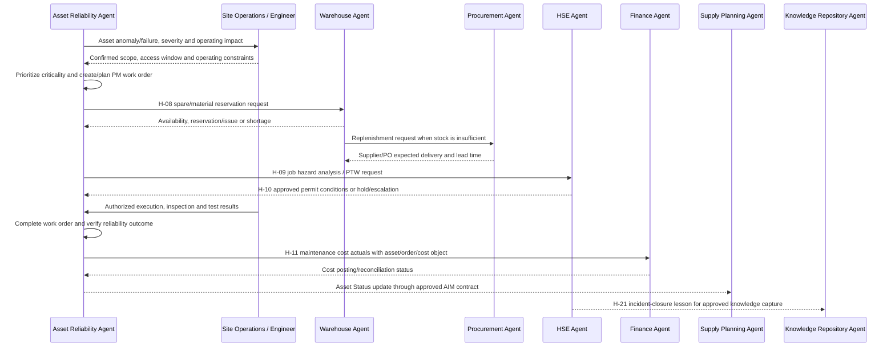

# Maintenance-to-Reliability Workflow Walkthrough

**Simulation mode:** Historical case reconstruction with a forward-looking control walkthrough  
**Sample case:** Serious process-safety incident INC-00020 linked to corrective work order 4000100353  
**Status:** Synthetic repository data; no agent runtime was executed and no new maintenance action or SAP posting was made.

## Executive Summary

This walkthrough follows the repository's Maintenance-to-Reliability (M2R) flow: asset condition/failure signal, maintenance work order, parts reservation, HSE permit/risk controls, execution, cost capture, and reliability KPI refresh.

The sample data supports a cross-file trace for one completed case:

- Asset `AST-00370`, V-32 Steam Header Vessel, Pressure Vessel / Static Equipment, at `FAC-03` (Montney-Kakwa Gas Plant 1), `BU-UPS`, `REG-AB`; asset status Active, criticality C.
- Failure record identifies a Major nozzle crack with root cause Fatigue and 38.7 downtime hours.
- HSE incident `INC-00020` is Serious, type Process Safety Event, closed, and references work order `4000100353` and asset `AST-00370`.
- The linked corrective work order is PM02, priority 2-High, Completed from 2025-01-21 to 2025-01-22, with CAD 80,987.62 maintenance cost and 77.4 labor hours.

**Simulated outcome:** treat this as a closed historical corrective-maintenance case suitable for reliability review and learning capture. Do not infer that a condition-monitoring alert, parts reservation, approved PTW, Finance journal posting, or return-to-service authorization is present: those artifacts are not linked in the sample. For a future repeat, require operator/HSE approval, governed part reservation, and auditable cost and status events before closing the reliability loop.

## 1. Participating Agents

| Participant | Role in M2R | Authority boundary |
|---|---|---|
| Asset-Reliability-Agent | Owns asset health/failure analysis, maintenance priority, work-order planning/completion evidence, and reliability KPI refresh. | Recommends and analyzes; does not authorize hazardous work, isolation, or return-to-service. |
| HSE-Agent | Assesses job hazards, permit-to-work (PTW), process-safety controls, and incident classification/closure. | Site HSE/permit authorities approve controls; emergency command and regulatory decisions remain human. |
| Warehouse-Agent | Checks material/stock availability, reserves/issues spares, and records goods/material movements. | Does not source or award purchases; adjustments and controlled-material handling require authorization. |
| Procurement-Agent | Sources unavailable MRO items and manages supplier/PO follow-up. | Authorized procurement approver commits spend; a Material master gap affects traceability. |
| Finance-Agent | Validates maintenance cost attribution to cost center/asset and reports actuals. | Finance controls approve postings/close; sample cost is not proof of a posted GL journal. |
| Operating agent / site operations | Confirms operating context, shutdown window, isolation, execution resources, and safe return to service. For this example, FAC-03 is an upstream gas-plant facility. | Operations retains plant/process-control authority. |
| Supply-Planning-Agent | Consumes asset availability/status as a capacity constraint. | Asset Status is an explicit AIM input concept; no timestamped event in this sample proves publication. |
| Knowledge-Repository-Agent | Captures approved lessons after an incident is closed (H-21). | Must preserve source authority, privacy and access; does not replace HSE RCA approval. |
| Data-Analytics-Agent | Validates entity joins, data quality, reliability calculations and lineage. | Domain owners define business meaning and approve interventions. |

## 2. Master Data Used

| Entity | Sample value | Role and caveat |
|---|---|---|
| Asset | `Asset_ID=AST-00370`; V-32 Steam Header Vessel; Pressure Vessel; Static Equipment; Active; Criticality C | Canonical equipment record in `master-data/assets.csv`; associated to exactly one site parent. |
| Facility | `Facility_ID=FAC-03`; Montney-Kakwa Gas Plant 1; Gas Plant; `REG-AB`; `BU-UPS` | Parent site for this asset; retains facility-vs-plant distinction. |
| Functional Location | `CA-AB-FAC-03-V032` | SAP-style location hierarchy key from asset master; confirm actual customer hierarchy before posting. |
| Business Unit | `Business_Unit_ID=BU-UPS` | Finance/operational roll-up; use BU crosswalk for legacy source labels. |
| Region | `Region_ID=REG-AB` | Geographic reporting dimension. |
| Material / spare part | No canonical `Material_ID` exists in current master data. | Work-order material need and Warehouse stock cannot be reliably reconciled without Material master and aliases/UoM rules. |
| Warehouse / storage location | No work-order-to-warehouse reservation key is present on the selected records. | Warehouse master exists, but no linked reservation/issue is observed for this work order. |
| Person / role / permit authority | Not identified by canonical employee or role key. | Approver identity/authorization must come from an approved identity/organization source; the repository recommends an Employee/Organization/Role master. |

## 3. Transactional Data Used

| Dataset | Grain and observed fields | Use / limitation |
|---|---|---|
| `Asset-Reliability-Agent/sample-data/asset_master.csv` and `master-data/assets.csv` | One asset per `Asset_ID`; site, type, functional location, criticality, status. | Establishes asset identity and site hierarchy. |
| `Asset-Reliability-Agent/sample-data/failure_analysis.csv` | Failure record linked by `Work_Order` and `Asset_ID`; mode, root cause, severity, downtime. | Selected record: Major nozzle crack, fatigue, 38.7 downtime hours. |
| `Asset-Reliability-Agent/sample-data/maintenance_history.csv` | One work-order history row; asset, order type, priority, dates/status, labor/material cost, labor hours. | Selected row: PM02, 2-High, Completed, CAD 80,987.62 total cost, 77.4 labor hours. Dictionary defines total cost as labor + material; contractor spend is included in labor. |
| `HSE-Agent/sample-data/incidents.csv` | One incident per `Incident_ID`; optional `Asset_ID` and `Related_Work_Order`, severity/type/site/status. | INC-00020 links to the selected asset/work order and is marked Serious, Process Safety Event, Closed. No PTW record is in this file. |
| `HSE-Agent/sample-data/safety_observations.csv` / `compliance_audits.csv` | Observation/action and audit/finding records by site/date. | Useful for wider site context; no direct selected-work-order key is established for the case. |
| `Warehouse-Agent/sample-data/inventory_stock.csv`, `warehouse_movements.csv`, `cycle_count.csv` | Material/warehouse stock, movement, count. | Movement schema has no Work_Order/Reservation/PO field; cannot show that a part was reserved or issued to this work order. |
| `Procurement-Agent/sample-data/purchase_orders.csv`, `contracts.csv`, `supplier_master.csv` | Supplier and PO/contract/spend/risk. | Can support sourcing if a required material is identified; no purchase record is joined to the selected work order. |
| `Finance-Agent/sample-data/operating_cost.csv`, `budget_vs_actual.csv` | Cost-center/account/period totals. | No Work_Order or Asset_ID key links the selected maintenance cost to a posted Finance line. |
| Condition monitoring / measurement series | Required for sensor-based anomaly detection, with tag, timestamp, value/unit and asset mapping. | No raw historian/SCADA series is present. This case is retrospective, not evidence of a predictive alert. |

## 4. End-to-End Sequence and Data Exchange

The process sequence follows `enterprise_process_model.md` §6.3. H-08 through H-11 are the process-model handoffs described in `agent_collaboration_patterns.md`; AIM separately defines Asset Status from Reliability to Supply Planning. These are documented process contracts, not evidence of deployed interfaces.

| Step | Agent / trigger | Data exchanged | Case status |
|---|---|---|---|
| 1. Detect and triage | Asset Reliability reviews condition signals, inspection or failure record; Operations confirms operating context. | Asset_ID, Functional_Location, site, measurement/failure mode, severity, detection time, operating impact. | **Observed retrospectively:** failure record is Major nozzle crack/fatigue, 38.7 downtime hours. No sensor/condition signal or alert timestamp is present. |
| 2. Create/prioritize work order | Asset Reliability creates or updates a PM work order based on failure, criticality and priority. | Work_Order, Asset_ID, PM order type, priority, scope, dates, status, labor/material plan. | **Observed:** work order 4000100353, PM02 corrective, priority 2-High, Completed. PR/work-order creation event itself is not separately logged. |
| 3. Reserve materials (H-08) | Work order material requirement triggers Asset Reliability -> Warehouse reservation. | Work_Order, Material_ID, quantity/UoM, required date, plant/storage location, criticality. | **Not observed:** Material_ID/reservation ID is absent and material/warehouse data has no work-order link. Hold claims of parts availability/issue. |
| 4. HSE risk assessment and PTW (H-09/H-10) | Planned hazardous job triggers Asset Reliability -> HSE job hazard/PTW review; approved permit returns clearance/conditions. | Asset/site, job scope, hazards/barriers, isolation, permit ID, approver, validity window and conditions. | **Not observed:** HSE incident is linked and closed, but no JHA/PTW record or permit clearance is represented. This stage is mandatory where site rules require it. |
| 5. Execute and close maintenance | Authorized site crew executes; Reliability records labor, material, findings, test and completion. | Work order/operation, actual time, parts, findings, test results, status, return-to-service evidence. | **Observed at summary level:** work order completed; dates 2025-01-21 to 2025-01-22; 77.4 labor hours. No operation-level confirmation/test record. |
| 6. Cost capture (H-11) | Work-order completion sends maintenance cost actuals to Finance. | Work_Order, Asset_ID, cost center, labor/material/contractor cost, currency, period, journal reference. | **Observed in maintenance history only:** total CAD 80,987.62. No linked cost-center/GL posting or journal reference proves Finance posting. |
| 7. HSE incident closure and lesson (H-21) | HSE verifies corrective actions/effectiveness, closes the incident, then sends lesson to Knowledge Repository. | Incident_ID, Work_Order, asset/site, RCA/CAPA, owner, effectiveness evidence, lesson/document ID and access classification. | **Observed:** INC-00020 is marked Closed and linked to work order/asset. No Knowledge Repository lesson link is present. |
| 8. Reliability KPI/status refresh | Reliability recalculates approved measures and publishes asset status; Supply Planning may consume AIM Asset Status. | Asset_ID, status, available capacity, validity time, work-order/failure metrics and KPI formula/version. | **Not observed:** no status event or KPI snapshot is in the samples; asset master status is Active but should not be interpreted as verified return-to-service approval. |

## 5. KPIs Evaluated

| KPI | Repository definition | Result for selected sample / limitation |
|---|---|---|
| Unplanned downtime | Failure-related downtime hours by asset/site and period. | **38.7 hours** on the selected failure record. This is a case value, not a normalized rate. |
| Maintenance cost per work order | Eligible labor + material + contractor cost. | **CAD 80,987.62** for work order 4000100353; maintenance dictionary states cost is labor + material and contractor cost is included in labor. Not independently matched to FI/CO. |
| Work duration / repair elapsed time | Use approved start/end or confirmation timestamps; do not confuse calendar span with labor hours. | Start Jan 21 and end Jan 22, 2025; 77.4 labor hours. Date-only resolution does not support a precise MTTR value. |
| MTBF | Operating time / count of relevant failures for a defined population. | **Not computable:** no asset operating-hour denominator, exposure window or stable failure population is supplied. |
| MTTR | Total repair time / completed repairs with an approved definition. | **Not scored:** a single order's labor hours/date span is not the population-level repair-time KPI. |
| Asset availability | Available operating time / scheduled time, with planned downtime treatment. | **Not computable:** scheduled/available operating-hour series is absent. |
| PM compliance | PM work completed by due date / PM work due. | **Not computable:** no PM schedule/due-date denominator; selected WO is corrective PM02. |
| Repeat-failure / bad-actor rate | Repeat failures within an approved time window / defined assets or work orders. | **Not evaluated for one case:** failure history exists, but no agreed time window or population baseline is applied here. |
| Asset utilization | Enterprise KPI model gives 90% illustrative target. | **Not evaluated:** no utilization series for AST-00370; utilization is not interchangeable with availability. |
| Corrective-action closure / HSE rate | HSE actions/events need denominator, category and due/closure rules. | Incident record is Closed; case-specific CAPA effectiveness is not provided. No hours-worked denominator for TRIR/LTIFR. |

The enterprise KPI target for Asset Utilization (90%) is illustrative; the enterprise KPI model does not define MTBF/MTTR formulas or production-approved thresholds. KPI owners must approve population, time window, exclusions and source before operational reporting.

## 6. Business Decisions Made (Simulated)

| Decision | Simulated outcome | Evidence / guardrail |
|---|---|---|
| Triage incident and equipment failure | Treat INC-00020 as a serious process-safety incident linked to a Major nozzle-crack failure on AST-00370; preserve the work-order and HSE records as linked evidence. | Historical data indicates the incident is Closed and the order Completed; do not infer current site condition from a 2025 record. |
| Maintenance priority | A corrective PM02 with priority 2-High was completed; use the case for reliability review and recurrence prevention. | Work prioritization/deferral and return-to-service are operations/engineering decisions, not autonomous agent actions. |
| Parts and materials | For a future repeat, require Warehouse confirmation of a governed Material_ID, stock status, reservation, and issue before schedule lock. | No selected-work-order part reservation/issue is represented. |
| Permit and safe work | Require site-specific JHA/PTW, isolation and HSE/Operations authorization before any future execution. | The linked incident is closed, but there is no permit record; do not backfill approval from incident closure. |
| Cost accounting | Reconcile CAD 80,987.62 from maintenance history against labor/material detail and Finance journal/cost-center posting. | Work-order cost is not independently tied to the GL in this sample. |
| Status to planning | After competent-person inspection/test and formal return-to-service, publish a timestamped Asset Status to Supply Planning if capacity changes. | Asset master says Active; that value alone is not proof of an approved return-to-service event. |

## 7. Escalation Points

1. **Imminent danger / process-safety event:** immediately escalate to site emergency command and HSE. Stop/isolations follow site authority; analysis must not delay response.
2. **Safety-critical equipment or integrity uncertainty:** escalate to responsible engineer/operations and HSE. Do not use a predicted failure score as authorization to continue or stop a process without human assessment.
3. **Permit, isolation or MOC:** no hazardous work proceeds without required approved PTW, isolation and management-of-change controls. Permit authority remains human.
4. **Critical spare unavailable or unmapped:** Warehouse informs Reliability; Procurement sources only after technical specification, Material_ID, lead time and delegated approval are established. Do not substitute parts without engineering approval.
5. **Work-order completion/return-to-service:** unresolved test, quality, inspection or corrective-action finding -> keep status blocked/pending and escalate to operations/engineering/HSE.
6. **Cost or posting mismatch:** maintenance history versus invoice/cost center/GL discrepancy -> Finance control owner and Procurement/Asset Reliability investigate; hold close/sign-off as required.
7. **HSE classification/reportability:** severity, API RP 754 tier, regulator notification, or CAPA effectiveness uncertain -> HSE/legal/regulatory authority decides; do not infer from a narrative label.
8. **Supply impact:** material asset-status change is published to Supply Planning through the approved contract; shortages or a capacity conflict escalate to human planners.
9. **Data/model integrity:** missing asset/site keys, mismatched work-order IDs, absent timestamps or model drift -> Data Analytics and source owners correct lineage before reliability KPIs or recommendations are issued.

## 8. Executive Recommendations

1. **Use the linked case for a controlled reliability review, not as proof of a predictive-maintenance outcome.** The sample starts with a recorded failure/work order; no sensor alert is included.
2. **Confirm the current asset state.** The selected event is from January 2025. Obtain current inspection, operating and return-to-service records before using it to affect today’s capacity plan.
3. **Complete RCA/CAPA lineage.** Link incident, failure, notification, work order, corrective action, verification, and lesson/document IDs with ownership and access controls.
4. **Add governed maintenance material links.** Create/approve a Material master and record reservations/issues against Work_Order + operation + warehouse/location, quantity, UoM and posting event.
5. **Implement explicit HSE/PTW events.** Define H-09 job hazard/PTW request and H-10 permit clearance payloads, validity, approver, isolation conditions, cancellation and audit trail.
6. **Reconcile maintenance cost to Finance.** Carry order, asset, cost center, GL, currency, posting period and journal reference; distinguish estimated from posted actual cost.
7. **Define reliability KPI contracts.** Approve MTBF/MTTR, availability, PM compliance, downtime and repeat-failure denominators, asset populations, periods and target thresholds. Add operating-hour/condition series where required.
8. **Publish Asset Status only from authorized state transitions.** Include source timestamp, validity window, capacity effect and status reason; require operator confirmation after work and testing before clearing a constraint.
9. **Close operational data coverage.** Current raw condition series, reservation, PTW, operation confirmation, return-to-service and Finance posting are not joined in these samples; instrument those links and monitor completeness.
10. **Pilot the full M2R flow at one site.** Test normal, emergency, spare-shortage, permit-denied, failed-inspection, cost-mismatch and repeat-failure cases with human approvals, audit evidence and measurable acceptance criteria before scaling.

## 9. Agent Interaction Sequence Diagram

The diagram shows intended handoffs. In the sample case, the incident/work-order/failure/asset links are observed; the parts reservation, PTW, cost posting, Asset Status event and Knowledge Repository lesson are not linked transaction records.

## 10. Source References and Limitations

- [Maintenance-to-Reliability process definition](enterprise_process_model.md#63-maintenance-to-reliability-m2r)
- [Asset Reliability skill](Asset-Reliability-Agent/SKILL.md), [HSE skill](HSE-Agent/SKILL.md), [Warehouse skill](Warehouse-Agent/SKILL.md), [Procurement skill](Procurement-Agent/SKILL.md), and [Finance skill](Finance-Agent/SKILL.md)
- [Agent Collaboration Patterns](agent_collaboration_patterns.md), [Agent Capability Matrix](agent_capability_matrix.md), and [Agent Interaction Model](Agent_Interaction_Model.md)
- [Entity Relationship Model](entity_relationship_model.md), [Master Data README](master-data/README.md), [Master Data Dictionary](master-data/master_data_dictionary.md), and [Relationship Matrix](master-data/data_relationship_matrix.csv)
- [Enterprise KPI Model](Enterprise_KPI_Model.md), [Enterprise Capability Model](Enterprise_Capability_Model.md), and [SAP Reference Architecture](sap_reference_architecture.md)
- Case data: `Asset-Reliability-Agent/sample-data/asset_master.csv`, `maintenance_history.csv`, `failure_analysis.csv`; `HSE-Agent/sample-data/incidents.csv`; master `assets.csv` and `facilities.csv`.

All records are synthetic. This example is retrospective and does not demonstrate a live sensor alert or an actively safe asset. Warehouse movements have no work-order key; the selected HSE incident has no linked PTW artifact; and no Finance journal or Knowledge Repository lesson is tied to the work order. SAP mappings and KPI targets are reference assumptions to be validated by the actual site, SAP release, and control owners.
