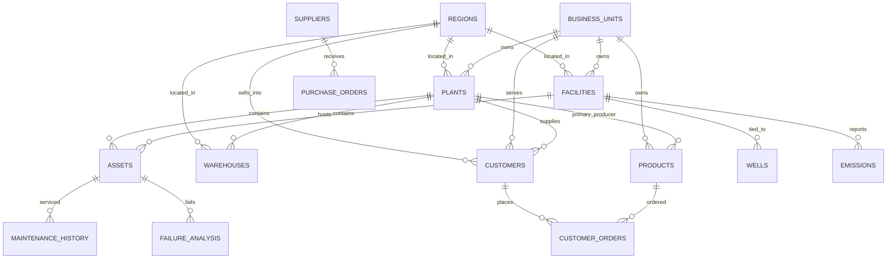

# Enterprise Master Data Model - Energy Enterprise Transformation Advisor

Synthetic data. Consolidates the 19 agent datasets (57 files, 25,475 records) onto one set of master keys so records can be joined across agents. All eight requested masters are built from the identifiers and names already used in the agent files; where the agent files use a name instead of an ID, the master carries that name as a join key. Two supporting files (`facilities.csv`, `bu_crosswalk.csv`) were added because the site columns in 8 agent files (upstream, ESG, HSE, assets) and the business-unit labels in 6 agent files (Finance, Trading-Risk, Strategy, PMO) cannot be joined without them.

## 1. Master files

| File | Records | Primary key | Built from | Main foreign keys |
|---|---|---|---|---|
| customers.csv | 200 | Customer_ID (CUS-001..200) | Sales-Trading customers (CUS-001..100, 100 customers) plus the 100 most-forecast customers in Demand-Planning `sales_forecast.csv` (CUS-101..200) | Region_ID, Primary_Supply_Plant_ID, Owning_Business_Unit_ID, Segment_ID |
| suppliers.csv | 200 | Supplier_ID (SUP-0001..0200) | Procurement `supplier_master.csv` (same IDs, names, categories, risk scores) | Region_ID |
| products.csv | 100 | Product_ID (PRD-001..100) | Commercial-Marketing `product_portfolio.csv` (same IDs and names) | Primary_Plant_ID, Owning_Business_Unit_ID |
| plants.csv | 20 | Plant_ID (R100, U100, G100, T100 ...) | Supply-Planning plant list (same codes and names; Logistics, Refining and Sales use the same codes) | Business_Unit_ID, Region_ID |
| warehouses.csv | 15 | Warehouse_ID (WH01..WH15) | Warehouse-Agent WH01-WH12 plus three new regional sites WH13-WH15 | Plant_ID, Business_Unit_ID, Region_ID |
| assets.csv | 500 | Asset_ID (AST-00001..500) | Asset-Reliability `asset_master.csv` (same IDs, names, functional locations) | Plant_ID or Facility_ID, Business_Unit_ID, Region_ID |
| regions.csv | 10 | Region_ID (REG-AB ...) | The 8 sales regions used by Sales, Demand and Commercial plus the Pacific and Atlantic export markets used by Logistics | - |
| business_units.csv | 10 | Business_Unit_ID (BU-UPS ...) | Rolls up Finance's 12 BU codes (BU01-BU12) and Strategy / PMO's 11 function labels | - |
| facilities.csv (support) | 33 | Facility_ID (FAC-01..25, PL-01..06, HQ-CAL, DC-EDM) | Upstream, ESG, HSE and Asset-Reliability site codes | Business_Unit_ID, Region_ID |
| bu_crosswalk.csv (support) | 81 | Source_Dataset + Source_Column + Source_Value | Every business-unit label found in Finance, Trading-Risk, Strategy and PMO files | Business_Unit_ID |

Key formats follow the agent files so existing joins keep working. `BU-` prefixed business-unit IDs are deliberately different from Finance's `BU01`-`BU12` codes, which are a lower level of detail (see `bu_crosswalk.csv`).

### Business unit hierarchy (business_units.csv)

| Business_Unit_ID | Name | Finance BU codes rolled up | Strategy / PMO labels rolled up |
|---|---|---|---|
| BU-UPS | Upstream Oil and Gas | BU01;BU02;BU03 | Upstream |
| BU-MID | Midstream, Terminals and Logistics | BU04 | - |
| BU-REF | Refining and Upgrading | BU05;BU06;BU07 | Refining |
| BU-RTL | Retail Fuels and Convenience | BU08 | - |
| BU-COM | Commercial, Wholesale and Specialty Products | BU09;BU10 | Marketing |
| BU-TRD | Energy Trading and Risk | BU11 | - |
| BU-LCN | Low Carbon and New Energy | BU12 | - |
| BU-SCM | Supply Chain, Procurement and Asset Management | - | Supply Chain; Procurement; Asset Reliability |
| BU-COR | Corporate, Finance and HSSE | - | Corporate; Finance; HSSE |
| BU-DIG | Digital, Data and Transformation | - | Data and Analytics; Enterprise Architecture |

## 2. Entity relationship overview

## 3. Data relationship matrix

Full machine-readable version: `data_relationship_matrix.csv` (85 rows). Coverage is measured on the actual files: the share of non-blank values in the dependent column that resolve to a master record. FK mapping reads `Dependent_File.FK_Column -> Master_File.Master_Key`.

### customers.csv

| Dependent agent | Dependent file | FK column | -> Master key | Join | Cardinality | Coverage | Status |
|---|---|---|---|---|---|---|---|
| Sales-Trading-Agent | customer_orders.csv | Customer_ID | Customer_ID | ID | many orders : 1 customer | 100.0% | Direct FK |
| Sales-Trading-Agent | customer_orders.csv | Customer | Customer_Name | Name | many : 1 | 100.0% | Name join |
| Sales-Trading-Agent | contract_volume.csv | Customer_ID | Customer_ID | ID | many contracts : 1 customer | 100.0% | Direct FK |
| Sales-Trading-Agent | contract_volume.csv | Customer | Customer_Name | Name | many : 1 | 100.0% | Name join |
| Demand-Planning-Agent | sales_forecast.csv | Customer | Customer_Name | Name | many forecast lines : 1 customer | 63.9% | Partial |
| Commercial-Marketing-Agent | customer_segments.csv | Segment_ID | Segment_ID | ID | many customers : 1 segment-region | 100.0% | Direct FK |

Notes: Master -> agent FK (customers.Segment_ID). Natural-key join; prefer Customer_ID. Only 100 of 181 forecast customers fit within the 200-record master; add a Customer_ID column and extend the master to cover the rest.

### suppliers.csv

| Dependent agent | Dependent file | FK column | -> Master key | Join | Cardinality | Coverage | Status |
|---|---|---|---|---|---|---|---|
| Procurement-Agent | purchase_orders.csv | Supplier | Supplier_ID | ID | many POs : 1 supplier | 100.0% | Direct FK |
| Procurement-Agent | contracts.csv | Supplier | Supplier_ID | ID | many contracts : 1 supplier | 100.0% | Direct FK |
| Upstream-Operations-Agent | drilling_operations.csv | Rig_Contractor | Supplier_Name | Name | many wells : 1 contractor | 0.0% | Gap |
| Logistics-Agent | carrier_performance.csv | Carrier | Supplier_Name | Name | 1 : 1 | 0.0% | Gap |
| Logistics-Agent | freight_costs.csv | Carrier | Supplier_Name | Name | many : 1 | 0.0% | Gap |

Notes: Carriers need a Carrier master or Supplier records (see recommendations). Column holds the Supplier_ID. Rig contractors are not in supplier_master; add them to the supplier master (category Rig Contractors). Same as above.

### products.csv

| Dependent agent | Dependent file | FK column | -> Master key | Join | Cardinality | Coverage | Status |
|---|---|---|---|---|---|---|---|
| Commercial-Marketing-Agent | product_portfolio.csv | Product_ID | Product_ID | ID | 1 : 1 | 100.0% | Direct FK |
| Commercial-Marketing-Agent | pricing_strategy.csv | Product_ID | Product_ID | ID | many prices : 1 product | 100.0% | Direct FK |
| Sales-Trading-Agent | customer_orders.csv | Product_ID | Product_ID | ID | many order lines : 1 product | 100.0% | Direct FK |
| Sales-Trading-Agent | customer_orders.csv | Product | Product_Name | Name | many : 1 | 100.0% | Name join |
| Sales-Trading-Agent | contract_volume.csv | Product | Product_Name | Name | many : 1 | 100.0% | Name join |
| Demand-Planning-Agent | demand_forecast.csv | Product | Product_Name | Name | many : 1 | 100.0% | Name join |
| Demand-Planning-Agent | demand_scenarios.csv | Product | Product_Name | Name | many : 1 | 100.0% | Name join |
| Demand-Planning-Agent | sales_forecast.csv | Product | Product_Name | Name | many : 1 | 100.0% | Name join |
| Refining-Operations-Agent | refinery_output.csv | Product | Product_Name | Name | many : 1 | 100.0% | Name join |
| Refining-Operations-Agent | yield_analysis.csv | Product | Product_Name | Name | many : 1 | 100.0% | Name join |
| Supply-Planning-Agent | production_plan.csv | Product | Product_Name | Name | many : 1 | 96.0% | Partial |
| Logistics-Agent | shipments.csv | Product | Product_Name | Name | many : 1 | 76.3% | Partial |

Notes: No Product_ID column; add one. Non-portfolio items (feedstock, tubulars, MRO) need a Material master. Sales Gas and Synthetic Crude Oil are not in the product portfolio; add to products or a Material master.

### plants.csv

| Dependent agent | Dependent file | FK column | -> Master key | Join | Cardinality | Coverage | Status |
|---|---|---|---|---|---|---|---|
| Supply-Planning-Agent | production_plan.csv | Plant | Plant_ID | ID | many plan lines : 1 plant | 100.0% | Direct FK |
| Supply-Planning-Agent | inventory_plan.csv | Plant | Plant_ID | ID | many : 1 | 100.0% | Direct FK |
| Supply-Planning-Agent | supply_constraints.csv | Plant | Plant_ID | ID | many : 1 | 100.0% | Direct FK |
| Refining-Operations-Agent | refinery_output.csv | Refinery | Plant_ID | ID | many : 1 | 100.0% | Direct FK |
| Refining-Operations-Agent | refinery_performance.csv | Refinery | Plant_ID | ID | many : 1 | 100.0% | Direct FK |
| Refining-Operations-Agent | yield_analysis.csv | Refinery | Plant_ID | ID | many : 1 | 100.0% | Direct FK |
| Sales-Trading-Agent | customer_orders.csv | Supply_Point | Plant_ID | ID | many : 1 | 100.0% | Direct FK |
| Logistics-Agent | shipments.csv | Origin | Plant_ID | ID | many shipments : 1 origin | 91.4% | Shared column (subset) |
| Logistics-Agent | shipments.csv | Destination | Plant_ID | ID | many : 1 | 36.0% | Shared column (subset) |
| Asset-Reliability-Agent | asset_master.csv | Site | Plant_ID | ID | many assets : 1 site | 60.0% | Shared column (subset) |
| Asset-Reliability-Agent | maintenance_history.csv | Site | Plant_ID | ID | many : 1 | 60.8% | Shared column (subset) |
| Asset-Reliability-Agent | failure_analysis.csv | Site | Plant_ID | ID | many : 1 | 62.4% | Shared column (subset) |
| HSE-Agent | incidents.csv | Site | Plant_ID | ID | many : 1 | 40.2% | Shared column (subset) |
| HSE-Agent | safety_observations.csv | Site | Plant_ID | ID | many : 1 | 33.8% | Shared column (subset) |
| HSE-Agent | compliance_audits.csv | Location | Plant_ID | ID | many : 1 | 32.7% | Shared column (subset) |

Notes: Destinations include customer pseudo-sites (RTL-, MINE-, FARM- ...). FAC- sites resolve to facilities. FAC-, PL- locations resolve to facilities. FAC-, PL-, HQ-, DC- sites resolve to facilities. Origins also include warehouses (WH..) - see warehouses. Refinery code = Plant_ID. Supply point = plant. Upstream FAC- sites resolve to facilities.

### warehouses.csv

| Dependent agent | Dependent file | FK column | -> Master key | Join | Cardinality | Coverage | Status |
|---|---|---|---|---|---|---|---|
| Warehouse-Agent | inventory_stock.csv | Warehouse | Warehouse_ID | ID | many : 1 | 100.0% | Direct FK |
| Warehouse-Agent | cycle_count.csv | Warehouse | Warehouse_ID | ID | many : 1 | 100.0% | Direct FK |
| Warehouse-Agent | warehouse_movements.csv | Warehouse | Warehouse_ID | ID | many : 1 | 100.0% | Direct FK |
| Logistics-Agent | shipments.csv | Origin | Warehouse_ID | ID | many : 1 | 8.6% | Shared column (minor) |
| Logistics-Agent | shipments.csv | Destination | Warehouse_ID | ID | many : 1 | 5.1% | Shared column (minor) |

Notes: Column mixes plants, warehouses and customer pseudo-sites.

### assets.csv

| Dependent agent | Dependent file | FK column | -> Master key | Join | Cardinality | Coverage | Status |
|---|---|---|---|---|---|---|---|
| Asset-Reliability-Agent | asset_master.csv | Asset_ID | Asset_ID | ID | many : 1 | 100.0% | Direct FK |
| Asset-Reliability-Agent | maintenance_history.csv | Asset_ID | Asset_ID | ID | many : 1 | 100.0% | Direct FK |
| Asset-Reliability-Agent | failure_analysis.csv | Asset_ID | Asset_ID | ID | many : 1 | 100.0% | Direct FK |
| HSE-Agent | incidents.csv | Asset_ID | Asset_ID | ID | many : 1 | 100.0% | Direct FK |

Notes: Populated only for equipment-related incidents.

### facilities.csv

| Dependent agent | Dependent file | FK column | -> Master key | Join | Cardinality | Coverage | Status |
|---|---|---|---|---|---|---|---|
| Upstream-Operations-Agent | production_metrics.csv | Facility | Facility_ID | ID | many : 1 | 100.0% | Direct FK |
| Upstream-Operations-Agent | wells.csv | Facility | Facility_ID | ID | many : 1 | 100.0% | Direct FK |
| ESG-Agent | emissions.csv | Facility | Facility_ID | ID | many : 1 | 88.0% | Shared column (subset) |
| ESG-Agent | water_consumption.csv | Facility | Facility_ID | ID | many : 1 | 88.0% | Shared column (subset) |
| Asset-Reliability-Agent | asset_master.csv | Site | Facility_ID | ID | many : 1 | 40.0% | Shared column (subset) |
| HSE-Agent | incidents.csv | Site | Facility_ID | ID | many : 1 | 59.8% | Shared column (subset) |
| HSE-Agent | safety_observations.csv | Site | Facility_ID | ID | many : 1 | 66.2% | Shared column (subset) |
| HSE-Agent | compliance_audits.csv | Location | Facility_ID | ID | many : 1 | 67.3% | Shared column (subset) |

Notes: Recommended extra master (included).

### regions.csv

| Dependent agent | Dependent file | FK column | -> Master key | Join | Cardinality | Coverage | Status |
|---|---|---|---|---|---|---|---|
| Sales-Trading-Agent | customer_orders.csv | Region | Region_Name | Name | many : 1 | 100.0% | Name join |
| Sales-Trading-Agent | contract_volume.csv | Region | Region_Name | Name | many : 1 | 100.0% | Name join |
| Commercial-Marketing-Agent | customer_segments.csv | Region | Region_Name | Name | many : 1 | 100.0% | Name join |
| Demand-Planning-Agent | demand_forecast.csv | Region | Region_Name | Name | many : 1 | 100.0% | Name join |
| Commercial-Marketing-Agent | pricing_strategy.csv | Region | Pricing_Zone | Zone | many Region_IDs : 1 pricing zone | 100.0% | Via crosswalk |
| Logistics-Agent | carrier_performance.csv | Home_Region | Logistics_Zone | Zone | many Region_IDs : 1 logistics zone | 100.0% | Via crosswalk |
| Upstream-Operations-Agent | wells.csv | Province | Province_Codes | Province | many : 1 region | 100.0% | Via crosswalk |
| ESG-Agent | emissions.csv | Province | Province_Codes | Province | many : 1 region | 100.0% | Via crosswalk |
| ESG-Agent | water_consumption.csv | Province | Province_Codes | Province | many : 1 region | 100.0% | Via crosswalk |
| Asset-Reliability-Agent | asset_master.csv | Province | Province_Codes | Province | many : 1 region | 100.0% | Via crosswalk |
| HSE-Agent | incidents.csv | Province | Province_Codes | Province | many : 1 region | 100.0% | Via crosswalk |
| HSE-Agent | compliance_audits.csv | Province | Province_Codes | Province | many : 1 region | 100.0% | Via crosswalk |
| Upstream-Operations-Agent | production_metrics.csv | Province | Province_Codes | Province | many : 1 region | 100.0% | Via crosswalk |

Notes: Pricing is zone-level (3 zones), not region-level; join via regions.Pricing_Zone. Province code maps to a region through regions.Province_Codes. Region name is the join key; use Region_ID going forward. Zone-level; join via regions.Logistics_Zone.

### business_units.csv

| Dependent agent | Dependent file | FK column | -> Master key | Join | Cardinality | Coverage | Status |
|---|---|---|---|---|---|---|---|
| Finance-Agent | revenue.csv | Business_Unit_Code | Business_Unit_ID | Crosswalk | many : 1 (via bu_crosswalk.csv) | 100.0% | Via crosswalk |
| Finance-Agent | revenue.csv | Business_Unit | Business_Unit_ID | Crosswalk | many : 1 (via bu_crosswalk.csv) | 100.0% | Via crosswalk |
| Finance-Agent | operating_cost.csv | Business_Unit | Business_Unit_ID | Crosswalk | many : 1 (via bu_crosswalk.csv) | 100.0% | Via crosswalk |
| Trading-Risk-Agent | hedging_positions.csv | Business_Unit | Business_Unit_ID | Crosswalk | many : 1 (via bu_crosswalk.csv) | 100.0% | Via crosswalk |
| Trading-Risk-Agent | risk_exposure.csv | Business_Unit | Business_Unit_ID | Crosswalk | many : 1 (via bu_crosswalk.csv) | 100.0% | Via crosswalk |
| Corporate-Strategy-Agent | strategy_goals.csv | Business_Unit | Business_Unit_ID | Crosswalk | many : 1 (via bu_crosswalk.csv) | 100.0% | Via crosswalk |
| Transformation-PMO-Agent | project_portfolio.csv | Business_Unit | Business_Unit_ID | Crosswalk | many : 1 (via bu_crosswalk.csv) | 100.0% | Via crosswalk |

Notes: Legacy BU labels map through bu_crosswalk.csv.

### plants.csv + facilities.csv

| Dependent agent | Dependent file | FK column | -> Master key | Join | Cardinality | Coverage | Status |
|---|---|---|---|---|---|---|---|
| Asset-Reliability-Agent | asset_master.csv | Site | Plant_ID | Facility_ID | ID | many : 1 | 100.0% | Direct FK (union of two masters) |
| Asset-Reliability-Agent | maintenance_history.csv | Site | Plant_ID | Facility_ID | ID | many : 1 | 100.0% | Direct FK (union of two masters) |
| Asset-Reliability-Agent | failure_analysis.csv | Site | Plant_ID | Facility_ID | ID | many : 1 | 100.0% | Direct FK (union of two masters) |
| HSE-Agent | incidents.csv | Site | Plant_ID | Facility_ID | ID | many : 1 | 100.0% | Direct FK (union of two masters) |
| HSE-Agent | safety_observations.csv | Site | Plant_ID | Facility_ID | ID | many : 1 | 100.0% | Direct FK (union of two masters) |
| HSE-Agent | compliance_audits.csv | Location | Plant_ID | Facility_ID | ID | many : 1 | 100.0% | Direct FK (union of two masters) |
| ESG-Agent | emissions.csv | Facility | Plant_ID | Facility_ID | ID | many : 1 | 100.0% | Direct FK (union of two masters) |
| ESG-Agent | water_consumption.csv | Facility | Plant_ID | Facility_ID | ID | many : 1 | 100.0% | Direct FK (union of two masters) |

Notes: Site column holds either a plant code (R/T) or a facility code (FAC/PL/HQ/DC); resolve with a union of the two masters.

### plants.csv + warehouses.csv

| Dependent agent | Dependent file | FK column | -> Master key | Join | Cardinality | Coverage | Status |
|---|---|---|---|---|---|---|---|
| Logistics-Agent | shipments.csv | Origin | Plant_ID | Warehouse_ID | ID | many : 1 | 100.0% | Direct FK (union of two masters) |
| Logistics-Agent | shipments.csv | Destination | Plant_ID | Warehouse_ID | ID | many : 1 | 41.1% | Partial (union of two masters) |

Notes: 41% of destinations are plants or warehouses; the rest are customer ship-to pseudo-sites (RTL-, MINE-, FARM-, EXP-) - recommend a Ship-To / Delivery Location master. Origin is a plant or a warehouse.

### Which agent should reference which master

| Agent | Masters it should reference |
|---|---|
| Corporate-Strategy-Agent | business_units, regions |
| Commercial-Marketing-Agent | products, customers (Segment_ID), regions |
| Demand-Planning-Agent | products, customers, regions |
| Procurement-Agent | suppliers, plants, warehouses |
| Supply-Planning-Agent | plants, products, warehouses |
| Warehouse-Agent | warehouses, plants, products (via material master) |
| Logistics-Agent | plants, warehouses, regions, products, suppliers (carriers) |
| Upstream-Operations-Agent | facilities, regions, suppliers (rig contractors) |
| Refining-Operations-Agent | plants, products |
| Asset-Reliability-Agent | assets, plants, facilities |
| Sales-Trading-Agent | customers, products, plants, regions |
| Finance-Agent | business_units, plants |
| ESG-Agent | facilities, plants, regions |
| Data-Analytics-Agent | all masters (as conformed dimensions) |
| Enterprise-Architecture-Agent | business_units (application owners), plants |
| Transformation-PMO-Agent | business_units, plants, regions |
| HSE-Agent | facilities, plants, assets, regions |
| Trading-Risk-Agent | business_units, products (commodities) |
| Knowledge-Repository-Agent | business_units, plants, assets (document links) |

## 4. End-to-end scenarios the masters enable

Each path was run against the generated files.

1. **Order-to-cash.** customers -> customer_orders -> products -> plants -> refinery_output / shipments. All 500 of 500 orders resolve to a customer, product and supply plant; 155 orders match a refinery_output row for the same plant and product, and 114 match a shipment from the same origin and product.
2. **Procure-to-pay.** suppliers -> purchase_orders / contracts. All 500 of 500 POs and 300 contracts resolve to a supplier; PO value by spend group: Feedstock and Energy Supply CAD 264M; Projects, Turnaround and Maintenance Services CAD 228M; Site and Environmental Services CAD 76M; Upstream Services and Materials CAD 60M; MRO and Process Equipment CAD 48M; Technology Services CAD 30M; Transportation and Logistics CAD 29M; Industrial Supplies CAD 26M. The PO -> warehouse stock link needs a material master (see section 6).
3. **Asset-to-incident-to-cost.** assets -> maintenance_history -> failure_analysis -> HSE incidents -> plant or facility -> business unit and region. 370 assets have work orders, 206 have failures, 122 have linked incidents and 78 have all three.
4. **Upstream-to-ESG.** facilities -> production_metrics, wells, emissions, HSE incidents. 22 of the 25 FAC facilities appear in all four datasets; the 3 outside the ESG boundary are flagged `ESG_Reporting_Boundary = N`.
5. **Finance, risk and strategy by business unit.** Through `bu_crosswalk.csv`, every row in revenue, operating_cost, hedging_positions, risk_exposure, strategy_goals and project_portfolio resolves to a Business_Unit_ID. Rows per BU: BU-COM 372; BU-COR 276; BU-DIG 40; BU-LCN 120; BU-MID 200; BU-REF 847; BU-RTL 175; BU-SCM 82; BU-TRD 321; BU-UPS 817.
6. **Demand-to-supply.** demand_forecast (Product, Region) -> products -> production_plan (Plant, Product). 800 of 1000 forecast rows belong to products that have a production plan; 2 of the 10 forecast products are not planned in production_plan (the plan covers 43 products).

## 5. Cross-agent inconsistencies found while building the masters

| # | Finding | Where | Master choice | Suggested fix |
|---|---|---|---|---|
| 1 | Terminal provinces differ: T200 is BC in Supply-Planning and Logistics but AB in Asset-Reliability, HSE and ESG; T400 is ON vs MB; T800 is AB vs BC | asset_master (34 assets), incidents (23), compliance_audits (19) | plants.csv follows Supply-Planning (T200 BC, T400 ON, T800 AB) | Re-key Province in Asset-Reliability and HSE from plants.csv |
| 2 | Terminal names in Asset-Reliability and HSE are generic ("Terminal T200") | asset_master, incidents | Plant_Name from Supply-Planning | Look up names from plants.csv |
| 3 | 81 of 181 customers in Demand-Planning `sales_forecast.csv` are not in the 200-record customer master (36% of forecast lines) | sales_forecast | Master covers the 100 most-forecast customers plus all Sales-Trading customers | Add Customer_ID to sales_forecast; extend the master by 81 records for full coverage |
| 4 | Sales-Trading customers and Demand-Planning forecast customers have no names in common | customer_orders vs sales_forecast | Treated as two customer populations | Decide whether forecast customers are accounts, ship-tos or prospects |
| 5 | Business-unit labels differ in every domain: Finance uses 12 codes, Strategy and PMO use 11 function labels, Trading-Risk uses 13 mixed labels (4 span two units) | Finance, Strategy, PMO, Trading-Risk | 10-record hierarchy plus crosswalk | Adopt Business_Unit_ID in new files; keep the crosswalk until sources are re-keyed |
| 6 | Pricing is held at 3 zones and carrier performance at 4 zones, not by region | pricing_strategy, carrier_performance | Zones kept as attributes of regions.csv | Join through Pricing_Zone / Logistics_Zone |
| 7 | PO materials (110) and warehouse stock materials (99) share no names, and only 36 of the 109 Supply-Planning inventory_plan materials appear in warehouse stock or movements or movements | purchase_orders, inventory_stock, inventory_plan | Out of scope for the eight masters | Build a Material master (section 6) |
| 8 | Carriers (200) and drilling rig contractors (8) are not in supplier_master | carrier_performance, drilling_operations | Not added to suppliers.csv | Add as supplier categories or build a Carrier master |
| 9 | production_plan lists Sales Gas and Synthetic Crude Oil, and shipments lists 10 non-portfolio items, that are not in the product portfolio | production_plan (4%), shipments (24%) | products.csv keeps the 100 sold products | Extend with a Material master (non-sold goods and feedstocks) |

## 6. Recommended additional master entities

| Priority | Entity | Proposed key | Why it is needed | Evidence in the agent data |
|---|---|---|---|---|
| High | Material (non-product materials, spares, feedstocks) | Material_ID | Links purchasing, warehouse stock, inventory planning, shipments and maintenance parts; the end-to-end procure-to-stock-to-maintenance flow is broken today | 110 PO materials, 99 stocked materials, 109 inventory-plan materials: 0 overlap between PO and stock names, 36 between inventory plan and stock |
| High | Cost Center and GL Account | Cost_Center_ID, GL_Account_ID | Ties Finance to plants, facilities and business units for cost-to-serve and variance analysis | 25 cost centers (CC-xxxx), 14 GL accounts in operating_cost, 25 accounts in budget_vs_actual; none link to plants or business units today |
| High | Counterparty (trading and credit) | Counterparty_ID | One record per trading partner for credit limits, exposure and hedge counterparties; may overlap with customers and suppliers | 24 counterparties, identical in trading_transactions and hedging_positions, named only |
| High | Commodity / Benchmark | Commodity_ID | Joins trades, market prices and hedges to products and benchmarks | 13 commodities in trades, 10 in market prices and hedges, names only |
| Medium | Ship-To / Delivery Location | ShipTo_ID | Customer delivery points for logistics and order-to-cash; 59% of shipment destinations are pseudo-sites | 41 destinations in shipments, 24 of them RTL-/MINE-/FARM-/HEAT-/EXP- style |
| Medium | Carrier | Carrier_ID | Carrier performance, freight cost and tendering; may be a supplier subtype | 200 carriers in carrier_performance, 153 used in freight_costs |
| Medium | Well | Well_ID (WL-00001) | Already a stable key; formalize it as a master tied to facilities and reserves | 300 wells in wells.csv and drilling_operations |
| Medium | Project and Program | Project_ID (PRJ-1001..) | Single project master across Strategy, PMO and Finance (capital) | 200 PMO projects, 100 in investment_portfolio |
| Medium | Contract (sales and purchase) | Contract_ID | Unified contract key (SCT-, CTR-) for volumes, pricing and spend | 500 sales contracts, 300 procurement contracts |
| Medium | Employee, Organization and Role | Employee_ID, Org_Unit_ID | Owners of risks, incidents, audits and KPIs are free text | Owners and managers appear in PMO, HSE, ESG, Strategy |
| Medium | Application and Data Source | Application_ID, Source_ID | Already keyed in Enterprise-Architecture and Data-Analytics; link to business units and plants | 200 applications, 150 data sources |
| Low | Calendar and Fiscal Period | Period_ID | Standardizes Month, Period and Date columns (YYYY-MM, YYYY-MM-DD, quarters) | Used in nearly all files |
| Low | Unit of Measure and Currency | UoM_ID, Currency_ID, FX rate | Litres, tonnes, kL, m3, boe and CAD / USD conversion for volume and value roll-ups | 8+ units and 2 currencies in use |
| Low | Document, KPI and Risk catalogs | Document_ID, KPI_ID, Risk_ID | Already keyed; link them to the masters above for knowledge retrieval | 500 documents, 100 KPIs, 500 risks |

## 7. How to use

- Join on the ID columns first; use the name join (customer, product, region) only for files without an ID column.
- For site columns (Site, Location, Facility, Origin) union plants.csv and facilities.csv (and warehouses.csv for logistics origins).
- For business-unit labels, join to `bu_crosswalk.csv` on Source_Dataset, Source_Column and Source_Value, then to business_units.csv. A few Trading-Risk labels span two units; the primary unit is in `Business_Unit_ID` and the second in `Secondary_Business_Unit_ID`.
- Counts shown in the masters (orders, work orders, POs and similar) were computed from the agent files and are for validation, not for double entry.
