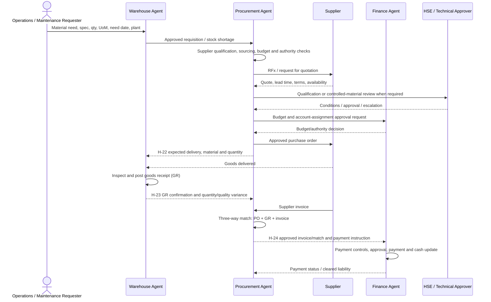

# Procure-to-Pay Workflow Walkthrough

**Scenario:** Purchase of a valve for an illustrative maintenance/operations requirement  
**Sample transaction anchor:** PO `4500001002`  
**Status:** Process simulation grounded in synthetic repository data. The requisition, receipt, invoice, and payment are not correlated to this PO in the sample files; those stages below are simulated control points, not observed postings.

## Executive Summary

This walkthrough follows the repository's five-stage P2P process: requisition, sourcing/PO, goods receipt, invoice verification, and payment. It uses one sample PO and its supplier master record to make the example concrete, then marks the unrepresented handoffs and decisions that a production flow must capture.

Observed sample facts:

- PO `4500001002`: 9 `Gate Valve 6in Class 600 (EA)`, value **CAD 58,455.53**, supplier `SUP-0042`.
- Supplier `SUP-0042`: Kestrel Valve and Actuation Ltd., category Valves and Actuators, risk score **5** (`Low`), status Active.
- Supplier master summary: five POs totaling CAD 739,969 and one contract totaling CAD 950,000. The ratio is **77.89%** at supplier aggregate grain; it is not a PO-to-contract compliance result because the PO has no `Contract_ID`.
- Master-data documentation reports 100% of 500 procurement POs and 300 contracts resolve to a supplier.
- The sample PO material is a description with an embedded unit; there is no conformed Material_ID. Warehouse data lacks PO linkage, and the sample set has no invoice or vendor-payment records.

**Simulated outcome:** the example supplier appears low risk in the synthetic master and its aggregate PO value is below the aggregate supplier contract value. A buyer may prepare a sourcing/PO recommendation subject to normal approvals. The workflow must not mark this specific PO received, matched, or paid from these datasets. It should hold those stages until a PO-linked goods receipt, invoice match, and payment confirmation are supplied by the system of record.

## 1. Participating Agents

| Participant | P2P role | Authority boundary |
|---|---|---|
| Requesting Operations agent / business requester | Defines the operational need, technical specification, required quantity, need-by date, plant, business justification and priority. Examples include Asset Reliability for an MRO need or an operations agent for a process requirement. | Requester does not select/commit a supplier or approve its own spend. |
| Warehouse-Agent | May create a material requisition; checks existing stock, storage, receiving capacity, goods receipt, inspection/quantity variance and inventory update. | Warehouse records receipt and stock action under site controls; it does not award the PO. |
| Procurement-Agent | Validates sourcing path and supplier, runs RFx/selection as required, creates/monitors PO and contract, and verifies invoice against PO/receipt. | Recommends and administers procurement; authorized approvers award/commit; payment is Finance-owned. |
| Finance-Agent | Validates budget/account assignment and financial impact; processes payment/cash update after approved invoice controls. | Payment and journal release stay with authorized Finance roles and segregation-of-duties controls. |
| Supply-Planning-Agent | Provides material requirements, planned supply, lead times and procurement-plan coordination when the purchase affects supply continuity. | Plans requirements; does not approve the purchase award. |
| Asset-Reliability-Agent | Provides asset/work-order context, criticality and MRO demand for maintenance-related requests. | Engineering validates technical fit and criticality; not the buyer/payment authority. |
| Data-Analytics-Agent | Helps validate Supplier_ID coverage, Material key gaps, spend/receipt data quality and lineage. | Does not own procurement facts or approve transactions. |
| HSE-Agent / ESG-Agent | Contributes site safety, hazardous-material, supplier safety/ESG requirements when relevant. | Qualified safety/compliance owners determine controls; no automatic qualification from sample flags. |

The external supplier is a business participant, not an agent. A human requester, buyer, budget owner, receiver/inspector, invoice approver, and payment approver are required control roles even if agent analysis supports their work.

## 2. Master Data Used

| Master/reference object | Sample key/value | P2P use and limitation |
|---|---|---|
| Supplier | `Supplier_ID=SUP-0042` | Joins PO to supplier identity/category/risk. Supplier master reports Active, Risk Score 5, Low tier. |
| Supplier category | `Valves and Actuators` | Supports category sourcing and supplier-category fit; supplier category does not prove item qualification. |
| Contract | Supplier `SUP-0042`; supplier-level aggregate value CAD 950,000 | Contract sample has Contract_ID and Supplier, but PO sample has no Contract_ID. Do not assert the PO is governed by a specific contract without a source link. |
| Material / service | `Gate Valve 6in Class 600 (EA)` | Current PO identifier is a description, not a governed Material_ID. The Material master is a documented gap. |
| Plant / warehouse | No plant or storage location on the sample PO row | Needed for account assignment, delivery, receipt, inspection and inventory. Obtain from requisition/PO extension; do not infer it. |
| Business unit / cost center / GL | BU crosswalk exists; Cost Center and GL appear in Finance datasets | No cost center/GL foreign key on this PO row and no complete cost-object-to-plant/BU master mapping. |
| Unit of measure / currency | Quantity unit appears in the material description; PO value is CAD | Normalize UoM/currency as structured fields before posting or comparison. |
| Requester / approver / employee | Not keyed in sample PO | Needed for accountability, authority checks, audit, and segregation of duties; employee/role master is a documented gap. |

## 3. Transactional Data Used

| Dataset / record | Observed fields and grain | What it supports / does not support |
|---|---|---|
| `Procurement-Agent/sample-data/purchase_orders.csv` | One PO summary row: PO_Number, Supplier, Material, Quantity, Value. Example `4500001002`. | Supports the sample PO/supplier/material/quantity/value facts. No requisition ID, PO item, plant, dates, status, currency column, contract ID, receipt, invoice, or payment reference. |
| `Procurement-Agent/sample-data/supplier_master.csv` | Supplier_ID, Supplier_Name, Category, Risk_Score | Supports supplier lookup and sample risk score; no dated qualification decision or approval event. |
| `Procurement-Agent/sample-data/contracts.csv` | Contract_ID, Supplier, Contract_Value | Supports supplier-level contract context; not explicitly linked to the selected PO and omits terms/validity/remaining commitment fields. |
| `master-data/suppliers.csv` | Supplier-level PO and contract counts/values, status and risk tier | Derived aggregate validation context, not a separate PO/contract posting. |
| `Warehouse-Agent/sample-data/inventory_stock.csv` | Material, Warehouse, Quantity, Unit | Current sample stock position, but no PO reference; material names do not align with procurement PO material names. |
| `Warehouse-Agent/sample-data/warehouse_movements.csv` | Movement_ID, Material, Qty, Warehouse, Movement_Type, Posting_Date, Unit | Movement facts have no PO_Number, GR document, supplier or PO item linkage. Cannot prove receipt of PO 4500001002. |
| `Warehouse-Agent/sample-data/cycle_count.csv` | Material, expected/actual quantity, warehouse, count date, unit | Inventory count evidence; not linked to the selected PO. |
| `Finance-Agent/sample-data/operating_cost.csv` / `budget_vs_actual.csv` | Cost center/type/amount/period; account/budget/actual/variance | Cost and budget context; no invoice ID, AP open item, payment document, or PO/GR/invoice triple match. |

### Transaction Grain and Missing Links

The sample PO is effectively one summary row per PO, while SAP purchase documents normally require header/item, account assignment, delivery schedule, and history detail. A production-quality flow needs stable identifiers such as `Requisition_ID`, `PO_Number` + item, `Material_ID`, `Supplier_ID`, `Plant_ID`, `Storage_Location`, `Goods_Receipt_ID` + item, `Supplier_Invoice_ID` + item, and `Payment_Document_ID`. Current sample files cannot reconstruct the full document chain.

## 4. End-to-End Process and Interactions

The sequence follows `enterprise_process_model.md` §6.2. H-22/H-23/H-24 are process-model handoffs in `agent_collaboration_patterns.md`; they are design references, not confirmed live event interfaces.

| Step | Agent/role | Trigger and data exchanged | Simulated treatment of the sample PO |
|---|---|---|---|
| 1. Need and requisition | Requester + Warehouse/Operations; Asset Reliability may originate MRO requirement | Trigger: identified need/work order or reorder point. PR should contain material/spec, quantity/UoM, need date, plant, cost object, criticality, requester and justification. | A valve purchase is used as the illustrative need context. No PR or work-order ID connects to PO 4500001002, so do not claim this PO was generated from an observed request. |
| 2. Sourcing and PO | Procurement + authorized buyer/approver | Trigger: approved PR and sourcing route. Exchange Supplier_ID, bids/quotes, specification, quantity/UoM, price/currency, terms, delivery date, plant, account assignment and approval. | Observed example: PO 4500001002 for 9 Gate Valve 6in Class 600 (EA), CAD 58,455.53, supplier SUP-0042. Procurement validates vendor/category/risk; award/PO approval remains human. |
| 3. Expected delivery notice (H-22) | Procurement -> Warehouse | Trigger: PO placed. Send expected delivery, material, quantity, PO/item, plant/storage location, date and handling/inspection instructions. | H-22 contract is documented, but sample PO lacks item/plant/date and no Warehouse record links to it. Expected receipt is simulated only. |
| 4. Goods receipt and inspection | Warehouse/receiving + technical inspector | Trigger: truck/parcel arrives. Match delivery to PO item; inspect quantity, condition, certificates and quality; post accepted/rejected/blocked amounts and GR document; update stock. | Process model describes GR posting (SAP movement 101). Warehouse samples contain generic material movements, but no PO/GR key; receipt status for this PO is unknown. |
| 5. Receipt variance notice (H-23) | Warehouse -> Procurement | Trigger: GR posted with quantity/quality variance or accepted receipt. Send PO/item, GR ID/date, accepted/rejected quantity, reason and evidence. | H-23 is a documented handoff; no matching payload exists for this sample PO. Simulate “awaiting receipt confirmation,” not “received.” |
| 6. Invoice verification / three-way match | Procurement + AP/invoice control | Trigger: supplier invoice received. Compare PO terms/quantity/price to accepted GR and invoice; resolve tax, freight, price, quantity, and tolerance exceptions. | Process model assigns invoice verification and three-way match to Procurement. No invoice dataset, invoice ID, tax/terms, or linked GR exists; match result is unknown. |
| 7. Invoice approval and Finance handoff (H-24) | Procurement -> Finance | Trigger: invoice match approved. Send invoice ID, vendor, amount/currency, due date, PO/GR match result, account assignment, tax and approval evidence. | H-24 describes the handoff; no approved invoice/payment instruction is present in sample data. |
| 8. Payment and cash update | Finance | Trigger: due date and approved payment proposal. Validate payment terms, duplicate/fraud controls, bank/payment method, cash position and approval authority; issue payment and clear liability. | Finance skill explicitly excludes AP/payment execution. No invoice or payment records are present, so payment cannot be simulated as completed. |
| 9. Supplier and spend performance | Procurement + Finance + Data Analytics | Trigger: receipt, invoice, payment, quality or contract-period close. Update supplier performance, spend, savings, risk and data lineage. | Supplier aggregate metrics can be checked; receipt punctuality, contract compliance, and realized savings cannot be scored for this PO. |

## 5. KPIs Evaluated

| KPI | Evaluation | Result / caveat |
|---|---|---|
| Supplier master match coverage | Master-data model says all 500 of 500 sample POs resolve to a supplier. | **100% dataset-level match coverage.** This verifies identity linkage, not supplier qualification or PO approval. |
| Supplier risk tier | SUP-0042 Risk_Score 5; master-data dictionary defines Low as <30. | **Low risk in synthetic sample.** Revalidate current risk, sanctions, safety prequalification and ESG status before award. |
| PO value | Selected PO line summary value. | **CAD 58,455.53** for 9 units. The PO CSV has no separate currency field; CAD is stated by its data dictionary. |
| Supplier PO-to-contract value ratio | Supplier aggregate PO value / supplier aggregate contract value. | **77.89%** (CAD 739,969 / CAD 950,000), below the sample-generation limit of 80%. This is supplier-level context, not proof of compliance for PO 4500001002. |
| Contract compliance | Requires PO item linked to a valid contract, effective terms, remaining commitment and applicable pricing. | **Not evaluable.** PO has no Contract_ID; a supplier-level contract exists but the specific PO-to-contract relationship is absent. |
| Spend under management / savings | Requires addressable-spend denominator and approved baseline/actual comparable costs. | **Not evaluable for this PO.** No category baseline, bid comparison, negotiated savings or coverage denominator is provided. |
| Supplier on-time/in-full / receipt quality | Requires due date, actual GR date, quantity and quality disposition. | **Not evaluable.** No receipt linked to the PO. |
| Three-way-match exception rate | Requires matched PO, GR and supplier invoice items. | **Not evaluable.** GR/invoice IDs and match results are absent. |
| P2P cycle time | Requires timestamps from requisition through PO, GR, invoice approval and payment. | **Not evaluable.** Sample PO contains no dates; no PR, invoice or payment transaction exists. |
| Payment on-time / discount capture | Requires invoice due date, payment date and terms. | **Not evaluable.** Finance sample contains no AP invoice/payment history. |

The enterprise KPI model does not define numeric procurement targets. Do not treat the sample supplier risk or generated 80% ceiling as a company-approved threshold.

## 6. Simulated Business Decisions

1. **Need validation:** requester/technical owner confirms the valve specification, required quantity, need-by date, destination plant, criticality and work-order/maintenance context. This is required before sourcing; it is not present on the sample PO.
2. **Supplier review:** SUP-0042 is an eligible candidate by sample status/category and has a low sample risk score. Procurement still checks current qualification, competitive sourcing requirements, sanctions, safety/ESG criteria, delivery capacity and delegated authority.
3. **PO approval:** recommend human approval of CAD 58,455.53 only after budget/cost center, plant, UoM, price, tax/freight terms, delivery date and contract assignment are supplied. No PO approval is inferred from the sample file.
4. **Receipt decision:** receiving/technical inspection accepts, rejects, or blocks each quantity against the PO and required certification. Do not update unrestricted stock before receipt and required inspection controls pass.
5. **Invoice decision:** hold invoice approval until a valid PO-item/GR/invoice three-way match is recorded and exceptions are resolved.
6. **Payment decision:** Finance pays only an approved invoice under payment terms, authority and duplicate-payment controls. The simulation does not claim payment.
7. **Supplier performance decision:** update scorecard after actual delivery/quality evidence; do not infer on-time performance or realized savings from supplier risk and PO value alone.

## 7. Escalation Points

- **Material identity/UoM:** no Material_ID and units are embedded in free-text material descriptions. Escalate to Material Data Steward and requester before PO/GR posting; do not map similar valve descriptions by guess.
- **Supplier qualification/risk:** score threshold, sanctions, safety prequalification or ESG status fails/expired -> Procurement category owner, Supplier Risk/Compliance and HSE/ESG as required. Sample score 5 is synthetic and does not replace current screening.
- **Budget/authority:** missing cost object, budget overrun, or value beyond delegation -> budget owner/Finance and authorized procurement approver; stop commitment until approved.
- **Contract ambiguity:** PO lacks Contract_ID or contract terms/validity are unclear -> Procurement/Legal; do not claim contract compliance from supplier aggregate totals.
- **Receipt discrepancy:** short/over shipment, damage, specification or certificate issue -> receiving inspector/Warehouse, Procurement and technical owner; quarantine/blocked stock where required.
- **Three-way mismatch:** price, tax, quantity, currency or PO-GR-invoice mismatch -> Procurement/AP exception queue and Finance control owner; hold invoice/payment pending resolution.
- **Safety/regulatory handling:** controlled/hazardous material, lifting/storage hazard, or site-specific valve criticality -> HSE/site authority before movement/use.
- **Interface/data quality:** unmatched Supplier_ID, missing PO/GR/invoice correlation key, duplicate event, or stale status -> source-system owner and Data Analytics; retain audit evidence and do not silently discard the transaction.

## 8. Executive Recommendations

1. **Treat the example as a supplier/PO screening illustration only.** It demonstrates a low sample risk and aggregate supplier spend context, not a complete P2P execution.
2. **Close the PO document chain.** Add stable requisition, PO header/item, GR, supplier invoice and payment-document IDs with timestamps and status transitions.
3. **Create a governed Material master and alias crosswalk.** Normalize procurement, warehouse, inventory planning and MRO item IDs, descriptions, UoM, plant and storage location. The master-data guide reports zero name overlap between PO materials and warehouse stock.
4. **Link contracts to PO items.** Capture contract reference, validity, remaining commitment, pricing/terms, tolerances and approval evidence to support true contract compliance.
5. **Connect procurement to receiving.** Carry PO/item and supplier keys into warehouse GR/movement facts; record accepted/rejected quantities, inspection, lot/serial, date and reason.
6. **Add AP and payment facts.** Capture invoice header/item, tax, due date, match result, payment proposal, payment document/date and cash/clearing outcome under Finance segregation of duties.
7. **Define KPI formulas and targets.** Approve spend-under-management, savings baseline, contract compliance, supplier OTIF/quality, cycle time, match-exception rate and payment timeliness with Procurement/Finance owners.
8. **Operationalize supplier risk.** Record risk model/source/as-of date, qualification validity, safety/ESG screening and category-specific thresholds; risk score alone should not auto-approve a supplier.
9. **Formalize H-22/H-23/H-24 contracts.** Define payload schema, correlation keys, event idempotency, replay, SLA, failure queue and human exception ownership; confirm deployment status before describing them as live.
10. **Pilot a controlled category.** Test the end-to-end flow for one MRO category across PR->PO->GR->invoice->payment with users, role separation, reconciliation, audit, negative tests and acceptance thresholds before scaling.

## 9. Interaction Sequence Diagram

The diagram combines the documented process sequence with human controls. Requisition/quote/invoice/payment messages are process requirements for this simulation; H-22, H-23 and H-24 are listed in the process-model handoff registry but are not demonstrated as deployed integrations by the sample CSVs.

## 10. Source References and Limitations

- [P2P process definition](enterprise_process_model.md#62-procure-to-pay-p2p)
- [Procurement skill](Procurement-Agent/SKILL.md), [Warehouse skill](Warehouse-Agent/SKILL.md), [Finance skill](Finance-Agent/SKILL.md), and [Asset Reliability skill](Asset-Reliability-Agent/SKILL.md)
- [Agent collaboration patterns](agent_collaboration_patterns.md), [Agent capability matrix](agent_capability_matrix.md), and [Agent Interaction Model](Agent_Interaction_Model.md)
- [Master-data landing page](master-data/README.md), [detailed master-data model](master-data/README_master_data_model.md), [field dictionary](master-data/master_data_dictionary.md), and [relationship matrix](master-data/data_relationship_matrix.csv)
- [Entity relationship model](entity_relationship_model.md), [Enterprise KPI Model](Enterprise_KPI_Model.md), and [SAP reference architecture](sap_reference_architecture.md)
- Sample data: Procurement `supplier_master.csv`, `purchase_orders.csv`, `contracts.csv`; Warehouse `inventory_stock.csv`, `warehouse_movements.csv`, `cycle_count.csv`; Finance `operating_cost.csv`, `budget_vs_actual.csv`, `revenue.csv`.

All sample values are synthetic. The purchase-order sample is summarized rather than itemized; supplier contracts are not linked to PO IDs; warehouse movements lack PO/GR references; and invoice/payment datasets are absent. SAP ECC/S/4HANA objects are reference mappings, not a verified customer landscape. Validate source schemas, module availability, workflow controls, contracts and regulatory requirements before implementation.
