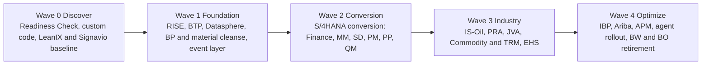
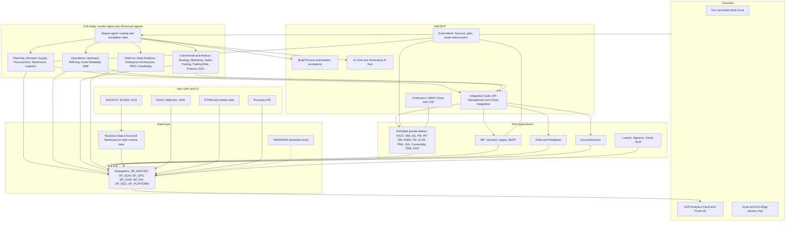

# SAP Reference Architecture
## Energy Enterprise Transformation Advisor (ICA-Edge)

| | |
|---|---|
| **Scope** | 19 business-domain agents, 8 master entities, SAP target landscape |
| **Sources** | README.md, SKILL.md, structure.md, Enterprise_Capability_Model.md, Enterprise_KPI_Model.md, entity_relationship_model.md, Agent_Interaction_Model.md |
| **Version** | 1.0 (draft for architecture review) |

---

## 1. Purpose and basis

This document maps the 19 agents of the Energy Enterprise Transformation Advisor to SAP solutions and defines the current-state, target-state, SAP BTP, SAP Datasphere and ECC-to-S/4HANA migration views that support them.

**What the repository defines.** Nineteen domain agents under a master routing agent; capabilities in three tiers (Strategic, Core Business, Supporting); eight master entities (Asset, Business Unit, Customer, Product, Region, Supplier, Plant, Warehouse) with their keys; three confirmed agent flows into Supply Planning (Demand Forecast, Procurement Plan, Asset Status); two human escalation rules; and a KPI catalog with owners.

**Assumptions to validate** (the repository does not contain a landscape inventory):

1. The current-state landscape in section 3 is an illustrative baseline for an integrated oil and gas company on SAP ECC 6.0. Replace it with the actual inventory from the Enterprise-Architecture-Agent before sizing.
2. Product names and versions follow SAP's public portfolio. Confirm against the current SAP roadmap and the S/4HANA Simplification List.
3. The Entity Relationship Model names source files `customer_master.csv`, `plant_master.csv` and so on. The generated master data uses `customers.csv`, `plants.csv` and so on. Entity names and primary keys match; only file names differ.
4. Where SAP has no solution for a domain, this document says **"Not provided by SAP"** and names the usual non-SAP or partner option.

**Design principles.** (1) Clean core: no modifications to standard S/4HANA code; extend on BTP. (2) One conformed master data set shared by every agent. (3) Agents read governed data from Datasphere and write only through released SAP APIs. (4) Events, not polling, move plans between agents. (5) Human approval stays inside SAP workflow.

---

## 2. SAP solution mapping

### 2.1 Capability-to-SAP mapping

| Tier | Capability (primary agent) | SAP solution | Fit |
|---|---|---|---|
| Strategic | Enterprise Strategy (Corporate-Strategy) | SAP Analytics Cloud (planning, scenarios); SAP Group Reporting; SAP Portfolio and Project Management | Partial. M&A target screening and market intelligence: Not provided by SAP |
| Strategic | Transformation Management (Transformation-PMO) | SAP Cloud ALM; SAP Signavio; SAP PPM; S/4HANA Project System | Good. Detailed construction scheduling is usually Oracle Primavera P6 |
| Core | Demand Planning (Demand-Planning) | SAP Integrated Business Planning (IBP) for Demand, Demand Sensing | Good |
| Core | Supply Planning (Supply-Planning) | SAP IBP for Supply and S&OP, Inventory; S/4HANA MRP Live; PP/DS | Good. Crude and refinery linear-programming models (for example Aspen PIMS): Not provided by SAP |
| Core | Procurement (Procurement) | SAP Ariba (Sourcing, Contracts, Supplier Lifecycle and Performance); S/4HANA MM; SAP Fieldglass | Good |
| Core | Asset Management (Asset-Reliability) | S/4HANA Plant Maintenance and EAM; SAP Asset Performance Management (APM); SAP Predictive Asset Insights | Good for work orders and criticality. Vibration and condition analytics often need third-party tools (GE APM, AVEVA) |
| Supporting | Data Analytics (Data-Analytics) | SAP Datasphere; SAP Business Data Cloud; SAP Analytics Cloud; BW/4HANA (transition); BusinessObjects | Good |
| Supporting | Enterprise Architecture (Enterprise-Architecture) | SAP LeanIX; SAP Signavio; SAP Integration Suite | Good |

### 2.2 Value-chain domains outside the capability model

| Domain (agent) | SAP solution | Fit |
|---|---|---|
| Warehouse | S/4HANA embedded EWM or SAP EWM; MM-IM | Good |
| Logistics | S/4HANA Transportation Management or SAP TM; IS-Oil Transportation and Distribution; SAP GTS | Good. Pipeline batch scheduling and SCADA: Not provided by SAP |
| Upstream-Operations | IS-Oil Production and Revenue Accounting (PRA); S/4HANA Joint Venture Accounting (JVA); Project System for drilling AFEs | Partial. Reservoir modelling, well planning and production allocation (Petrel, WellView, Energy Components): Not provided by SAP |
| Refining-Operations | S/4HANA PP-PI, QM, IS-Oil Hydrocarbon Product Management; SAP Digital Manufacturing | Partial. Process control (DCS), historians (AVEVA PI) and LIMS (LabWare): Not provided by SAP |
| Sales-Trading | S/4HANA Sales (SD), SAP Commodity Management (procurement, sales, pricing, risk), IS-Oil Trader's and Scheduler's Workbench | Partial. Full energy trading and risk management (ETRM) with forward curves: Not provided by SAP |
| Trading-Risk | SAP Treasury and Risk Management (TRM) and Commodity Management risk functions | Partial. VaR with commodity forward curves and market data: Not provided by SAP |
| Finance | S/4HANA Finance (Universal Journal, Controlling), Group Reporting, Advanced Financial Closing, JVA, Cash Management | Good |
| Commercial-Marketing | S/4HANA SD pricing; SAP Customer Data Platform; SAP Commerce; SAP Sales Cloud | Partial. Market intelligence and retail fuel pricing engines: Not provided by SAP |
| ESG | SAP Sustainability Control Tower; Sustainability Footprint Management; S/4HANA EHS | Partial. Methane quantification and leak detection and repair (LDAR): Not provided by SAP |
| HSE | S/4HANA EHS (Incident Management, Risk Assessment); SAP Product Compliance; Work Clearance Management | Good. API RP 754 tier calculation is configuration or custom |
| Knowledge-Repository | SAP Build Work Zone; SAP Document Management Service; Joule | Partial. Engineering document control (OpenText Documentum) and enterprise search: Not provided by SAP |

### 2.3 Master entity to SAP object mapping

This fills the empty "SAP Object Mapping" section of the Entity Relationship Model.

| Entity | Key | SAP object | Notes |
|---|---|---|---|
| Customer | Customer_ID | Business Partner (customer role); legacy KNA1 | Customer-vendor integration (CVI) is mandatory in S/4HANA |
| Supplier | Supplier_ID | Business Partner (supplier role); legacy LFA1 | Same BP number range; one partner can be both |
| Product | Product_ID | Material (MARA, MARC) | 40-character material number in S/4HANA |
| Plant | Plant_ID | Plant (T001W); refineries and terminals also as functional locations | Plant codes (R100, T100) carry over |
| Warehouse | Warehouse_ID | Storage location (T001L); EWM warehouse number | |
| Asset | Asset_ID | Equipment (EQUI) with Functional Location (IFLOT) | Asset_ID maps to equipment number; functional location holds site hierarchy |
| Region | Region_ID | Country and region (T005S); sales district; Datasphere hierarchy | No single SAP object; model as a hierarchy |
| Business Unit | Business_Unit_ID | Profit Center and Segment (above company code) | Roll-up of Finance BU codes (BU01 to BU12) |

---|---|
| Revenue Growth Rate, EBITDA Margin, ROA (Finance, Corporate-Strategy) | Universal Journal (ACDOCA) via Datasphere; SAC |
| Customer Satisfaction, Retention (Commercial-Marketing) | CRM or survey data (SAP Qualtrics if used); SD billing history |
| Asset Utilization (Asset-Reliability) | PM notifications and orders; APM; AVEVA PI operating hours |
| Supply Chain Throughput (Supply-Planning) | IBP supply plan versus S/4HANA goods movements (MATDOC) |

---

## 3. Current-state architecture (illustrative baseline)

```
Channels     SAP GUI | Fiori (limited) | Excel and e-mail planning | BO WebI / Power BI
Analytics    BW on HANA (7.5) | BusinessObjects | many spreadsheet extracts
Applications SAP ECC 6.0 (FI/CO, MM, SD, PM, PP, QM, IS-Oil, JVA)  |  SAP TM / EWM (some)  |  SAP SuccessFactors
Integration  SAP PI/PO 7.5 | IDocs | SFTP files | point-to-point scripts
Non-SAP      AVEVA PI historians | DCS and SCADA | LabWare LIMS | WellView / Petrel | ETRM tool | Primavera P6
Infra        On-premise or hosted; AnyDB or HANA; Windows and Linux servers
```

**Pain points that the agents expose.**

| # | Observation | Effect on agents |
|---|---|---|
| 1 | Customer and vendor masters held separately (KNA1, LFA1) and duplicated across plants | Demand, Procurement and Sales agents see different customer and supplier records |
| 2 | Planning in spreadsheets; demand and supply plans do not reconcile | The Demand-to-Supply flow in the interaction model has no system of record |
| 3 | Reporting through BW on HANA and BusinessObjects with overlapping reports | Data-Analytics-Agent cannot find certified sources |
| 4 | PI/PO point-to-point interfaces, no event layer; Z-code in IS-Oil, PRA and PM; inconsistent site and BU codes | Event triggers are batch files; clean core is blocked; cross-agent joins need crosswalks |

---

## 4. Target-state architecture

**Landscape.** SAP S/4HANA on RISE (private edition) is the digital core. Cloud applications handle planning (IBP), sourcing (Ariba) and people (SuccessFactors). SAP BTP provides integration, extension, workflow and AI services. SAP Datasphere is the single governed data layer. ICA-Edge hosts the master agent and 19 domain agents, which call SAP only through BTP.

| Layer | Target solution | Replaces |
|---|---|---|
| Digital core | S/4HANA private edition: FI/CO, MM, SD, PM, PP, QM, EWM, TM, IS-Oil, PRA, JVA, Commodity Management, TRM, EHS | ECC 6.0 |
| Planning | SAP IBP (demand, supply, S&OP, inventory) | Spreadsheets, APO or legacy planning |
| Sourcing | SAP Ariba, Fieldglass | Manual RFx, contract folders |
| People | SAP SuccessFactors | HCM on ECC |
| Business partner | S/4HANA Business Partner, optionally SAP Master Data Governance (MDG) | KNA1, LFA1 duplicates |
| Integration | SAP Integration Suite (Cloud Integration, API Management, Event Mesh) | PI/PO, point-to-point |
| Extension | BTP: ABAP Cloud (RAP), CAP, Build apps | Z-code in the core |
| Data | Datasphere, Business Data Cloud, SAC, Power BI | BW on HANA, BusinessObjects |
| AI | BTP AI Core and Generative AI Hub; Joule; ICA-Edge agents | Ad hoc analysis |
| Governance | SAP LeanIX, Signavio, Cloud ALM | Spreadsheet inventories |

**Agent interaction in the target state.**

| Flow (from the Agent Interaction Model) | Target implementation |
|---|---|
| Demand Planning to Supply Planning (Demand Forecast) | IBP demand plan published as an event; Supply-Planning-Agent subscribes |
| Procurement to Supply Planning (Procurement Plan) | Ariba and S/4HANA purchase requisitions and contracts exposed through released APIs and events |
| Asset Reliability to Supply Planning (Asset Status) | PM or APM status event; capacity constraint updates IBP |
| Escalation: forecast variance above 20% | BTP Build Process Automation workflow to the demand planner |
| Escalation: procurement plan conflicts with supply plan | Workflow task to supply and procurement managers with both plans attached |

The routing logic ("route demand forecast to Supply Planning" and so on) stays in the ICA-Edge master agent. SAP owns the data, authorizations and approvals.

---

## 5. SAP BTP architecture

**Account model.** One global account; directories by domain (Supply Chain, Operations, Commercial and Finance, Platform); subaccounts per environment (dev, test, prod) with Cloud Transport Management between them. Cloud Connector links BTP to the private-edition S/4HANA network. Identity: SAP Cloud Identity Services federated with Microsoft Entra ID; agents use technical users with OAuth 2.0 client credentials and, where user context matters, principal propagation.

| BTP service | Role in the advisor |
|---|---|
| Integration Suite: API Management | One governed front door for agent calls into S/4HANA, IBP and Ariba; rate limits, authentication, audit |
| Integration Suite: Cloud Integration | Replaces PI/PO interfaces; B2B partners, regulatory files, non-SAP systems |
| Event Mesh / Advanced Event Mesh | Carries the three agent events plus operational events (work order created, shipment delayed) |
| Build Process Automation | Human escalation workflows, approvals, notifications |
| ABAP Cloud and CAP | Side-by-side extensions (for example API RP 754 tier calculator, allocation reconciliation) |
| SAP HANA Cloud | Persistence for extensions and agent memory that needs HANA features |
| AI Core and Generative AI Hub | Governed model access, prompt logging, retrieval over Datasphere and Work Zone content |
| Build Work Zone | Single launchpad combining Fiori apps, SAC stories and the advisor chat |
| Cloud ALM and Cloud Transport Management | Operations, monitoring, transports |
| Alert Notification, Destination, Credential Store | Operations and secrets |

**Event topics** (naming proposal): `ica/demand/forecast/updated`, `ica/procurement/plan/updated`, `ica/asset/status/changed`, `ica/supply/plan/published`, `ica/escalation/raised`. Payloads carry conformed keys (Product_ID, Region_ID, Plant_ID, Asset_ID, Supplier_ID) and a Datasphere view reference, not full data sets.

**Security.** Least-privilege roles per agent (read through Datasphere; write only through named APIs); data classification tags in Datasphere; audit trail in API Management and AI Core; no agent holds ERP credentials.

---

## 6. SAP Datasphere architecture

The Entity Relationship Model names a Datasphere modeling view as a placeholder. This section defines it.

**Spaces** (aligned to agent groups, plus one shared space):

| Space | Content | Agents |
|---|---|---|
| `SP_MASTER` | Conformed dimensions: Customer, Supplier, Product, Plant, Warehouse, Asset, Region, Business Unit; BU crosswalk | All 19 |
| `SP_SCM` | Demand, supply, procurement, inventory, shipment facts | Demand-Planning, Supply-Planning, Procurement, Warehouse, Logistics |
| `SP_OPS` | Production, refinery output and yield, maintenance, failures, incidents | Upstream, Refining, Asset-Reliability, HSE |
| `SP_COM` | Orders, contracts, trades, prices, hedges, exposure | Commercial-Marketing, Sales-Trading, Trading-Risk |
| `SP_FIN` | Revenue, cost, budget vs actual, project portfolio, benefits | Finance, Corporate-Strategy, Transformation-PMO |
| `SP_ESG` | Emissions, water, targets | ESG, HSE |
| `SP_PLATFORM` | Catalog, lineage, application and interface inventory, document metadata | Data-Analytics, Enterprise-Architecture, Knowledge-Repository |

**Layers inside each space.**

| Layer | Objects | Rule |
|---|---|---|
| L0 Inbound | Replication flows and remote tables from S/4HANA (CDS extraction views), IBP, Ariba; file uploads; historian extracts | Raw, no business logic |
| L1 Harmonized | Views that apply conformed keys (BP number to Customer_ID, material to Product_ID, plant to Plant_ID) and the BU crosswalk | One transformation per source |
| L2 Business | Fact and dimension views (for example Demand Forecast, Production Plan, Work Orders, Incidents) | Reusable across agents |
| L3 Consumption | Analytic models and agent-facing views with measures and security | Only layer agents and SAC may read |

**Source patterns.** S/4HANA: replication flows from CDS extraction views for large facts, remote tables with federation for small, fresh reference data. Non-SAP: AVEVA PI and SCADA aggregates through files or APIs into Datasphere; high-frequency tags stay in the historian or a lakehouse (Business Data Cloud with Databricks) and are summarized into Datasphere. Legacy BW: keep BW/4HANA queries only until content is rebuilt as analytic models.

**Agent data contracts to Datasphere models.**

| Agent contract (from the interaction model) | Datasphere object | Keys |
|---|---|---|
| Demand Forecast | `FACT_DEMAND_FORECAST` (L2), analytic model `AM_DEMAND` | Product_ID, Region_ID, Month |
| Procurement Plan | `FACT_PROCUREMENT_PLAN`, `AM_PROCUREMENT` | Supplier_ID, Product_ID or Material, Plant_ID |
| Asset Status | `FACT_ASSET_STATUS`, `AM_ASSET_RELIABILITY` | Asset_ID, Plant_ID |
| Supply Plan | `FACT_SUPPLY_PLAN`, `AM_SUPPLY` | Product_ID, Plant_ID, Month |
| KPI catalog | `FACT_KPI` with owner, formula version and source view | KPI, Business_Unit_ID, Period |

**Governance.** Data owner per space; business glossary aligned to the KPI model; data access controls by business unit; lineage published to the Knowledge-Repository-Agent; consumption through SAC, Power BI (live connection to analytic models) and the agents.

---

## 7. ECC to S/4HANA migration view

### 7.1 Approach decision

| Option | Fit for this enterprise | Verdict |
|---|---|---|
| Greenfield | Cleanest core, but re-implements IS-Oil, PRA, JVA and three refinery configurations; loses history | Use for Finance chart-of-accounts redesign only if business agrees |
| **Brownfield (system conversion)** | Keeps IS-Oil, PRA, JVA configuration and history; fastest for large industrial ERP | **Recommended base approach**, with a clean-up of Z-code and master data first |
| Selective data transition (bluefield) | Allows entity-by-entity cutover (for example a separate commodity trading entity) | Use for carve-outs or new legal entities |

### 7.2 What changes (simplification impact)

| Area | ECC today | S/4HANA target | Impact |
|---|---|---|---|
| Master data | Separate customer and vendor | Business Partner with CVI | Cleanse, merge duplicates before conversion |
| Product | 18-character material | 40-character material number | Check interfaces and custom fields |
| Finance | GL, CO, asset accounting separate | Universal Journal (ACDOCA), new asset accounting | Reconcile; BW and report redesign |
| Inventory | MKPF and MSEG | MATDOC | Replace custom reads |
| Planning | MRP in batch | MRP Live; IBP for S&OP | Retire APO or spreadsheets |
| Credit | FI-AR credit | SAP Credit Management | Reconfigure |
| Oil and gas | IS-Oil with Z-enhancements | IS-Oil, PRA, TSW, JVA available in S/4HANA with simplifications | Review the Simplification List item by item |
| Maintenance | PM, SAP GUI | S/4HANA EAM, Fiori; APM | Fiori role redesign |
| EHS | EHS Incident (legacy) | S/4HANA EHS | Data migration, new app model |
| Reporting | BW on HANA, BusinessObjects | Datasphere, SAC, embedded analytics | Rebuild per report-rationalization rules |
| Integration | PI/PO | Integration Suite | Migrate or retire interfaces |
| Custom code | Z programs | ATC clean-core checks; ABAP Cloud | Retire, re-implement on BTP, or keep in core with approval |

SAP's maintenance dates for ECC 6.0 and the options for private-edition customers have changed more than once. Confirm the current dates with SAP before fixing the program deadline.

### 7.3 Waves



Agent rollout follows data readiness: Data-Analytics, Enterprise-Architecture and Knowledge-Repository first (Wave 1), planning and operations agents after conversion (Waves 2 and 3), trading and ESG agents last (Wave 4).

---

## 8. Agent-to-SAP mapping

| # | Agent | Primary SAP solutions | Key SAP objects and interfaces | Not provided by SAP (typical option) |
|---|---|---|---|---|
| 1 | Corporate-Strategy | SAC planning; Group Reporting; PPM | ACDOCA aggregates; SAC planning models | M&A screening, market intelligence |
| 2 | Commercial-Marketing | S/4HANA SD; Customer Data Platform | Pricing conditions (KONV or PRCD); customer BP | Retail fuel pricing engine |
| 3 | Demand-Planning | IBP Demand, Demand Sensing | Planning area, key figures; OData and event APIs | External demand signals |
| 4 | Procurement | Ariba; S/4HANA MM; Fieldglass | PO, contract, supplier BP; Ariba APIs | Spend benchmarks |
| 5 | Supply-Planning | IBP Supply and S&OP; MRP Live | Supply plan, inventory targets, supply constraints | Refinery LP (Aspen PIMS) |
| 6 | Warehouse | EWM; MM-IM | Warehouse tasks, stock (MATDOC), cycle counts | RFID readers and scanners |
| 7 | Logistics | TM; IS-Oil T&D; GTS | Freight orders, shipments, carriers | Pipeline scheduling, SCADA |
| 8 | Upstream-Operations | IS-Oil PRA; JVA; Project System | Well and entitlement data; JV cash calls; AFEs | Reservoir, drilling and allocation tools |
| 9 | Refining-Operations | PP-PI; QM; IS-Oil HPM; Digital Manufacturing | Process orders, inspection lots, material documents | DCS, historian, LIMS, LP model |
| 10 | Asset-Reliability | S/4HANA EAM; APM; Predictive Asset Insights | Equipment, functional locations, notifications, orders | Vibration and condition analytics |
| 11 | Sales-Trading | SD; Commodity Management; TSW | Sales orders, contracts, pricing, deals | Full ETRM, forward curves |
| 12 | Finance | S/4HANA Finance; Group Reporting; Advanced Closing | ACDOCA, cost centers, profit centers, journal APIs | Consolidation tax engines (local) |
| 13 | ESG | Sustainability Control Tower; Footprint Management | Emission factors, activity data, targets | Methane measurement, LDAR |
| 14 | Data-Analytics | Datasphere; Business Data Cloud; SAC | Spaces, replication flows, analytic models, lineage | Specialized ML platforms |
| 15 | Enterprise-Architecture | LeanIX; Signavio; Integration Suite | Application, interface and process inventories | OT architecture tools |
| 16 | Transformation-PMO | Cloud ALM; PPM; Signavio | Project, milestone and benefit tracking | Primavera P6 scheduling |
| 17 | HSE | S/4HANA EHS; Work Clearance Management | Incidents, risk assessments, permits, audits | Behavior-based safety apps |
| 18 | Trading-Risk | TRM; Commodity Management risk | Positions, hedge designation, market data | VaR with forward curves |
| 19 | Knowledge-Repository | Build Work Zone; Document Management; Joule | Document metadata, links to LeanIX and Datasphere | Engineering document control (Documentum) |

---

## 9. Architecture diagram



---

## 10. Next steps

1. Replace the illustrative current-state baseline with the real landscape from the Enterprise-Architecture-Agent inventory.
2. Run the SAP Readiness Check and a custom-code analysis to confirm the brownfield approach.
3. Build SP_MASTER first (the eight conformed entities and the business-unit crosswalk); every other space and agent depends on it.
4. Stand up Integration Suite, Event Mesh and the three agent events as the first end-to-end scenario (demand to supply to procurement to asset status).
5. Decide the strategy for each "Not provided by SAP" item (keep, integrate, or replace) as part of the target architecture review.
