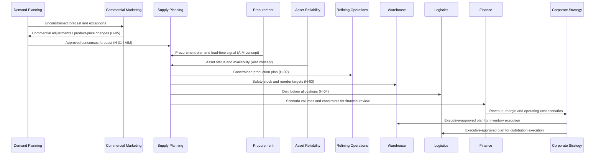

# S&OP Workflow Walkthrough

**Simulation period:** November 2026 planning cycle  
**Scenario:** Cold Winter 2026-27 demand sensitivity for Winter Diesel No. 1  
**Status:** Tabletop simulation using repository sample data; no agents were executed and no operational plan was approved or published.

## Executive Summary

This walkthrough follows the repository's monthly S&OP flow from demand forecast through executive review and execution planning. It uses the actual synthetic records available for Winter Diesel No. 1 and surfaces the data blockers that prevent a valid quantitative supply-demand balance.

Observed sample facts:

- Demand Planning has five November 2026 regional forecast rows totaling **82,112 Forecast_Volume units**. The CSV has no unit column and the agent currently has no data dictionary.
- The `Cold Winter 2026-27` scenario has `Demand_Impact = +5.4`; the impact unit/meaning is undocumented. **If** treated as a 5.4% uplift, the conditional demand becomes 86,546 units (an increase of 4,434). This is a sensitivity illustration, not an approved forecast.
- Supply Planning has three November product-plan rows totaling **169,621 kL**: R100 73,464 kL; R200 52,232 kL; R300 43,925 kL.
- The demand unit is unknown, so the demand total cannot be compared to the kL supply plan. Product master states litres as the base unit, but that does not establish the unit used by this forecast file.
- The inventory plan has **36,544 kL of safety-stock targets** across 10 plants/terminals for this product. Warehouse `inventory_stock.csv` has zero exact-name rows for Winter Diesel No. 1, so current stock coverage cannot be calculated.
- November synthetic constraints include an R200 outage, R100 extreme cold and crude-pipeline allocation limits, and multiple terminal/transport constraints. Treat their impact values as modeled reductions per the supply-constraint data dictionary, not observed losses.
- Finance sample actuals end in August 2026; no forward financial review can be calculated from the repository sample alone.

**Simulated executive outcome:** hold the plan as provisional. Authorize data normalization and a constrained scenario rerun; do not declare surplus/shortage, promise customer service, release new procurement, or approve a final production schedule until units, inventory, plant allocation, constraint treatment, and finance assumptions are reconciled.

## 1. Participating Agents

### Core S&OP Participants

| Agent | Role in this cycle | Decision authority / boundary |
|---|---|---|
| Demand-Planning-Agent | Produces the unconstrained forecast and cold-winter sensitivity; reports forecast accuracy and bias when actuals are available. | Owns forecast methods/versions; escalates forecast variance above 20% to a human planner per the Agent Interaction Model. |
| Commercial-Marketing-Agent | Reviews commercial demand, product/price changes, segment/customer context, and pricing assumptions. | Recommends commercial adjustments; does not execute physical trades or override risk limits. |
| Supply-Planning-Agent | Reconciles demand, plant capability, inventory, procurement, logistics, and constraints into constrained/unconstrained plans. | Owns planning recommendation; cannot authorize plant-control actions or procurement awards. |
| Refining-Operations-Agent | Validates refinery production, throughput, unit availability, yields, quality and operating feasibility. | Site/technical operators approve operating changes and product release. |
| Finance-Agent | Reviews revenue, margin, operating cost, working-capital and scenario impact. | Finance validates financial definitions and close/forecast assumptions. |
| Corporate-Strategy-Agent | Chairs executive S&OP in the process model and decides strategic exceptions and integrated-plan priorities. | Executive/portfolio approval remains human and follows delegated authority. |
| Warehouse-Agent | Confirms inventory position, storage capacity, safety stock, and execution readiness. | Warehouse owners approve inventory adjustments and handling exceptions. |
| Logistics-Agent | Checks distribution allocations, terminal/carrier/transport feasibility, and delivery risk. | Logistics operators approve dispatch/rerouting and applicable transport controls. |

### Supporting Contributors

| Agent | S&OP contribution | Trigger / boundary |
|---|---|---|
| Procurement-Agent | Confirms supplier lead times, expected receipts, material availability and sourcing constraints. | Supply plan/procurement-plan conflict escalates to human owners; no sample procurement plan is present for this cycle. |
| Asset-Reliability-Agent | Supplies asset availability, outage/maintenance windows, and status affecting plant capacity. | Asset Status is an explicit input contract to Supply Planning, but no current event payload is in the samples. |
| Data-Analytics-Agent | Validates keys, units, coverage, lineage, and scenario/report calculations. | Data owners resolve business defects; analytics does not redefine the business forecast or approve the plan. |
| ESG-Agent | Can compare emissions/water implications when a plan and factors are available. | Optional decision lens; repository sample ESG periods end before the November 2026 scenario. |
| HSE-Agent | Reviews safety or compliance implications if an operating or transport option changes exposure. | Required when process safety, permits, hazardous materials, or regulatory constraints are implicated; no direct HSE step is listed in the core S&OP flow. |

## 2. Sequence of Interactions

The primary sequence follows `enterprise_process_model.md` §6.1. Handoff IDs refer to its registry. H-01 and the Procurement Plan/Asset Status inputs are also represented in the Agent Interaction Model. Other process-model handoffs are documented design contracts, not proof of deployed interfaces.

| Step | Agent(s) | Trigger and activity | Data exchanged / resulting artifact | Outcome in this simulation |
|---|---|---|---|---|
| 0. Data readiness | Demand Planning, Supply Planning, Data Analytics; source owners | Monthly cycle opens; validate product/region/plant keys, units, period, file freshness, and relationship coverage. | `demand_forecast.csv`, `demand_scenarios.csv`, `production_plan.csv`, `supply_constraints.csv`, `inventory_plan.csv`, warehouse stock, product/plant masters. | Validation finds a missing demand UoM, undocumented scenario-impact units, and no exact-name warehouse stock row for the selected product. Mark the balance provisional. |
| 1. Statistical forecast | Demand Planning | Monthly forecast run/version is prepared. | Unconstrained forecast by product-region-month; November Winter Diesel forecast is 28,739 Alberta; 9,908 BC; 15,059 Saskatchewan; 16,360 Ontario; 12,046 Quebec. | Base forecast totals 82,112, but has no unit/version metadata in the CSV schema. |
| 2. Commercial demand review | Commercial Marketing with Demand Planning | Product portfolio, price, market, or customer changes are reviewed; H-05 is triggered by product/price changes. | Product/price changes, regional pricing zones, customer segments, demand adjustments and commercial assumptions. | Review PRD-012 product and pricing-zone assumptions; the cold-weather scenario is retained as an alternative, not silently merged into the baseline. |
| 3. Supply constraint identification | Supply Planning with Procurement, Asset Reliability, Refining Operations and Logistics | Demand review is complete; material shortages, capacity, feedstock, asset and distribution constraints are gathered. | Procurement-plan/lead-time data and Asset Status are AIM inputs; constraints identify plant/site, impact and time window. | November constraints include R200 outage (15.2%, 6 days from Nov 1), R100 extreme cold (22.5%, 5 days from Nov 2), R100 crude-pipeline allocation (24.4%, 8 days from Nov 21), and terminal/transport constraints. |
| 4. Constrained supply review | Supply Planning + Refining Operations | Supply review tests feasible product/plant plans against demand, capacity, feedstock, inventory and outage assumptions. | Constrained supply plan, inventory plan, production schedule, risk scenarios; H-02 sends production plan to Refining. | The current sample production plan is 169,621 kL across R100/R200/R300. It cannot be reconciled to 82,112 forecast units until UoM and grain are confirmed. |
| 5. Inventory and distribution review | Supply Planning + Warehouse + Logistics | Inventory plan is approved and distribution allocation is issued; H-03 sends safety-stock/reorder targets, H-04 sends plant-to-customer allocations. | Safety-stock targets, opening/on-hand stock, allocation by product/plant/customer/terminal, transportation feasibility and delivery window. | Safety-stock targets total 36,544 kL. Actual stock is unavailable for exact-name Winter Diesel in the warehouse sample; allocations remain unapproved. |
| 6. Financial review | Finance with Commercial, Supply, Refining and Procurement | Constrained alternatives are costed for revenue, margin and operating cost. | Product volumes and prices, refinery costs/yields, procurement costs, freight, budget/actuals, scenario assumptions. | No valid Nov 2026 financial impact is calculated: Finance actual/budget sample periods end Aug 2026 and volume units/allocations are unresolved. |
| 7. Executive S&OP | Corporate Strategy with functional owners | Integrated options and exceptions are presented for approval. | Plan versions, service/cost/risk/emissions trade-offs, unresolved data issues, exception requests. | Executive decision: authorize a conditional scenario rerun; do not yet approve a final plan or customer promise. |
| 8. Plan execution and feedback | Warehouse + Logistics; Refining and operations execute; Finance records outcomes | Approved plan is released and translated into inventory/distribution execution; actuals feed the next cycle. | Production plan, safety-stock/replenishment signals, allocations, dispatch and actual shipment/production/inventory/financial outcomes. | Not simulated as an actual posting or dispatch. Execution remains subject to human approvals and system integration. |

## 3. Data Exchanged

| Producer -> Consumer | Data payload | Keys / grain | Contract status and issue |
|---|---|---|---|
| Commercial Marketing -> Demand Planning (H-05) | Product launch/discontinuation, price changes and commercial adjustments. | Product_ID or governed product alias; pricing zone/region; effective period. | Handoff listed in process model; payload schema/cadence is not implemented in repository. |
| Demand Planning -> Supply Planning (H-01 / AIM) | Approved consensus demand forecast by product/plant or product-region/period, with version and scenario. | Current file grain is Product + Region + Month; `Forecast_Volume` has no UoM, version, or status columns. Plant mapping is not explicit. | Explicit AIM flow, but sample contract lacks a data dictionary and canonical unit contract. |
| Procurement -> Supply Planning (AIM) | Procurement plan, expected receipts, lead times, PO/contract supply. | Supplier_ID, Material_ID, Plant_ID, due period, quantity/UoM, status. | Explicit AIM input concept; no approved November procurement-plan sample dataset or Material master. |
| Asset Reliability -> Supply Planning (AIM) | Asset status/capacity availability and maintenance windows. | Asset_ID, Plant_ID/Facility_ID, status, validity period, capacity impact. | Explicit AIM input concept; no timestamped event payload in the sample set. |
| Supply Planning -> Refining Operations (H-02) | Production plan by plant/product/volume/period. | Plant, Product, Planned_Qty, Month, Unit. | Process handoff; the sample has kL for Winter Diesel and needs demand UoM normalization. |
| Supply Planning -> Warehouse (H-03) | Approved safety-stock targets and reorder points. | Material/Product, plant/warehouse, quantity/UoM, effective period. | Process handoff; planned safety-stock facts exist, but on-hand Winter Diesel is not represented in warehouse stock sample. |
| Supply Planning -> Logistics (H-04) | Plant-to-customer allocations and distribution schedule. | Product, plant, customer/Ship-To, quantity/UoM, requested date, route/terminal. | Process handoff; no explicit region-to-plant allocation key or Ship-To master. |
| Supply/Refining/Procurement -> Finance | Scenario volumes, yield, feedstock/operating cost, price and freight assumptions. | Product/plant/period/BU, currency, volume UoM, cost basis. | Finance review is a process step; Nov forecast financial data and reconciled cost allocation are absent. |

### Observed Sample Values

| Measure | Value | Interpretation |
|---|---:|---|
| November 2026 Winter Diesel demand | 82,112 across 5 regions | `Forecast_Volume`; UoM unspecified. |
| Cold Winter 2026-27 scenario impact | +5.4 | `Demand_Impact`; sign is present, but unit/semantics are undocumented. |
| Conditional cold scenario total | 86,546 | Only if +5.4 means +5.4%; same unknown unit as base. The implied increase is 4,434. |
| November production plan | 169,621 kL | R100 73,464; R200 52,232; R300 43,925. This is not comparable to demand until demand UoM and allocation grain are validated. |
| Network safety-stock target | 36,544 kL | Ten R/T nodes; a target, not observed on-hand stock. |
| Matching warehouse stock records | 0 rows | No exact `Winter Diesel No. 1` material name in `inventory_stock.csv`; this does not prove real inventory is zero. |
| Last refinery utilization observations (2026-10-07) | R100 92.4%; R200 89.0%; R300 89.9% | Historical sample context, not a November capacity guarantee. |

## 4. KPIs Evaluated

| KPI | Repository definition/target | Simulation evaluation |
|---|---|---|
| Forecast accuracy / MAPE | Agent skill proposes MAPE; enterprise KPI model has no formula. | **Not computable.** Actual November demand has not occurred and the forecast has no documented unit. |
| Forecast bias | Agent skill proposes signed forecast-versus-actual bias. | **Not computable.** No matched actual demand or agreed denominator/convention. |
| Demand-supply gap | Forecast demand minus available/constrained supply by product/location/period. | **Blocked.** Demand unit is absent; region-to-plant allocation and material/product equivalence are not established. Do not subtract the two totals. |
| Supply Chain Throughput | Enterprise model target 95%, illustrative; Supply skill cautions that the measure needs a definition. | **Not scored.** Plan and actual throughput are not on the same grain/period and the target definition is unapproved. |
| OTIF / fill rate | Proposed shared measure across Supply, Warehouse, Logistics and Sales. | **Not computable for the future plan.** Requires eligible order quantities and actual delivery dates/quantities. |
| Inventory accuracy / stockout / days on hand | Proposed Warehouse/Supply measures. | **Not computable.** No matching on-hand Winter Diesel rows; only safety-stock targets are present. |
| Refinery utilization | Sample performance measure; latest 2026-10-07 values above. Enterprise Asset Utilization target is 90% and is not identical to refinery utilization. | Historical context only; cannot infer November product capacity from utilization alone. |
| Margin / revenue / operating cost | Finance and Commercial require aligned price, volume, yield, cost and period. | **Not computable for Nov 2026.** Finance samples end Aug 2026; product pricing exists by zone but demand UoM and allocated volumes are unresolved. |
| Customer satisfaction / retention | Enterprise targets 85% / 90%, respectively; definitions are high-level. | **Not evaluated.** No validated satisfaction survey or retention cohort for this planning cycle. |
| Emissions intensity | ESG/operations measure requiring activity denominator, boundary and factor. | **Not evaluated for the November plan.** ESG sample period ends Aug 2026; no plan-specific emissions factors/forecasted activity. |

The shared KPI model's numerical targets are illustrative until owners approve formula, scope, data source, and threshold.

## 5. Decisions Made (Simulated)

| Decision | Owner(s) | Status | Rationale |
|---|---|---|---|
| Keep the base forecast and cold-winter alternative as separate, versioned scenarios. | Demand Planning + Commercial Marketing | Recommended | The +5.4 value has no documented unit or application rule; do not overwrite the base forecast. |
| Do not publish a quantitative shortage/surplus or supply-chain-throughput result. | Supply Planning + Data Analytics | Hold | Demand units and plant/customer allocation are missing; 82,112 cannot be compared to 169,621 kL. |
| Request plant-level constraint review for R100 and R200 and terminal/logistics capacity review for affected T-sites. | Supply Planning + Refining + Logistics | Escalate for human review | November synthetic constraints overlap the planning window; impact values are expected reductions but no decision threshold or combination rule is approved. |
| Treat 36,544 kL as target stock only; request a current, keyed on-hand inventory snapshot before setting replenishment. | Warehouse + Supply Planning | Recommended | No exact-match stock row exists; creating replenishment from a target alone could duplicate or misstate supply. |
| Defer financial recommendation until unit, allocation, price, cost and period assumptions are reconciled. | Finance + Commercial + Supply | Hold | Finance sample ends Aug 2026 and no consistent November scenario model is present. |
| Return a conditional integrated plan for executive decision after owners resolve the data/constraint exceptions. | Corporate Strategy / S&OP chair | Recommended | Executive S&OP approval is the final modeled gate; this simulation does not approve operational execution. |

## 6. Escalations

1. **Demand data-quality escalation:** Demand Planning owner and Data Analytics to define `Forecast_Volume` unit, scenario-impact semantics, forecast version, and the product-region-to-plant allocation method before publishing H-01 as a decision-grade plan.
2. **Plant constraint escalation:** Supply Planning sends CON-017/018 and related R100/R200 impacts to Refining/plant authorities for schedule and recovery options. Impact percentages must not be added or multiplied without a documented interaction rule.
3. **Terminal/transport escalation:** Logistics and Warehouse review constraints at T600, T500, T400, T300 and T700 against route, stock, terminal, mode, and delivery dates. HSE joins if route, dangerous-goods or worker-safety controls are implicated.
4. **Inventory escalation:** Warehouse provides a timestamped on-hand/available stock extract with canonical Material_ID, warehouse, status and UoM; Procurement confirms inbound receipts and lead times.
5. **Forecast-variance rule:** AIM says to escalate to a human when forecast variance exceeds 20%. This threshold compares a forecast with actual/approved reference variance; it is **not triggered by** the +5.4 scenario value, and cannot be evaluated without actuals.
6. **Procurement-plan conflict:** AIM requires human escalation when procurement plan conflicts with supply plan. No procurement plan is present here, so this escalation remains pending rather than asserted.
7. **Financial review:** Finance validates price basis, volume conversion, COGS/freight and forecast period before any margin or budget decision. The sample's Aug 2026 end date is a hard coverage limitation.
8. **No autonomous release:** Production changes, procurement commitments, inventory adjustments, pricing changes, and customer promises remain human-approved and use authorized systems.

## 7. Executive Recommendations

1. **Approve a conditional planning cycle, not a final supply plan.** Keep base and cold-winter versions separate until demand units and scenario semantics are confirmed.
2. **Normalize quantities and calendar grain.** Add UoM and forecast-version metadata; map product names to `Product_ID`; convert demand and supply to a common base UoM with audited conversion rules.
3. **Reconcile geography and allocation.** Build a governed region/customer/Ship-To to plant/terminal allocation before interpreting regional demand against plant production.
4. **Re-run constrained supply with human plant inputs.** Model R100 cold weather and crude-pipeline constraints, R200 outage/feedstock/inspection events, and relevant terminal constraints; document overlap assumptions and recovery options.
5. **Verify stock and inbound supply.** Compare the 36,544 kL safety-stock target with keyed available inventory and confirmed procurement receipts; do not equate missing sample rows with zero stock.
6. **Obtain a forward financial view.** Finance and Commercial should use approved winter product prices, demand/supply volumes, yield, feedstock, operating and freight costs, and the Nov 2026 forecast horizon.
7. **Evaluate service and risk trade-offs.** Once data is aligned, compare baseline and cold scenario using fill/OTIF, stockout, throughput/utilization, margin, working capital and emissions intensity; obtain KPI-owner sign-off on definitions.
8. **Bring a decision pack to executive S&OP.** Present alternatives, assumptions, constraint dates, unresolved data quality, owners and requested approvals; approve customer allocation and execution only after evidence is complete.

## 8. Process Sequence and Event View

Only the H-01 demand forecast, procurement plan, and asset status inputs are described as explicit interaction-model contracts; the exact schemas/API/event deployment for the broader process-model H-02–H-05 handoffs must be defined and tested.

## 9. Assumptions and Source References

This is a reproducible tabletop narrative over synthetic sample records, not a live agent run. The numbers above are observed CSV values unless explicitly marked as conditional calculations. Because Demand Planning has no `data_dictionary.md`, all demand-unit and scenario-impact interpretation remains provisional.

- [S&OP process definition](enterprise_process_model.md#61-sales--operations-planning-sop-cycle)
- [Agent collaboration patterns](agent_collaboration_patterns.md#21-sales-and-operations-planning-monthly)
- [Demand Planning skill](Demand-Planning-Agent/SKILL.md)
- [Commercial Marketing skill](Commercial-Marketing-Agent/SKILL.md)
- [Supply Planning skill](Supply-Planning-Agent/SKILL.md)
- [Refining Operations skill](Refining-Operations-Agent/SKILL.md)
- [Finance skill](Finance-Agent/SKILL.md)
- [Corporate Strategy skill](Corporate-Strategy-Agent/SKILL.md)
- [Warehouse skill](Warehouse-Agent/SKILL.md)
- [Logistics skill](Logistics-Agent/SKILL.md)
- [Procurement skill](Procurement-Agent/SKILL.md)
- [Asset Reliability skill](Asset-Reliability-Agent/SKILL.md)
- [ESG skill](ESG-Agent/SKILL.md)
- [Agent Interaction Model](Agent_Interaction_Model.md)
- [Entity relationship model](entity_relationship_model.md)
- [Capability matrix](agent_capability_matrix.md)
- [Enterprise KPI model](Enterprise_KPI_Model.md)
- [Master-data relationships](master-data/data_relationship_matrix.csv)
