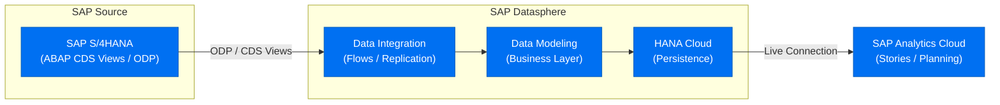
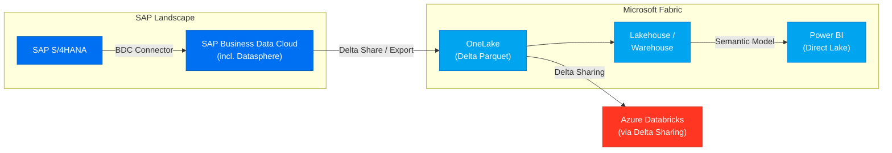

# SAP Architecture Patterns Reference

Common reference architectures for the SAP Architecture Advisor skill.
Each pattern includes: overview, component list, integration flow, and a Mermaid diagram stub.

---

## Pattern Index

1. [S/4HANA → Datasphere → SAC (SAP-native analytics)](#s4-datasphere-sac)
2. [S/4HANA → BDC → Microsoft Fabric / Power BI](#s4-bdc-fabric)
3. [S/4HANA → Azure Databricks (cloud-native analytics)](#s4-databricks)
4. [BW/4HANA Migration to Datasphere](#bw4-migration)
5. [SAP AI Agents: Joule + Knowledge Graph + BTP AI](#sap-ai-agents)
6. [BDC vs. Datasphere: Decision Framework](#bdc-vs-datasphere)
7. [HANA Cloud as Federation Hub](#hana-cloud-federation)
8. [S/4HANA → Fabric + Power BI (Microsoft-native path)](#s4-fabric-pbi)

---

## Pattern 1: S/4HANA → Datasphere → SAC {#s4-datasphere-sac}

**Best for:** Organizations standardizing on the SAP data ecosystem; end-to-end SAP governance.

### Overview
SAP S/4HANA exposes transactional data via ABAP CDS views and ODP. SAP Datasphere ingests and models
this data in a semantic layer (Business Layer / Analytic Model). SAP Analytics Cloud connects to
Datasphere via a live connection for interactive analysis and planning.

### Component Flow
```
S/4HANA → (ODP / CDS Views) → Datasphere [Data Builder + Business Layer] → SAC [Stories / Planning]
```

### Integration Mechanisms
- **ODP (Operational Data Provisioning)**: Preferred for delta/incremental extraction from S/4HANA
- **ABAP CDS Views**: Virtual data models exposed from S/4HANA; consumed as ODP sources or via SQL
- **Direct SQL Access**: HANA Cloud underlying Datasphere can query S/4HANA HANA DB via remote source
- **SAC Live Connection**: SAC queries Datasphere models in real-time (no data duplication)

### Diagram


### Key Documentation
- [SAP Datasphere Help Portal](https://help.sap.com/docs/SAP_DATASPHERE)
- [ODP Integration Guide](https://help.sap.com/docs/SAP_DATASPHERE/be5967d099974c69b77f4549425ca4c0/bbc217044d9a401893b398e9ee4ed0cb.html)
- [SAC Live Data Connection to Datasphere](https://help.sap.com/docs/SAP_ANALYTICS_CLOUD)

---

## Pattern 2: S/4HANA → BDC → Microsoft Fabric / Power BI {#s4-bdc-fabric}

**Best for:** Organizations with joint SAP + Microsoft investments; SAP BDC licensing.

### Overview
SAP Business Data Cloud (BDC) is a joint SAP + Microsoft offering that bundles SAP Datasphere with
Microsoft Fabric. BDC automates the data pipeline from SAP systems into Fabric OneLake, where it
becomes available to Power BI, Azure Synapse/Spark, and Databricks via Delta Sharing.

### Component Flow
```
S/4HANA → (BDC Connector / SAP Datasphere) → Fabric OneLake → [Power BI / Spark / ML workloads]
```

### Integration Mechanisms
- **BDC Out-of-the-Box Connectors**: Pre-built extractors for S/4HANA, BW/4HANA, ECC objects
- **SAP Datasphere within BDC**: Acts as the semantic/governance layer
- **Fabric OneLake**: Target cloud data lake in Delta Parquet format
- **Microsoft Fabric Lakehouses / Warehouses**: Downstream consumption
- **Power BI Direct Lake**: Power BI reads from OneLake directly for high-performance reports

### Diagram


### Key Documentation
- [SAP Business Data Cloud Overview](https://help.sap.com/docs/business-data-cloud)
- [Microsoft Fabric + SAP Integration](https://learn.microsoft.com/en-us/fabric/get-started/fabric-and-sap)
- [OneLake Delta Sharing](https://learn.microsoft.com/en-us/fabric/governance/onelake-sharing)

---
